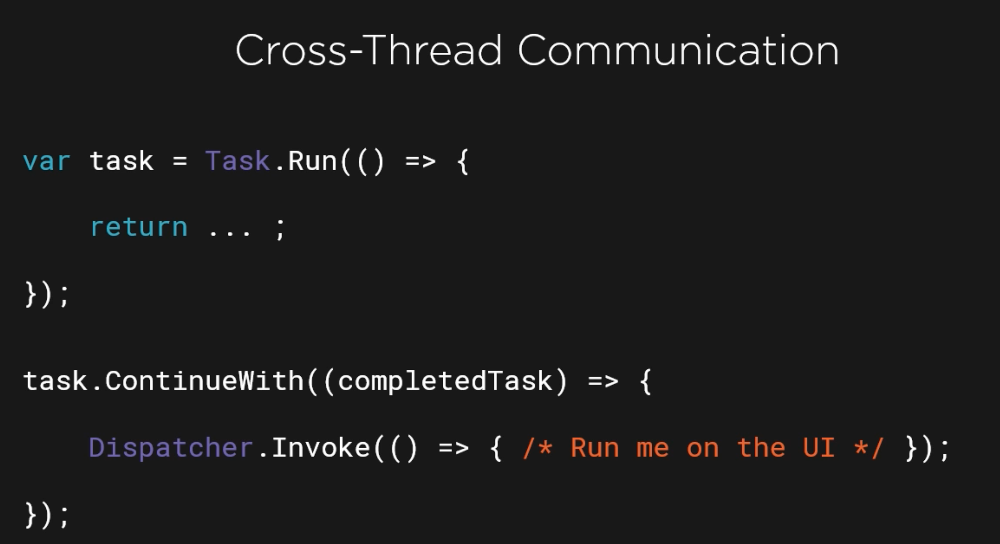
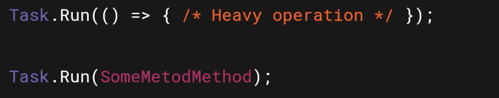

# 04 `cancel` 

## Annuler une `Task`

On a besoin de la classe `CancellationTokenSource`.

```cs
CancellationTokenSource cancellationTokenSource = new();

cancellationTokenSource.Cancel();
```

`Cancel` signale à un `Cancellation Token` qu'il doit annuler une `Task`.

On peut indiquer un certain temps d'attente avant annulation (`cancellation`) :

```cs
cancellationTokenSource.CancelAfter(5000) // ms = 5 secondes
```


## `CancellationToken`

Le `cancellationTokenSource` et couplé avec un `CancellationToken`.

C'est celui-ci que l'on passe à la méthode `Run` :

```cs
CancellationTokenSource cancellationTokenSource = new();
CancellationToken token = cancellationTokenSource.Token;

Task.Run(() => {}, token);

Task.Run(() => {
  if(token.IsCancellationRequested) { ... }
})
```


## Exemple

```cs
Console.WriteLine("Cancellation Token");

CancellationTokenSource cts = new();
CancellationToken token = cts.Token;

cts.CancelAfter(5000);

await Task.Run(() => {
    Console.WriteLine("Start task");
    
    for(int i = 1; i < 10; i++)
    {
        Console.WriteLine($"loop {i}");
        Thread.Sleep(1000);
        if(token.IsCancellationRequested)
        {
            Console.WriteLine("Task cancelled");
            break;
        }
    }
}, token);
```

```
Cancellation Token
Start task
loop 1
loop 2
loop 3
loop 4
loop 5
Task cancelled
```


### ! Finir la `Task`

Lors d'un `Cancel` le programme peut quitter alors que la `task` n'est pas terminée :

```cs
var cts = new CancellationTokenSource();
var token = cts.Token;

var t = Task.Run(async () => {
    display("Start While Loop");
    while(!token.IsCancellationRequested)
    {
        await Task.Delay(500);
        display("*");
    }

    display("Task is cancelled");
});

await Task.Delay(1800);

cts.Cancel();

display($"Task is completed ? {t.IsCompleted}");
```

```
Start While Loop
*
*
*
Task is completed ? False
```

On peut terminer manuellement la `Task` avec `Wait` :

```cs
// ...
cts.Cancel();

t.Wait();

display($"Task is completed ? {t.IsCompleted}");
```

```
// ...
*
Task is cancelled
Task is completed ? True
```


## Quand s'effectue la `cancellation`

La `Task` est annuler seulement si le `cancellationToken` lui est fournit avant qu'elle ne commence.

#### On doit gérer l'annulation ! `cancellationToken.IsCancellationRequested`

```cs
while((line = await stream.ReadLineAsync()) != null)
{
  if(cancellationToken.IsCancellationRequested)
  {
    break;
  }
  lines.Add(line);
}
```

On peut aussi lancer une `exception` :

```cs
while((line = await stream.ReadLineAsync()) != null)
{
  cancellationToken.ThrowIfCancellationRequested();

  lines.Add(line);
}
```

On peut continuer de passer le `cancellation token` à la `continuation` suivante :

```cs
CancellationToken token = cancallationTokenSource.Token;

var task = Task.Run(() => {}, token);

task.ContinueWith(t => {}, token);
```

On peut spécifier plusieurs paramètres à `Run` ou `ContinueWith` :

```cs
task.ContinueWith(() => {},
                 token,
                 TaskContinuationOptions.OnlyOnRanToCompletion,
                 TaskScheduler.Current);
```


### `cancellationTokenSource.Token.Register`

Cette méthode nous permet d'enregistrer un `Delegate` qui s'exécutera à chaque fois qu'une `cancellation` est demandée.

```cs
try
{
  cancellaTokenSource = new();

  cancellationTokenSource.Token.Register(() => {
    Notes.Text = "cancellation requested";
  });
```

Les `Delegates` s'exécute (il semble !?) dans l'ordre inverse de leur enregistrement et avant le bloc `if` de `token.IsCancellationRequested` :

```cs
token.Register(() => {
    Console.WriteLine("One");
});
token.Register(() => {
    Console.WriteLine("Two");
});

// ...

if(token.IsCancellationRequested)
{
  Console.WriteLine("Task cancelled");
}
```

```
Two
One
Task cancelled
```


## Enchaînement de `continuation` et `cancellation token`


Attention la dernière `continuation` n'est pas informer de la `cancellation`.

chaque `continuation` n'est informée que de la précédente.


## `HttpClient`

```cs
using(var client = new HttpClient())
{
  var result = await client.GetAsync(Url, cancellationToken);
}
```

En cas de `cancellation`, `GetAsync` arrête la requête et lance une `exception`.


## `Canceled` une méthode de `.net`

On peut directement passer le `token` de `cancellation` à une méthode asynchrone de `.net` pour la `cancellation` soit gérée pas le framework.

### Exemple avec `Task.Delay`

On passe directement le `token` à `Delay` en deuxième argument :

```cs
var cts = new CancellationTokenSource();
var token = cts.Token;

var tLong = Task.Run(async () => {
    await Task.Delay(5000, token);
    display("Task Finished");
});

await Task.Delay(2000);
cts.Cancel();

display($"Task Complted : {tLong.IsCompleted}");
display($"Task Canceled : {tLong.IsCanceled}");
```

```
Task Complted : True
Task Canceled : True
```


## Résumé

Chaque `continuation` crée sa propre `Thread`.



Une `Task` est une référence vers une opération asynchrone.

N'importe quel traitement lourd peut être délégué à une nouvelle `Thread` grâce à `Task`.



Attention de ne pas bloquer la `Thread` principale (`UI Thread`) avec un traitement trop lourd.

On peut dire à une `continuation` de n'exécuter son code qu'en cas de réussite de la précédente `Task` : 

#### `TaskContinuationOptions.OnlyOnRanToCompletion`

