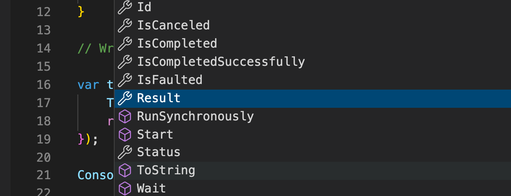
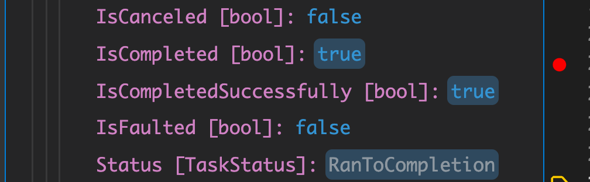

# 05 `Task` library

## `Task.WhenAll`

Permet de lancer plusieurs `Task` en parallèlle et de les récupérer lorsqu'elle sont toutes achevées.

```cs
var identifiers = StockIdentifier.Text.Split(',',' ');

var loadingTasks = new List<Task<IEnumerable<StockPrice>>>();

foreach(var identifier in identifiers)
{
  var loadTask = service.GetStockPricesFor(identifier, token);

  loadingTasks.Add(loadTask);
}
var allStock = await Task.WhenAll(loadingTasks);
```

`allStock` est un tableau de tous les résultats, on peut l'aplatir avec `SelectMany`.


### Comparaison des temps d'exécution

En série et en parallèle :

```cs
using System.Diagnostics;

var sw = Stopwatch.StartNew();

await WaitAMoment();
await WaitAMoment();
await WaitAMoment();
Console.WriteLine(sw.ElapsedMilliseconds);

sw.Restart();
var taskOne = WaitAMoment();
var taskTwo = WaitAMoment();
var taskThree = WaitAMoment();

await Task.WhenAll(taskOne, taskTwo, taskThree);
Console.WriteLine(sw.ElapsedMilliseconds);

async Task WaitAMoment()
{
    Console.WriteLine("Start Task");
    await Task.Run(() => {
        Thread.Sleep(1000);
    });
    Console.WriteLine("Finish Task");
}
```

```
Start Task
Finish Task
Start Task
Finish Task
Start Task
Finish Task
3019
Start Task
Start Task
Start Task
Finish Task
Finish Task
Finish Task
1001
```

C'est le mot clé `await` qui permet de rendre asynchrone le traitement.

Dans l'exemple suivant les deux traitement dure autant :

```cs
var sw = Stopwatch.StartNew();

await WaitAMoment();
await WaitAMoment();
await WaitAMoment();

Console.WriteLine(sw.ElapsedMilliseconds);

sw.Restart();
var taskOne = WaitAMoment();
var taskTwo = WaitAMoment();
var taskThree = WaitAMoment();

await Task.WhenAll(taskOne, taskTwo, taskThree);
Console.WriteLine(sw.ElapsedMilliseconds);

async Task WaitAMoment() => Thread.Sleep(1000);
```

```
3011
3012
```

De même avec la méthode `Wait`, on ne redonne jamais la main à la méthode principal :

```cs
async Task WaitAMoment() => Task.Run(() => {
        Thread.Sleep(1000);
    }).Wait();
```

```
3006
3002
```

C'est toute la magie du mot `await` (utilisé avec `Task.WhenAll`) :

```cs
async Task WaitAMoment() => await Task.Run(() => {
        Thread.Sleep(1000);
    });
```

```
3006
1001
```


### `Task` en parallèle

On peut plutôt que d'utiliser `WhenAll`, tout simplement lancer les `Task` en parallèle et ensuite récupérer les résultats (si besoin) avec `await` :

```cs
sw.Restart();
var taskOne = WaitAMoment();
var taskTwo = WaitAMoment();
var taskThree = WaitAMoment();

await Task.WhenAll(taskOne, taskTwo, taskThree);
Console.WriteLine(sw.ElapsedMilliseconds);

sw.Restart();
var taskFour = WaitAMoment();
var taskFive = WaitAMoment();
var taskSix = WaitAMoment();

await taskFour;
await taskFive;
await taskSix;
Console.WriteLine(sw.ElapsedMilliseconds);
```

```
1001
1001
```

On a le même temps.

### On `await` chaque `Task` avant d'utiliser son `Result`.

```cs
Task<TResult> doSomethingTask = DoSomething();

TResult result = await doSomethingTask;
```


## `Task.WhenAny`

Retourne la première `Task` terminée.

```cs
using System.Threading;

var taskOne = Task.Run(() => {
    Thread.Sleep(1000);
    return "One";
});

var taskTwo = Task.Run(() => {
    Thread.Sleep(2000);
    return "two";
});

var result = await Task.WhenAny(taskOne, taskTwo);
Console.WriteLine(result.Result);
```

```
One
```

On peut ainsi mettre un `timer`à une `Task` ou à un ensemble de `Task` (créé avec `WhenAll`).

```cs
using System.Threading;

var taskOne = Task.Run(() => {
    Thread.Sleep(1000);
    return "One";
});

var taskTwo = Task.Run(() => {
    Thread.Sleep(2000);
    return "two";
});

var groupOfTasks = Task.WhenAll(taskOne, taskTwo);
var timeoutTask = Task.Delay(2500);

var completedTask = await Task.WhenAny(groupOfTasks, timeoutTask);
var resultBool = completedTask == timeoutTask;
Console.WriteLine(resultBool);
```

On peut utiliser le réssultat pour annuler une `Task` :

```cs
if(completedTask == timeoutTask)
{
  cancellationTokenSource.Cancel();
}
```

On peut aussi simplement utiliser `cancellationTokenSource.CancelAfter` :

```cs
cancellationTokenSource.CancelAfter(3000);
```


## `Wait`

On peut attendre la fin d'une `Task` avec la méthode `Wait` :

```cs
myTask.Wait();
```

 

### Propriété : `IsCompleted`, `Result`

On peut tester si une `Task` est terminée avec `IsCompleted`.

On récupère le retour de la `Task` avec `Result`.

```cs
var task = Task.Run(() => {
    Thread.Sleep(600);
    return "Hello Task Is Completed";
});

Console.WriteLine($"task is completed ? : {task.IsCompleted}");

task.Wait();

Console.WriteLine(task.Result);
```

```
task is completed ? : False
Hello Task Is Completed
```






### ! `Task.Result`

L'appelle à `Result` est équivalent à l'appelle à la méthode `Wait` et bloque la `Thread` principale jusqu'à l'obtention du résultat.

