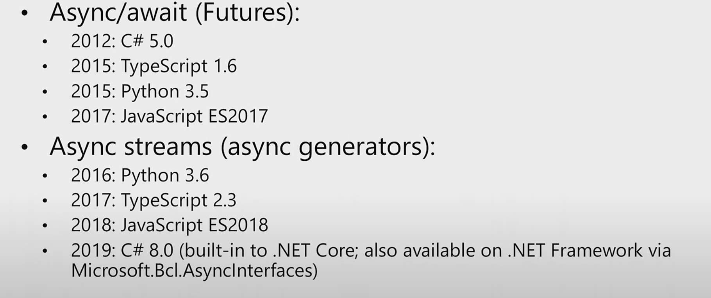
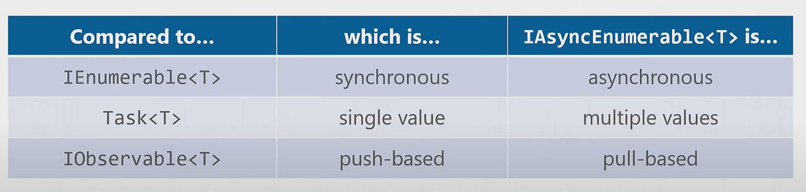

# 07 `Async Stream`

Contrairement à `async/await` littéralement inventé par `c#`, les `async streams` arrive tardivement en 2019 dans `.net` avec `C# 8`.

## Observable

Les `observable` n'ont pas été adoptés en `C#` car il sont sur un principe de `push` (l'information est poussée par l'`observable`).

La manière courante de consommer des données est plutôt `pull` (tirer), on tire une donnée d'une collection (ce n'est pas la collection qui nous envoie la donnée quand celle-ci est prête).

## Comparaison croisée avec `IAsyncEnumerable<T>`

On peut dreeser le tableau suivant :

| Accès Désiré                          |    Type de retour     |
| :------------------------------------ | :-------------------: |
| Une seule valeur, Synchrone           |          `T`          |
| Plusieurs valeurs, Synchrone          |   `IEnumerable<T>`    |
| Une seule valeur, Asynchrone (`pull`) |       `Task<T>`       |
| Une seule valeur, Asynchrone (`push`) |   `IObservable<T>`    |
| Plusieurs valeur, Asynchrone (`pull`) | `IAsyncEnumerable<T>` |
| Plusieurs valeur, Asynchrone (`push`) |   `IObservable<T>`    |

## `Async Streams` en un mot

C'est l'utilisation de `await` et `yield return` dans la même méthode.