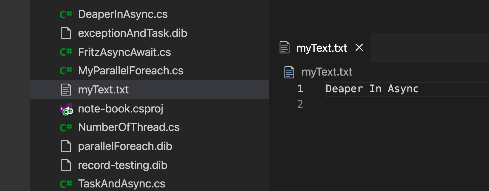

# AA Divers remarques

## `Console.WriteLine`

Un programme ne peut pas écrire sur l'écran, seulement dans un fichier.

`Console.WriteLine` écrit en fait dans le fichier `STDOUT`.

On peut rediriger cette écriture en ligne de commande dans un simple fichier texte :

```cs
Console.WriteLine("Deaper In Async");
```

```bash
dotnet run > myText.txt
```



On peut aussi lire depuis `STDIN` :

```cs
var line = Console.ReadLine();

Console.WriteLine($"my line : {line}");

Console.WriteLine("Deaper In Async");
Console.WriteLine("And other topic ...");
```

```bash
dotnet run < myText.txt
my line : Deaper In Async
Deaper In Async
And other topic ...
```

On peut même écrire ceci avec `|` (`pipe`) :

```bash
echo "Something happened" | dotnet run
my line : Something happened
Deaper In Async
And other topic ...
```

