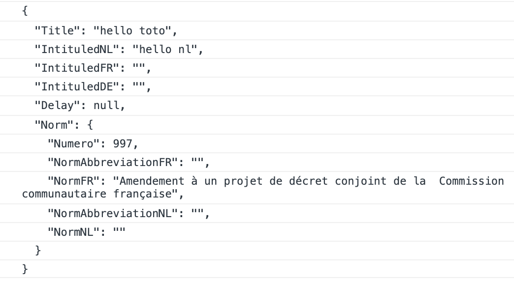

# 22 `Json`

Utilisation des bibliothèques de `.net`.

Il est maintenant conseillé de ne plus utiliser `Newtonsoft` mais `System.Text.json`.

## Sérialisation `JsonSerializer.Serialize`

```cs
string letterJson = JsonSerializer.Serialize(letter);
Console.WriteLine(letterJson);
```

```
{"Title":"hello toto","IntituledNL":"hello nl","IntituledFR":"","IntituledDE":"","Delay":null,"Norm":{"Numero":997,"NormAbbreviationFR":"","NormFR":"Amendement \u00E0 un projet de d\u00E9cret conjoint de la  Commission communautaire fran\u00E7aise","NormAbbreviationNL":"","NormNL":""}}
```

Tout est écrit sans indentation et certain caractères sont échappés.

On doit ajouter des `options` :

```cs
var options = new JsonSerializerOptions { 
  Encoder = JavaScriptEncoder.Create(UnicodeRanges.BasicLatin, UnicodeRanges.Latin1Supplement),
  WriteIndented = true 
};
string letterJson = JsonSerializer.Serialize(letter, options);
Console.WriteLine(letterJson);
```

`Encoder` : permet d'afficher certain caractère sans les échapper.

`WriteIndented` : ajoute des indentations.




## Déserialisation d'un fichier `data.json`

On peut recevoir les données dans un fichier `json` de ce type :

```json
[
    {"id":1,"car_make":"Subaru","car_model":"Legacy"},
    {"id":2,"car_make":"Hyundai","car_model":"XG350"},
    // ...
```

On crée une classe avec des `attributs` pour *mapper* les données `json` :

```cs
using System.Text.Json.Serialization;

public class Car
{
    [JsonPropertyName("id")]
    public int Id { get; set; }
    
    [JsonPropertyName("car_make")]
    public string Make { get; set; } = string.Empty;
    
    [JsonPropertyName("car_model")]
    public string Model { get; set; } = string.Empty;
}
```

Et puis en deux lignes on récupère les données sous la forme d'un tableau de `Car` :

```cs
using System.Text.Json;

var fileContent = await File.ReadAllTextAsync("data.json");
var cars = JsonSerializer.Deserialize<Car[]>(fileContent);
```


## Références circulaires

```
System.Text.Json.JsonException: A possible object cycle was detected. This can either be due to a cycle or if the object depth is larger than the maximum allowed depth of 32.
```

Lorsqu'un `controller` via  `EF Core`  lance une requête avec `Include`, on peut avoir des références circulaires lors de la `serialization`.

Dans ce cas on utilise une `option` du `JsonSerializer` utilisé :

```cs
builder.Services.AddControllersWithViews().AddJsonOptions(options =>
	options.JsonSerializerOptions.ReferenceHandler =                                                    		ReferenceHandler.IgnoreCycles;
);
```


### Deuxième solution : avec `Newtonsoft`

Installer `Newtonsoft`

```bash
dotnet add package Microsoft.AspNetCore.Mvc.NewtonsoftJson --version 6.0.1
```

```cs
builder.Services.AddControllersWithViews().AddNewtonsoftJson(
    options => options.SerializerSettings.ReferenceLoopHandling =
    	Newtonsoft.Json.ReferenceLoopHandling.Ignore
);
```

