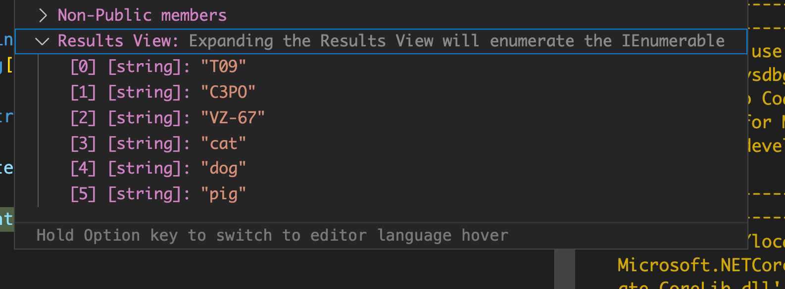

# 23 Les collections

## Vérifier qu'une `List`contient un élément

### `Contains`

```cs
bool MyList<TItem>.Contains(TItem item)
```

```cs
bool result = Persons.Contains(roger);
```

Basé sur la méthode `Equals`.


### `Exists`

Basé sur un prédicats.

```cs
bool MyList.Exists(x => x.Length > 30);
```


### `Any`

Une extension de méthode de `Linq`.

fonctionne comme `Exists` :

```cs
var result = Persons.Any(x => x.Name.Contains("sam"));
```

```cs
List<Person> persons = new() { new("bousam"), new("bob"), };

Console.WriteLine(persons.Any(x => x.Name.Contains("sa"))); // true

record Person(string Name);
```


## Applatir une liste

### `SelectMany`

Applati par projection une séquence d'éléments dans un `IEnumerable<T>`.

```cs
var robots = new string[] { "T09", "C3PO", "VZ-67" };
var pets = new string[] { "cat", "dog", "pig" };

var allItems = new string[][] { robots, pets };

var flatItems = allItems.SelectMany(x => x);
```


