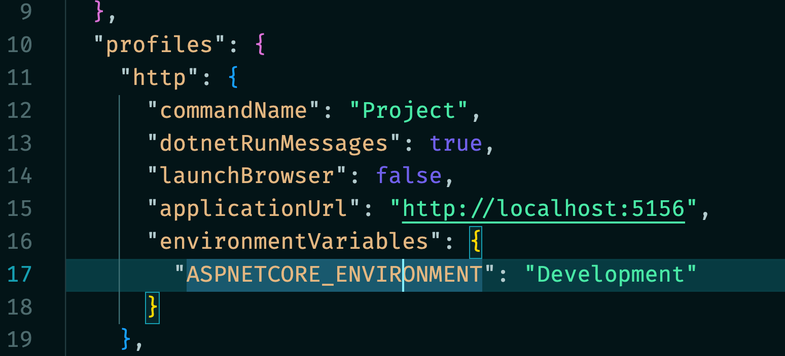
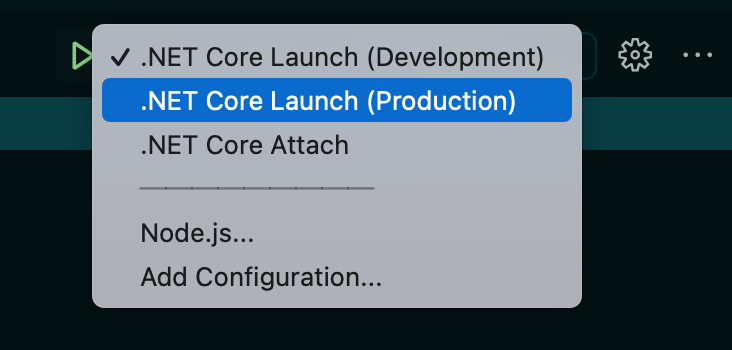

# 24 `Environment`

C'est une classe `static` contenant plein d'informations.


## Définir le type d'`environment` : `Development`, `Staging`, `Production`

On peut définir le type d'environnement dans le fichier `launchSettings.json` en assignant une valeur à la variable d'environement `ASPNETCORE_ENVIRONMENT` :




### Utilisation dans le code

On peut se servir de cette info pour configurer les `middleware` par exemple dans `Program.cs` :

```cs
if(app.Environment.IsProduction()) 
    Console.WriteLine("Production Environment");
if(app.Environment.IsDevelopment()) 
    Console.WriteLine("Development Environment");
```

On utilise les méthodes `IsProduction`, `IsStaging` et `IsDevelopment` de la classe `Envirinment`.


### Configuration par environement

On peut aussi créer des `settings` différents suivant le type d'environnement :


Cela permet par exemple de renseigner des `DB` différentes suivant l'environement.


### Changer d'environement dans `VSCode` en `Debbug`

Si on veut tester notre `app` dans un environement particulier, on peut ajouter des configurations de `launch` dans `.vscode/launch.json` :

```json
"configurations": [
        {
            "name": ".NET Core Launch (Development)",
            // ...
            "env": {
                "ASPNETCORE_ENVIRONMENT": "Development"
            },
            // ...
        },
        {
            "name": ".NET Core Launch (Production)",
            // ...
            "env": {
                "ASPNETCORE_ENVIRONMENT": "Production"
            },
            // ...
        },
```




## `GetEnvironmentVariables`

Renvoie un `IDictionary` avec les variables :

```cs
IDictionary members = Environment.GetEnvironmentVariables();

foreach(DictionaryEntry item in members)
{
    Console.WriteLine($"{item.Key} : {item.Value}");
}
```

```bash
TERM_PROGRAM_VERSION : 1.63.2
USER : hukar
ORIGINAL_XDG_CURRENT_DESKTOP : undefined
COMMAND_MODE : unix2003
_ : /usr/local/share/dotnet/dotnet
VSCODE_GIT_ASKPASS_NODE : /Applications/Visual Studio Code.app/Contents/MacOS/Electron
OLDPWD : /Users/hukar/Documents/programmation/dotnet/note-book
SHELL : /bin/zsh
DOTNET_ROOT_X64 : /usr/local/share/dotnet
LANG : en_GB.UTF-8
PWD : /Users/hukar/Documents/programmation/dotnet/note-book
SHLVL : 1
TMPDIR : /var/folders/q4/7nvwsl8s0rz348t_ymlnft_m0000gn/T/
TERM : xterm-256color
MSBuildLoadMicrosoftTargetsReadOnly : true
PATH : /usr/local/bin:/usr/bin:/bin:/usr/sbin:/sbin:/usr/local/share/dotnet:~/.dotnet/tools:/Library/Frameworks/Mono.framework/Versions/Current/Commands:/Users/hukar/.dotnet/tools:/Users/hukar/dotnet-core-uninstall:/Users/hukar/.dotnet/tools:/Users/hukar/dotnet-core-uninstall
HOME : /Users/hukar
__CFBundleIdentifier : com.microsoft.VSCode
VSCODE_GIT_ASKPASS_MAIN : /Applications/Visual Studio Code.app/Contents/Resources/app/extensions/git/dist/askpass-main.js
VSCODE_GIT_ASKPASS_EXTRA_ARGS : --ms-enable-electron-run-as-node
TERM_PROGRAM : vscode
GIT_ASKPASS : /Applications/Visual Studio Code.app/Contents/Resources/app/extensions/git/dist/askpass.sh
__CF_USER_TEXT_ENCODING : 0x1F5:0x0:0x0
LOGNAME : hukar
VSCODE_GIT_IPC_HANDLE : /var/folders/q4/7nvwsl8s0rz348t_ymlnft_m0000gn/T/vscode-git-8ebe3b9079.sock
XPC_SERVICE_NAME : 0
SSH_AUTH_SOCK : /private/tmp/com.apple.launchd.IMYz9N9kPl/Listeners
XPC_FLAGS : 0x0
COLORTERM : truecolor
```


## `ProcessId`

```cs
Console.WriteLine(Environment.ProcessId);
```

```bash
20610
```


## `ProcessorCount`

```csharp
Console.WriteLine(Environment.ProcessorCount);
```

```bash
12
```


## Récupérer les Propriétés `public` de `Environment`

On a encore d'autre valeurs dans les propriétés :

```cs
var properties = typeof(Environment).GetProperties();

foreach(var prop in properties)
{
   Console.WriteLine($"{prop.Name} : {prop.GetValue(null)}");
}
```

```bash
CurrentManagedThreadId : 1
ExitCode : 0
TickCount : 249586080
TickCount64 : 249586080
ProcessorCount : 12
HasShutdownStarted : False
CommandLine : /Users/hukar/Documents/programmation/dotnet/note-book/bin/Debug/net6.0/note-book.dll
CurrentDirectory : /Users/hukar/Documents/programmation/dotnet/note-book
ProcessId : 20735
ProcessPath : /Users/hukar/Documents/programmation/dotnet/note-book/bin/Debug/net6.0/note-book
Is64BitProcess : True
Is64BitOperatingSystem : True
NewLine : 

OSVersion : Unix 12.0.1
Version : 6.0.1
StackTrace :    at System.Environment.get_StackTrace()
   at System.RuntimeMethodHandle.InvokeMethod(Object target, Span`1& arguments, Signature sig, Boolean constructor, Boolean wrapExceptions)
   at System.Reflection.RuntimeMethodInfo.Invoke(Object obj, BindingFlags invokeAttr, Binder binder, Object[] parameters, CultureInfo culture)
   at System.Reflection.RuntimePropertyInfo.GetValue(Object obj, BindingFlags invokeAttr, Binder binder, Object[] index, CultureInfo culture)
   at System.Reflection.PropertyInfo.GetValue(Object obj)
   at Program.<Main>$(String[] args) in /Users/hukar/Documents/programmation/dotnet/note-book/CancellationBubbleUp.cs:line 21
UserInteractive : True
SystemDirectory : /System
SystemPageSize : 4096
UserDomainName : hukar
MachineName : hukar
UserName : hukar
WorkingSet : 19517440
```

