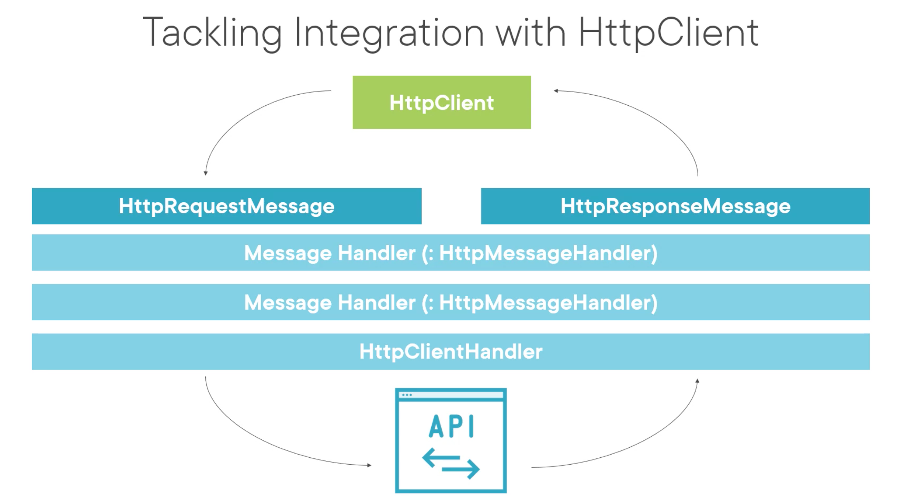

# 01 Utilisation de `HttpClient`dans une `API`

## Générer les `DTOs` depuis la spécification `OpenAPI`

Sur mac il existe un service online :

https://editor.swagger.io/

Il existe aussi ce projet en `CLI` :

https://openapi-generator.tech/

### Aussi `NSwag` et sa version `NPM` :

https://www.npmjs.com/package/nswag

```bash
npm install nswag -g
```

```bash
nswag jsonschema2csclient /input:JsonSchema.json 
                          /output:MyClasses.cs
```

💩 ça marche pas trop et quand ça marche le code est affreux !!


## S'attaquer (**tackling**) à `HttpClient`

```cs
var httpClient = new HttpClient();
var response = await _httpClient.GetAsync("http://localhost:5001/api/movies");

response.EnsureSuccessStatusCode();

var content = await response.Content.ReadAsStringAsync();
var movies = JsonSerializer.Deserialize<List<Movie>>(content);
```



La requête passe par un `pipeline` de `handler` (gestionnaire).

Chaque `handler` peut choisir de passer le `message` au prochain ou d'annuler la requête.