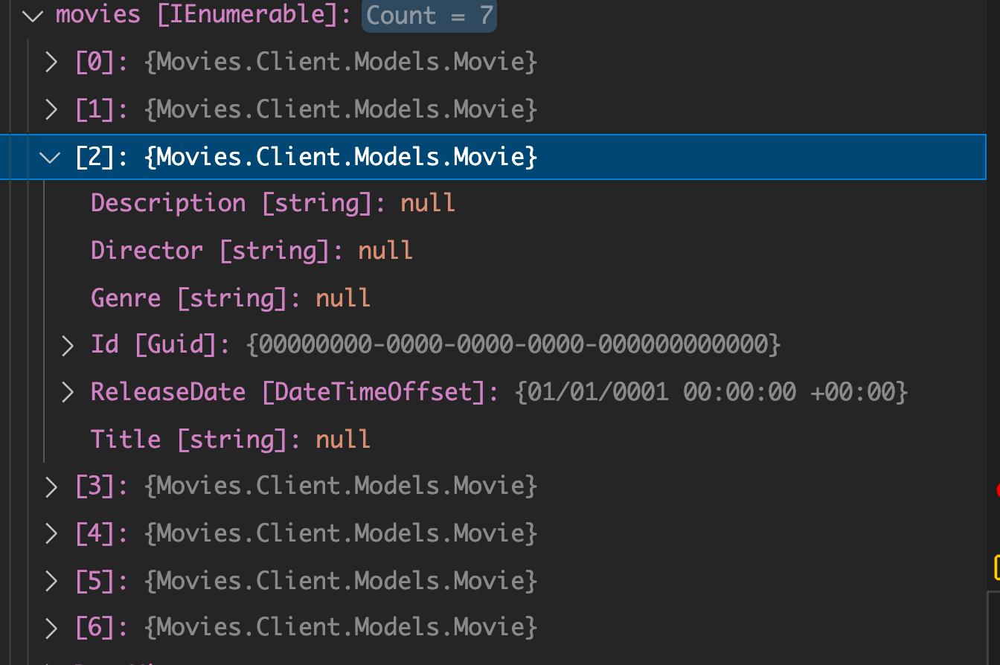
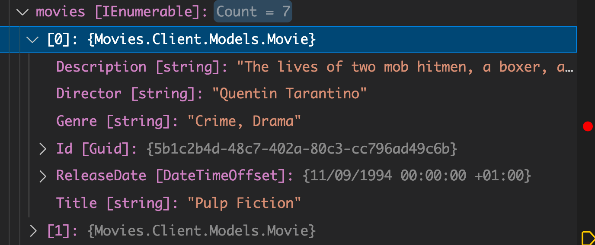
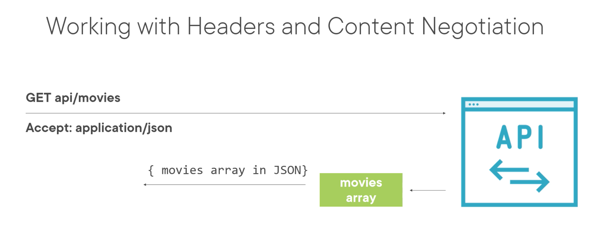
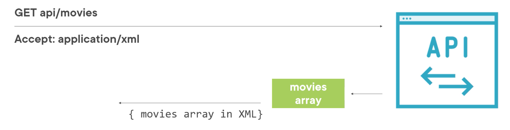

# 02 `GET` une ressource

## Utilisation de `GetAsync`

```cs
public class CRUDService : IIntegrationService
{
  private static HttpClient _httpClient = new();

  public CRUDService()
  {
    _httpClient.BaseAddress = new Uri("http://localhost:5000");
    _httpClient.Timeout = TimeSpan.FromSeconds(30);
  }

  public async Task Run()
  {
    await GetResource();
  }

  public async Task GetResource()
  {
    var response = await _httpClient.GetAsync("/api/movies");
    response.EnsureSuccessStatusCode();

    var content = await response.Content.ReadAsStringAsync();
  }
}
```

On devrait écrire l'instanciation de `HttpClient` avec un `using` :

```cs
using var _httpClient = new HttpClient;
```

car `HttpClient` implémente `IDisposable`, mais il ne faut pas faire comme cela (voire dans les prochaines fiches avec `HttpClientFactory`).

On peut garder à l'esprit que `HttpClient` doit vivre longtemps, c'est pour ça qu'il n'est pas nécessaire de le `Dispose` et qu'on le stocke dans un champ `private` et `static`.

Par contre on pourrait écrire :

```cs
using HttpResponseMessage response = await _httpClient.GetAsync("...");
```

car `HttpResponseMessage` implémente `IDisposable`.


### `EnsureSuccessStatusCode` 

Lance une exception si la propriété de la réponse `HTTP` `IsSuccessStatusCode` est `false`.

`response.Content` est du type `HttpContent` et permet de lire :

- un `string` => `ReadAsStringAsync`
- un `stream` => `ReadAsStreamAsync`
- un `Byte array` => `ReadAsByteArrayAsync`


### Déserialisation du `json` : `JsonSerializer.Deserialize`

Vient du package `System.Text.Json`.

```cs
var movies = JsonSerializer.Deserialize<IEnumerable<Movie>>(content);
```



On obtient bien nos 7 `movies` mais les valeurs ont été initialisées par défaut.

C'est parceque le `json` reçu est `camelCase` alors que les propriétés définies dans la classe `Movie` sont `PascalCase`.


### Problème de `CamelCase` :  `JsonSerializerOptions`.

On va ajouter des options pour la `Deserialization` :

```cs
var movies = JsonSerializer.Deserialize<IEnumerable<Movie>>(content, 
    new JsonSerializerOptions(){
      PropertyNamingPolicy = JsonNamingPolicy.CamelCase
    });
```



Maintenant on a le bon résultat.


## Différent formats : `Json` `XML`

Si le client reçoit du `xml` plutôt que du `json`, à ce stade il va cracher :

```
An exception happened while running the integration service.
      System.Text.Json.JsonException: '<' is an invalid start of a value. Path: $ | LineNumber: 0 | BytePositionInLine: 0.
```

Le `serializer` ne comprend plus le formatage reçu.

La responsabilité du type de données acceptées incombe au `client`.

La négotiation se fait grâce aux `headers`, des couples clé/valeur(s) contenus dans le `header` de la requête `HTTP`.

```
Accept: application/json
Accept: application/json, text/html
```

Si un `header` possède plusieurs valeurs, celle-ci sont déparé par une virgule (`coma`).

La réponse elle précise son `Content-Type` :

```
Content-Type: application/json
```

Les `headers` sont facultatifs, mais systématiquement préciser `Accept` augmente la fiabilité (`reliability`) du programme.


### Négotiation du contenu : Content Negotiation



En précisant à l'`API` qu'elle type de contenu on désire, celle-ci peut répondre de manière plus personnalisée.



La négotiation de contenu peut être conduite grâce à différents `header` :

```
Accept
Accept-Encoding
Accept-Language
Accept-Charset
```


## Manipuler les `Request Headers`

`HttpClient` possède la propriété `DefaultRequestHeaders` pour en supprimer ou en ajouter.

```cs
_httpClient.DefaultRequestHeaders.Clear(); // supprime les headers par défaut
_httpClient.DefaultRequestHeaders.Accept.Add(
	new MediaTypeWithQualityHeaderValue("application/json")
);
// On peut aussi ajouter le support de xml
_httpClient.DefaultRequestHeaders.Accept.Add(
	new MediaTypeWithQualityHeaderValue("application/xml")
);
```

De nouveau l'application fonctionne car l'`API` envoie du `json` et du `xml`.

Il faut encore la modifier pour qu'elle soit capable de gérer le `xml`.

On doit regarder le `Content-Type` de la `response` :

```cs
public async Task GetResource()
{
  var response = await _httpClient.GetAsync("/api/movies");
  response.EnsureSuccessStatusCode();

  var content = await response.Content.ReadAsStringAsync();
  var movies = new List<Movie>();
  
  if(response.Content.Headers.ContentType.MediaType == "application/json")
  {
    movies = JsonSerializer.Deserialize<List<Movie>>(content, 
         new JsonSerializerOptions() {
              PropertyNamingPolicy = JsonNamingPolicy.CamelCase
         });      
  }
  else if(response.Content.Headers.ContentType.MediaType == "application/xml")
  {
    var serializer = new XmlSerializer(typeof(List<Movie>));
    movies = (List<Movie>)serializer.Deserialize(new StringReader(content));
  }
}
```


### Indicateur de préférence

On peut indiquer la préférence de ce que l'on souhaite recevoir, par exemple si on préfére le `json` au `xml` :

```
Accept: application/json, application/xml;q=0.9
```

Tous les serveurs ne sont pas configurer pour répondre justement à ce `header`, mais par défaut `.net` le gère.

```cs
_httpClient.DefaultRequestHeaders.Accept.Add(
  new MediaTypeWithQualityHeaderValue("application/json")
);
_httpClient.DefaultRequestHeaders.Accept.Add(
  new MediaTypeWithQualityHeaderValue("application/xml", 0.9)
);
```


## `HttpRequestMessage` et `SendAsync`

Créer tous les réglages directement sur l'instance de `HttpClient` est intérêssant seulement si toutes les requêtes nécessitent ces mêmes réglages.

On peut vouloir fixer les valeurs de `header` sur seulement une `requête` plutôt que sur le `client`.

```cs
public async Task GetResourceThroughHttpRequestMessage()
{
  var request = new HttpRequestMessage(HttpMethod.Get, "api/movies");
  request.Headers.Accept.Add(new MediaTypeWithQualityHeaderValue("application/json"));
  
  var response = await _httpClient.SendAsync(request);
  response.EnsureSuccessStatusCode();
  
  var content = await response.Content.ReadAsStringAsync();
  
  var movies = JsonSerializer.Deserialize<IEnumerable<Movie>>(content,
      new JsonSerializerOptions() {
        PropertyNamingPolicy = JsonNamingPolicy.CamelCase
      });
}
```

C'est dans le `httpRequestMessage` qu'on va définir le `Verb` , l'`URI`et les `Headers`.

Ensuite on passe la `request` à la méthode `SendAsync` de `_httpClient`.


## Méthode raccourcie ou `SendAsync`

Le problème des méthodes raccourcies c'est qu'elle ne définisse pas le `header`  `Accept`.

On doit alors le définir avec `httpClient.DefaultRequestHeaders.Accept.Add` pour toute l'application.

Si ce n'est pas possible alors on utilise `HttpRequestMessage` avec `SendAsync`.