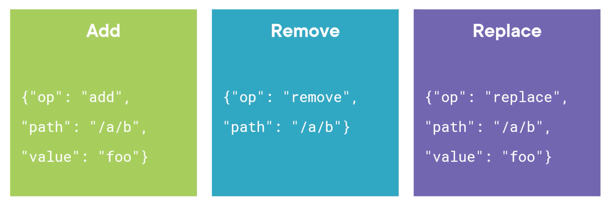
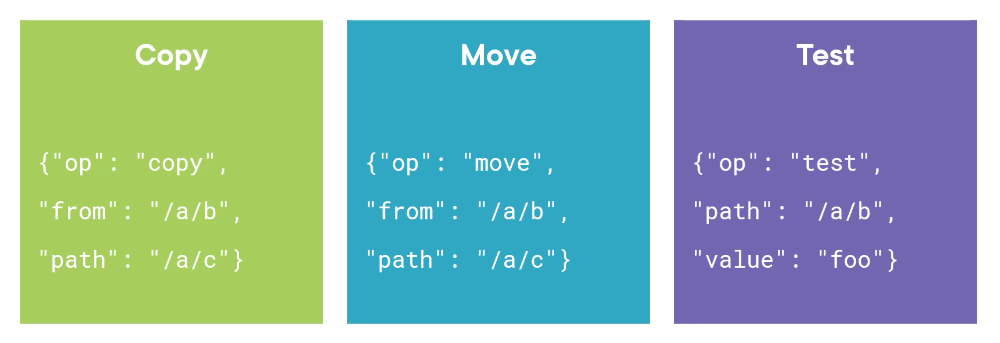
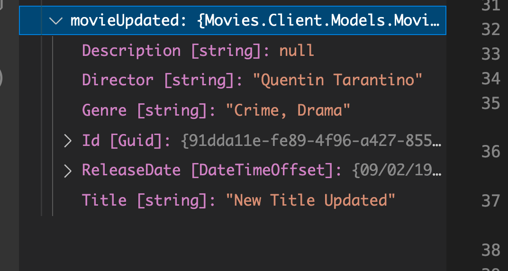
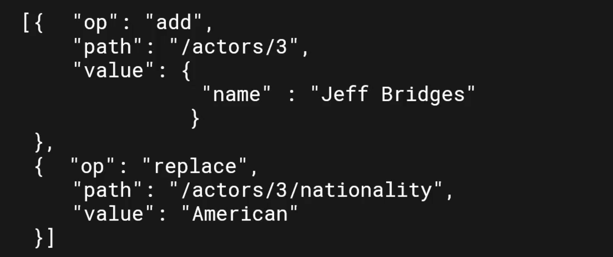

# `PATCH`

La méthode `PUT` est seulement attendu pour une mise à jour complète.

L'entiéreté de l'enregistrement est remplacé.

`PATCH` en ne modifiant qu'une partie de l'enregistrement va permettre une amélioration des performances.


## Modification Partielle avec `PATCH`

C'est une bonne pratique d'utiliser `PATCH` plutôt que `PUT`.

Il existe un standard pour ce type de modification : `Json Patch`.

http://jsonpatch.com/

https://datatracker.ietf.org/doc/html/rfc6902

```json
// THE ORIGINAL DOCUMENT
{
  "baz": "qux",
  "foo": "bar"
}

// THE PATCH
[
  { "op": "replace", "path": "/baz", "value": "boo" },
  { "op": "add", "path": "/hello", "value": ["world"] },
  { "op": "remove", "path": "/foo" }
]

// THE RESULT
{
  "baz": "boo",
  "hello": ["world"]
}
```

C'est un tableau d'opérations de modification (un `set` de changements).

C'est entièrement supporté par `.net`.

On utilise le `Content-Type` `application/json-patch+json`.

Beacoup d'application accepte simplement `application/json`.

```json
[
  {
    "op": "replace",
    "path": "/title",
    "value": "Mynew title"
  },
  {
    "op": "remove",
    "path": "/description"
  }
]
```

`remove` peut signifier mettre la valeur par défaut ou carrément retirer la propriété (le champs).


## Les opérations



`add` ajoute ou remplace si la propriété existe déjà.



`move` supprime la valeur dans `from` pour l'ajouter à la propriété déterminée par `path`.

`copy` garde la valeur dans `from`.

`test` teste si la propriété à tel valeur.


## Utilisation

On doit installer un `package` : `JsonPatch`

```bash
dotnet add package Microsoft.AspNetCore.JsonPatch
```

`JsonPatch` utilise `Newtonsoft.Json` en interne plutôt que `System.Text.Json`.


### Implémentation de la méthode `PatchResource`

### `JsonPatchDocument`

### `Replace(o => o.Property, "new value")`

### `Remove(o => o.Property)`

```cs
public async Task PatchResource()
{
  // version non typée : système dynamique
  var patchDoc = new JsonPatchDocument();
  
  // version typée : ce qu'on va utiliser
  var patchDoc = new JsonPatchDocument<MovieForUpdate>();
  patchDoc.Replace(m => m.Title, "New Title Updated");
  patchDoc.Remove(m => m.Description);
  
  var serializedChangeSet = JsonConvert.SerializeObject(patchDoc);
  var request = new HttpRequestMessage(HttpMethod.Patch, "api/movies/91dda11e-fe89-4f96-a427-855d4d18b1e7");
  request.Headers.Accept.Add(new MediaTypeWithQualityHeaderValue("application/json"));
  
  request.Content = new StringContent(serializedChangeSet); 
  request.Content.Headers.ContentType = new MediaTypeHeaderValue("application/json-patch+json");
  
  var response = await _httpClient.SendAsync(request);
  response.EnsureSuccessStatusCode();
  
  var content = await response.Content.ReadAsStringAsync();
  var movieUpdated = JsonConvert.DeserializeObject<Movie>(content);
}
```



On voit que le `remove` a mis `Description` à `null` et que le `Replace` a modifié le `Title`.

Voici le `ChangeSet` généré :

```json
[
  {"value":"New Title Updated","path":"/title","op":"replace"},
  {"path":"description","op":"remove"}
]
```


## Méthode raccourcie : `PatchAsync`

Ondoit toujours d'abord créer le `patchDoc` :

```cs
var patchDoc = new JsonPatchDocument<MovieForUpdate>();
patchDoc.Replace(m => m.Title, "Super Nice New Title");
patchDoc.Remove(m => m.Description);
```

Puis on utilise `PatchAsync` :

```cs
var response = await PatchAsync(
	"api/movies/91dda11e-fe89-4f96-a427-855d4d18b1e7",
  new StringContent(
  	JsonConvert.SerializeObject(patchDoc),
    Encoding.UTF8,
    "application/json-patch+json"
  )
);
```

Enfin on récupère la réponse :

```cs
response.EnsureSuccessStatusCode();

var content = await response.Content.ReadAsStringAsync();
var updatedMovie = JsonConvert.DeserializeObject<Movie>(content);
```


## Scenario avancé



On peut ainsi accéder au contenu de tableaux.

#### ! La compléxité côté `API` peut empêcher l'implémentation d'un support à plus d'un niveau d'imbrication.


## Différence entre `Json.net` et `System.Text.Json`

`System.Text.Json` ets plus rapide.

`Json.net` permet des sérialisation plus complexe.

`Json.net` est développé par `Newtonsoft`.

https://www.newtonsoft.com/json