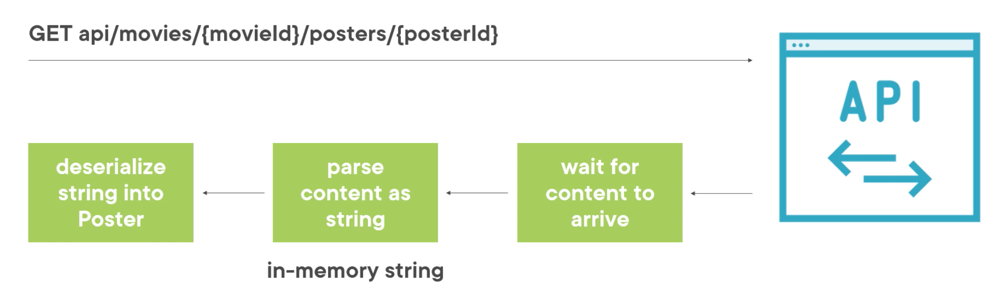
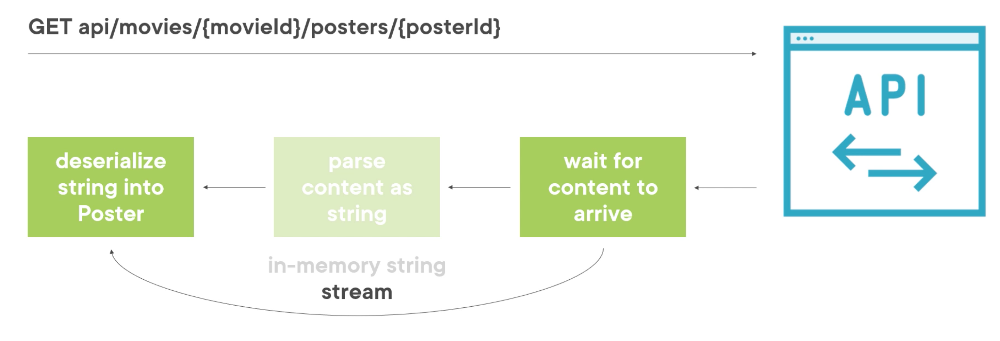
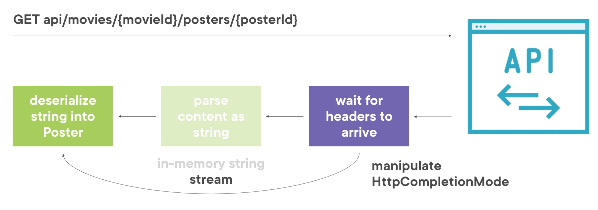

# 07 Utilisation des `Streams` (`GET`)

Utiliser les `streams` permet de minimiser l'impact de l'application sur la mémoire de l'ordinateur.


## Définition

Un `stream` est une abstraction d'une séquence d'`octets`, comme un fichier, un périphérique d'entrée/sortie, ou le traffic du réseau.

Un `stream` implique trois opérations fondamentales :

- Lire un depuis un `stream` vers une structure de données
- Écrire depuis une structure de données dans un `stream`
- Rechercher dans un `stream` en modifiant la position courante (pas toujours possible)

On peut utiliser les `streams` côté `client` avec n'importe quelle `API`, même si celle-ci ne les implémente pas.


## Utiliser `Streams` pour lire des données

Indépendament du `client` ou de l'`API`, `HTTP` utilise le `streaming` pour transporter ses données dans le réseau.



Une fois le contenu arrivé, il est transformé en `string` et stocké en mémoire avec `response.Content.ReadAsStringAsync`.

### Alternative avec un `Stream`



Avec l'utilisation des `Streams` on peut sauter l'étape du `string` en mémoire et ainsi épargner celle-ci.


## Implémentation

On veut produire de grand tableaux de `byte` pour simuler le téléchargement d'image.

Voilà comment sont créé les posters de `500KB` côté `API`.

```cs
var random = new Random();
var generatedByte = new byte[524288];
random.NextBytes(generatedByte);
```

`NextBytes` va remplir de manière aléatoire le tableau de `byte`.

Maintenant implémentons le `client` :

```cs
private async Task GetPosterWithStream()
{
  // On crée la requête GET
  var request = new HttpRequestMessage(
    HttpMethod.Get,
  	$"api/movies/bb6a100a-053f-4bf8-b271-60ce3aae6eb5/posters/{Guid.NewGuid()}"
  );
  // On ajoute le header Accept
  request.Headers.Accept.Add(
    new MediaTypeWithQualityHeaderValue("application/json")
  );
  
  // On envoie la requête
  var response = await _httpClient.SendAsync(request);
  // On récupére le stream de la response
  using (var stream = await response.Content.ReadAsStreamAsync())
  {
    // On vérifie le status sinon Exception
    response.EnsureSuccessStatusCode();

    // Les streams implémente IDisposable on utilise using
    using (var streamReader = new StreamReader(stream))
    {
      // On utilise JsonTextReader pour récupérer le json
      using (var jsonTextReader = new JsonTextReader(streamReader))
      {
        // On deserialize le json
        var jsonSerializer = new JsonSerializer();
        var poster = jsonSerializer.Deserialize<Poster>(jsonTextReader);
      }
    } 
  }
}
```


## Amélioration du code

Pour le moment on attend que la `response` soit arrivée avant de commencer le `streaming` vers l'objet `Poster`.

On pourrait faire débuter le `streaming` dès que la `response` commence à arriver sans que celle-ci soit complétement arrivée.



Cela améliore la performance  : le traitement commance plus vite.

Cela améliore l'utilisation de la mémoire : la `response` n'a plus besoin d'être mise en mémoire avant traitement.


## Implementation : `HttpCompletionOption`

```cs
private async Task GetPosterWithStreamAndCompletionMode()
{
  // ...

  var response = await _httpClient.SendAsync(
    request, HttpCompletionOption.ResponseHeadersRead
  );
  // ...
}
```

Par défaut l'opération est considérée comme complète que quand la `response` est lu entierement, `Content` inclus.

`HttpCompletionOption` a deux options :

- `ResponseContentRead`
- `ResponseHeadersRead`

Pour commencer plus tôt on utilise `HttpCompletionOption.ResponseHeadersRead`.


## Réutilisation du code : `extension method`

On crée une nouvelle `class`: `StreamExtensionMethod`

La classe `JsonTextReader` et la classe `JsonSerializer` viennent du package `Newtonsoft.Json`.

```cs
public static class StreamExtensionMethod
{
  public static T ReadAndDeserializeFromJson<T>(this Stream stream)
  {
    // Vérification préalable
    if(stream is null)
    {
      throw new ArgumentNullException(nameof(stream));
    }
    if(!stream.CanRead)
    {
      throw new NotSupportedException("can't read from this stream");
    }
    
    // Traitement du stream
    using(var streamReader = new StreamReader(stream))
    {
      using(var jsonTextReader = new JsonTextReader(streamReader))
      {
        var jsonSerializer = new JsonSerializer();
        return jsonSerializer.Deserialize<T>(jsonTextReader);
      }
    }
  }
}
```

On peut donc simplifier notre code :

```cs
private async Task GetPosterWithStream()
{
  // On créer la requête Method + Url
  var request = new HttpRequestMessage(
  	HttpMethod.Get,
    $"api/movies/bb6a100a-053f-4bf8-b271-60ce3aae6eb5/posters/{Guid.NewGuid()}"
  );
  // On ajoute le header
  requset.Headers.Accept.Add(
    new MediaTypeWithQualityHeaderValue("application/json")
  );
  
  // On envoie la requête
  var response = await _httpClient.SendAsync(request);
  
  // On récupère le stream de la respons
  using(var stream = response.Content.ReadAsStreamAsync())
  {
    // On vérifie le status de la response
    response.EnsureSuccessStatusCode();
    
    // On récupère la donnée parsée depuis le stream
    // avec la méthode d'extension
    var poster = stream.ReadAndDeserializeFromJson<Poster>();
  }
}
```

Et avec le `HttpCompletionOption.ResponseHeadersRead`:

```cs
private async Task GetPosterWithStreamAndCompletionMode()
{
  var request = new HttpRequestMessage(
    HttpMethod.Get,
    $"api/movies/bb6a100a-053f-4bf8-b271-60ce3aae6eb5/posters/{Guid.NewGuid()}"
  );

  request.Headers.Accept.Add(
    new MediaTypeWithQualityHeaderValue("application/json")
  );

  var response = await _httpClient.SendAsync(
    request, HttpCompletionOption.ResponseHeadersRead);
  
  // On récupére le stream de la response
  using (var stream = await response.Content.ReadAsStreamAsync())
  {
    response.EnsureSuccessStatusCode();

    var poster = stream.ReadAndDeserializeFromJson<Poster>();
  }
} 
```


## Test des performances

Pour le test on implémente une méthode sans `stream` :

```cs
private async Task GetPosterWithoutStream()
{
  var request = new HttpRequestMessage(
  	HttpMethod.Get,
    $"api/movies/bb6a100a-053f-4bf8-b271-60ce3aae6eb5/posters/{Guid.NewGuid()}"
  );
  
  request.Headers.Accept.Add(
  	new MediaTypeWithQualityHeaderValue("application/json")
  );
  
  var response = await _httpClient.SendAsync(requset);
  
  response.EnsureSuccessStatusCode();
  
  var content = await response.Content.ReadAsStringAsync();
  
  var poster = JsonConvert.DeserializeObject<Poster>(content);
}
```


### Méthodes de test

`TestGetPosterWithoutStream`

```cs
public async Task TestGetPosterWithoutStream()
{
  // Warmup
  await GetPosterWithoutStream();
  
  // Start Stopwatch
  var stopwatch = Stopwatch.StartNew();
  
  // Run requests
  for(int i = 0; i < 200; i++)
  {
    await GetPosterWithoutStream();
  }
  
  // Stop Stopwatch
  stopwatch.Stop();
  
  Console.WriteLine(
  	$"Elapsed millisecond without stream : {stopwatch.ElapsedMilliseconds}, "
    +$"Averaging {stopwatch.ElapsedMilliseconds/200} milliseconds/request"
  );
}
```

`TestGetPosterWithStream`

```cs
public async Task TestGetPosterWithStream()
{
  // Warmup
  await GetPosterWithStream();
  
  // Start Stopwatch
  var stopwatch = Stopwatch.StartNew();
  
  // Run requests
  for(int i = 0; i < 200; i++)
  {
    await GetPosterWithStream();
  }
  
  // Stop Stopwatch
  stopwatch.Stop();
  
  Console.WriteLine(
  	$"Elapsed millisecond with stream : {stopwatch.ElapsedMilliseconds}, "
    +$"Averaging {stopwatch.ElapsedMilliseconds/200} milliseconds/request"
  );
}
```

`TestGetPosterWithStreamAndCompletionMode`

```cs
public async Task TestGetPosterWithStreamAndCompletionMode()
{
// Warmup
  await GetPosterWithStreamAndCompletionMode();
  
  // Start Stopwatch
  var stopwatch = Stopwatch.StartNew();
  
  // Run requests
  for(int i = 0; i < 200; i++)
  {
    await GetPosterWithStreamAndCompletionMode();
  }
  
  // Stop Stopwatch
  stopwatch.Stop();
  
  Console.WriteLine(
  	$"Elapsed millisecond with stream and completion mode : {stopwatch.ElapsedMilliseconds}, "
    +$"Averaging {stopwatch.ElapsedMilliseconds/200} milliseconds/request"
  );
}
```


### Résultats

```cs
for(int i = 0; i < 4; i++)
{
  await TestGetPosterWithoutStream();
  await TestGetPosterWithStream();
  await TestGetPosterWithStreamAndCompletionMode();
}
```

```
without stream : 3492, Averaging 17 milliseconds/request
with stream : 3280, Averaging 16 milliseconds/request
with stream and completion mode : 3305, Averaging 16 milliseconds/request
________________
without stream : 3493, Averaging 17 milliseconds/request
with stream : 3294, Averaging 16 milliseconds/request
with stream and completion mode : 3294, Averaging 16 milliseconds/request
________________
without stream : 3540, Averaging 17 milliseconds/request
with stream : 3371, Averaging 16 milliseconds/request
with stream and completion mode : 4292, Averaging 21 milliseconds/request
________________
without stream : 3520, Averaging 17 milliseconds/request
with stream : 3308, Averaging 16 milliseconds/request
with stream and completion mode : 3267, Averaging 16 milliseconds/request
________________
```

Rien de flagrant au niveau des performances, même pire pour l'avant dernier où celui être censé le plus performant est en fait le moins.


