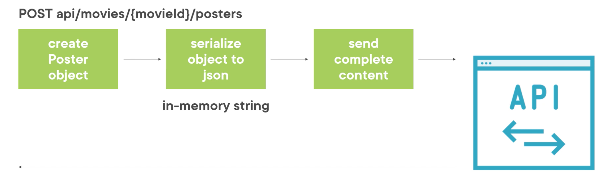
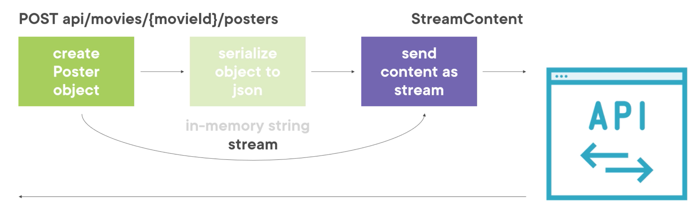

# 08 Utilisation des `streams` : `Post`

On peut aussi utiliser les `streams` pour envoyer des données.

De base on a le flow suivant :



On peut améliorer le processus avec des `streams` :



On saute le passage en mémoire de la sérialisation vers `json` et on utilise comme `HttpContent` :`StreamContent` au lieu de `StringContent`.


## Création d'un `Post Stream`

```cs
private async Task PostPosterWithStream()
{
  // Création de l'enregistrement
  var random = new Random();
  var generatedBytes = new byte[524288];
  random.NextByte(generatedBytes);
  
  var posterForCreation = new PosterForCreation() {
    Name = "A new poster for The Big Lebowski",
    Bytes = generatedBytes
  };
  
  // Création d'un stream en mémoire
  var memoryStream = new MemoryStream();
  using(var streamWriter = new StreamWriter(
    memoryStream, new UTF8Encoding(), 1024, true
  ))
  {
    using(var jsonTextWriter = new JsonTextWriter(streamWriter))
    {
      var jsonSerializer = new JsonSerializer();
      jsonSerializer.Serialize(jsonTextWriter, posterForCreation);
      jsonTextWriter.Flush();
    } 
  }
}
```

On créer un `stream` en mémoire avec `MemoryStream`.

On veut ensuite lire dans le `stream` avec `StreamWriter`.

`1024` c'est la taille du `buffer` utilisé par le `stream`.

`true` pour que le `stream` reste ouvert après l'appelle de `Dispose()`. 

`jsonTextWriter.Flush()` vide le `buffer`.


### Création d'une `Extension Method`

On va directement simplifier (factoriser) le code grâce à une `extension method` :

```cs
// Dans la classe StreamExtensionMethod
public static void SerializeToJsonAndWrite<T>(this Stream stream, T objectToWrite)
{
  if(stream is null)
  {
    throw new ArgumentNullException(nameof(stream));
  }
  if(!stream.CanWrite)
  {
    throw new NotSupportedException("can't write this stream");
  }
  
  using(var streamWriter = new StreamWriter(
    stream, new UTF8Encoding(), 1024, true
  ))
  {
    using(var jsonTextWriter = new JsonTextWriter(streamWriter))
    {
      var jsonSerializer = new JsonSerializer();
      jsonSerializer.Serialize(jsonTextWriter, objectToWrite);
      jsonTextWriter.Flush();
    } 
  }
}
```


### De retour dans notre méthode `PostPosterWithStream`

```cs
private async Task PostPosterWithStream()
{
  // Création de l'enregistrement
  var random = new Random();
  var generatedBytes = new byte[524288];
  random.NextBytes(generatedBytes);
  
  var posterForCreation = new PosterForCreation() {
    Name = "A new poster for The Big Lebowski",
    Bytes = generatedBytes
  };
  
  // Création d'un stream en mémoire
  var memoryStream = new MemoryStream();
  memoryStream.SerializeToJsonAndWrite(posterForCreation);
  
  // mettre le stream en position 0
  memoryStream.Seek(0, SeekOrigin.Begin);
  
  // Pour appeller Dispose automatiquement on utilise using
  using(var request = new HttpRequestMessage(
  	HttpMethod.Post,
    $"api/movies/bb6a100a-053f-4bf8-b271-60ce3aae6eb5/posters"
  ))
  {
    request.Headers.Accept.Add(new MediaTypeWithQualityHeaderValue("application/json"));
    using(var streamContent = new StreamContent(memoryStream))
    {
      streamContent.Headers.ContentType = new MediaTypeHeaderValue("application/json");
      request.Content = streamContent;
      
      var response = await _httpClient.SendAsync(request);
      response.EnsureSuccessStatusCode();
      
      var createdContent = await response.Content.ReadAsStringAsync();
      var createdPoster = JsonConvert.DeserializeObject<Poster>(createdContent);
    }
  }
}
```

