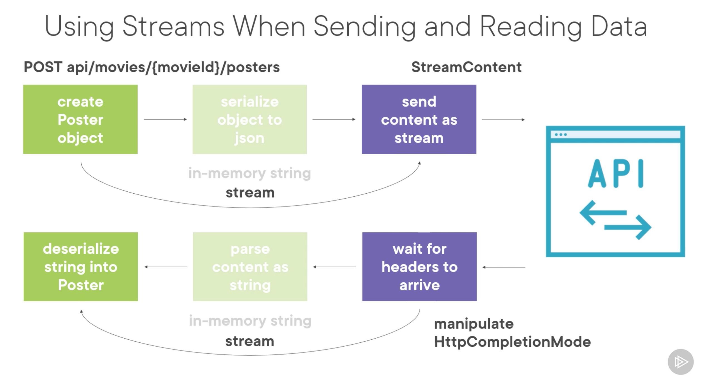

# 09 Utiliser les `stream` pour envoyer et lire les données




## Implémentation

```cs
private async Task PostAndReadPosterWithStream()
{
    // generate poster
    Random random = new();
    byte[] bytesGenerated = new byte[524288];
    random.NextBytes(bytesGenerated);
    PosterForCreation posterForCreation = new() {
        Name = "My new poster for The Big Lebowski",
        Bytes = bytesGenerated
    };
    
    // create stream for serialize
    MemoryStream memoryStream = new();
    memoryStream.SerializeToJsonAndWrite(posterForCreation); // Extension method cf 08-stream-post
    
    memoryStream.Seek(0, SeekOrigin.Begin);
    
    using HttpRequestMessage request = new(HttpMethod.Post, "api/movies/bb6a100a-053f-4bf8-b271-60ce3aae6eb5/posters");
    request.Headers.Accept.Add(new MediaTypeWithQualityHeaderValue("application/json"));
    
    using StreamContent streamContent = new(memoryStream);
    streamContent.Headers.ContentType = new MediaTypeHeaderValue("application/json");
    
    request.Content = streamContent;
    
    using HttpResponseMessage response = await _httpClient.SendAsync(request, HttpCompletionOption.ResponseHeadersRead);
    
    response.EnsureSuccessStatusCode();
    
    Stream stream = await response.Content.ReadAsStreamAsync();
    Poster poster = stream.ReadAndDeserializeFromJson<Poster>(); // Extension method
}
```


## Test de performance

Pour pouvoir comparer on va créer une méthode sans `stream` :

```cs
private async Task PostPosterWithoutStream()
{
    // generated poster
    Random random = new();
    byte[] bytesGenerated = new byte[523288];
    random.NextBytes(bytesGenerated);

    PosterForCreation posterForCreation = new() {
        Name = "Poster without stream The Big Lebowski",
        Bytes = bytesGenerated
    };

    using HttpRequestMessage request = new(HttpMethod.Post, "/api/movies/5b1c2b4d-48c7-402a-80c3-cc796ad49c6b/posters");
    request.Headers.Accept.Add(new MediaTypeWithQualityHeaderValue("application/json"));

    string posterSerialized = newtonsoft.JsonConvert.SerializeObject(posterForCreation);

    request.Content = new StringContent(posterSerialized);
    request.Content.Headers.ContentType = new MediaTypeHeaderValue("application/json");

    using HttpResponseMessage response = await _httpClient.SendAsync(request);
    string content = await response.Content.ReadAsStringAsync();

    Poster poster = newtonsoft.JsonConvert.DeserializeObject<Poster>(content);

}
```

On va comparer `4` méthode :

### `newtonsoft.Json`

- Sans aucun `stream` : `PostPosterWithoutStream`
- Avec `stream` en envoie et lecture sans `stream` : `PostPosterWithStream`
- Avec `stream` en envoie et en lecture : `PostAndReadPosterWithStream`

### `System.Text.Json`

- Avec `stream` en envoie et en lecture : `PostAndReadPosterWithStreamMicrosoftJson`


### Test

```cs
private async Task TestPostPoster(Func<Task> postPoster, string postPosterName, int numberOfRequest)
{
    // Warm up
    await postPoster();

    // Start Stopwatch
    Stopwatch stopwatch = Stopwatch.StartNew();

    // Do request
    for (int i = 0; i < numberOfRequest; i++)
    {
        await postPoster();
    }

    // Stop Stopwatch
    stopwatch.Stop();
    Console.WriteLine($"elapsed time average for {postPosterName}:\n \t\t{stopwatch.ElapsedMilliseconds / numberOfRequest}\n");
}
```

```cs
int numberOfRequest = 300;

for (int i = 0; i < 4; i++)
{
    await TestPostPoster(PostPosterWithoutStream, "no stream", numberOfRequest);

    await TestPostPoster(PostPosterWithStream, "stream for send", numberOfRequest);

    await TestPostPoster(PostAndReadPosterWithStream, "stream for send and read", numberOfRequest);

    await TestPostPoster(PostAndReadPosterWithStreamMicrosoftJson, "stream for send and read mcrsft", numberOfRequest);

    Console.WriteLine("- - - - -------------------------------- - - - -\n");
}
```

```
elapsed time average for no stream: 134

elapsed time average for stream for send: 123

elapsed time average for stream for send and read: 125

elapsed time average for stream for send and read mcrsft: 128

- - - - -------------------------------- - - - -

elapsed time average for no stream: 125

elapsed time average for stream for send: 126

elapsed time average for stream for send and read: 124

elapsed time average for stream for send and read mcrsft: 120

- - - - -------------------------------- - - - -
elapsed time average for no stream: 126

elapsed time average for stream for send: 127

elapsed time average for stream for send and read: 124

elapsed time average for stream for send and read mcrsft: 127

- - - - -------------------------------- - - - -
elapsed time average for no stream: 133

elapsed time average for stream for send: 128

elapsed time average for stream for send and read: 129

elapsed time average for stream for send and read mcrsft: 121

- - - - -------------------------------- - - - -
```

Pas de résultat vraiment significatif. Les scores les plus bas pour `System.Text.Json`.

## Analyse des résultats

Le `streaming` garantit que l'occupation mémoire restera basse et est censé améliorer aussi les performances.

Mais il ajoute un coût de création et de destruction (`disposing`).

Même si le bénéfice n'est pas flagrant, garder l'empreinte mémoire faible est toujours une bonne idée.

Une empreinte mémoire faible réduit le temps de passage du `garbage collector` ce qui a un impacte positif sur les performances.

Pour améliorer les performances, on peut aussi compresser nos données.


## Utiliser la compression

On doit utiliser un `HttpHandler` pour la décompression :

```cs
private static readonly HttpClient _httpClient = new(
	new HttpClientHandler() {
        AutomaticDecompression = System.Net.DecompressionMethods.GZip
    });
```


```cs
private async Task GetPosterWithGZipCompression()
{
    using HttpRequestMessage request = new(HttpMethod.Get, $"/api/movies/5b1c2b4d-48c7-402a-80c3-cc796ad49c6b/posters/{Guid.NewGuid()}");
    request.Headers.Accept.Add(new MediaTypeWithQualityHeaderValue("application/json"));
    // On accepte un nouvel encoding : gzip
	request.Headers.AcceptEncoding.Add(new StringWithQualityHeaderValue("gzip"));
    
    using HttpResponseMessage response = await _httpClient.SendAsync(request, HttpCompletionOption.ResponseHeadersRead);

    response.EnsureSuccessStatusCode();

    using Stream stream = await response.Content.ReadAsStreamAsync();

    Poster poster = JsonSerializer.Deserialize<Poster>(stream, new JsonSerializerOptions { 
        PropertyNamingPolicy = microsoft.JsonNamingPolicy.CamelCase
    });
}
```

