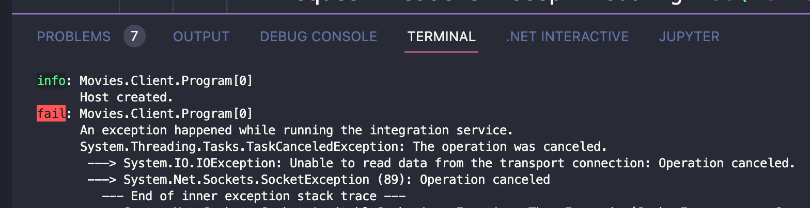
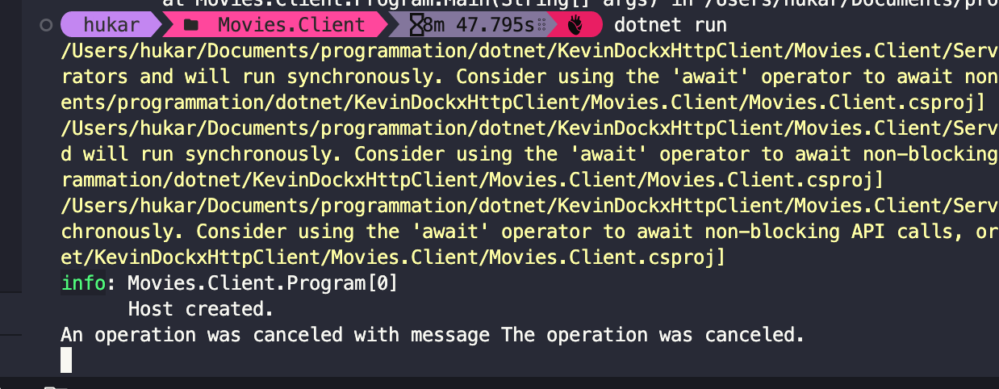
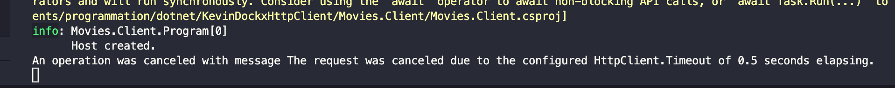

# 10 - `Cancellation Token` : annuler une requête

`HttpClient` est construit avec les `async Tasks`.

- Une `task` peut être annulée pour libérer le `thread` (vers le `thread pool`) l'hébergeant.
- La `Task` est annulée par nous.

Le `Timout` peut être gérer avec élégance.


## `CancellationTokenSource` et `CancellationToken`

`CancellationTokenSource` est un objet qui gère et envoie les notifications de `cancellation` individuellement  aux `CancellationTokens`.

Le `CancellationToken` est passé aux `Tasks` pour écouter les notifications du `CancellationTokenSource`.

Cela ne `cancel` pas automatiquement la `Task`, c'est au `HttpClient` d'écouter les notifications et d'annuler sa tâche (`cancel task`).


## Implémentation

On crée un objet `CancellationTokenSource`

```cs
CancellationTokenSource cancellationTokenSource = new();
```

Puis on passe un `Token` à l'envoie de la requête :

```cs
using HttpResponseMessage response = await _httpClient.SendAsync(
    request, 
    HttpCompletionOption.ResponseHeadersRead, 
    cancellationTokenSource.Token);
```

Deux méthodes nous permettent de déclencher la `cancellation` :

- `cancellationTokenSource.Cancel()` : annulation immédiate
- `cancellationTokenSource.CancelAfter(TimeSpan.FromSeconds(30))` après un certain délai de temps (en `millisecondes` ou un `TimeSpan`)

```cs
CancellationTokenSource cancellationTokenSource = new();
cancellationTokenSource.CancelAfter(1000); // 1 seconde

using HttpResponseMessage response = await _httpClient.SendAsync(
    request, 
    HttpCompletionOption.ResponseHeadersRead, 
    cancellationTokenSource.Token);
```



Après une seconde une `TaskCnacelledException` est levée.


## Place de l'initialisation de `CancellationTokenSource`

Dans un but de réutilisation, il est toujours bon de ne pas placer l'initialisation de `CancellationTokenSource` directement dans la méthode.

```cs
public class CancellationService : IIntegrationService
{
    private CancellationTokenSource _cancellationTokenSource = new();
```

```cs
public async Task Run()
{
    _cancellationTokenSource.CancelAfter(1000)
        await GetTrailerAndCancel(_cancellationTokenSource.Token);
}
```

```cs
private async Task GetTrailerAndCancel(CancellationToken cancellationToken)
{
    // ...
    using HttpResponseMessage response = await _httpClient.SendAsync(
        request, 
        HttpCompletionOption.ResponseHeadersRead, 
        cancellationToken);
```


## Gérer la `cancellation`

Il suffit d'encadrer l'appel à `SendAsync` dans un bloc `try & catch`.

```cs
private async Task GetTrailerAndCancel(CancellationToken cancellationToken)
{
   // ...

    try
    {
        using HttpResponseMessage response = await _httpClient.SendAsync(
            request, 
            HttpCompletionOption.ResponseHeadersRead, 
            cancellationToken);

        // ...
    }
    catch (OperationCanceledException ocException)
    {
        Console.WriteLine($"An operation was canceled with message {ocException.Message}");
        // Additional clean up
    }
}
```

On aurait pu aussi utiliser `TaskCanceledException` qui dérive de `OperationCanceledException`

```cs
public class TaskCanceledException : OperationCanceledException
```


## `Timeout`

Le `timeout` fonctionne comme un `cancellationToken` :

```cs
_httpClient.Timeout = TimeSpan.FromMilliseconds(500);
```

Dans les paramètres de la méthode on ne passe plus de `cancellationToken` :

```cs
private async Task GetTrailerWithTimeout()
{
    //...
    }
    catch (OperationCanceledException ocException)
    {
        Console.WriteLine($"An operation was canceled with message {ocException.Message}");
        // Additional clean up
    }
```




