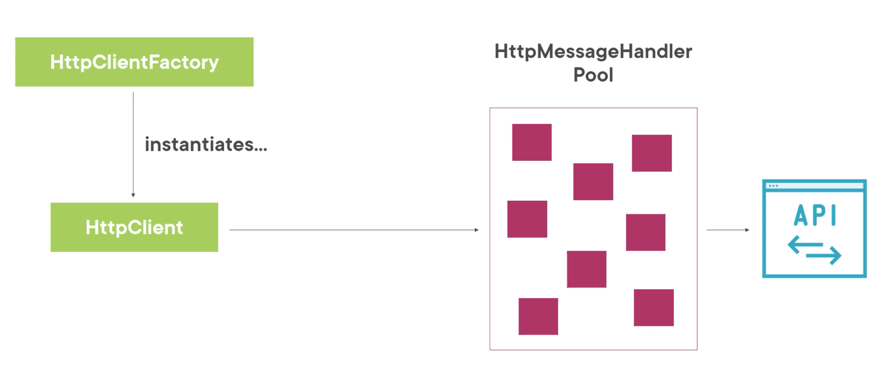

# `HttpClientFactory`

## Le problème de `Dispose` `HttpClient`

Quand on `Dispose` `HttpClient`, sous le capot `HttpClientHandler` est aussi `Disposed`, ce qui ferme la connexion sous-jacente.

- Réouvrir une connexion est **lent**
- Pendant le temps pris pour fermer la connexion, il n'y a peut-être plus de `socket` disponible pour une nouvelle connexion.

On pourrait penser qu'il suffit de rendre `HttpClient` `static` et de ne le `Disposed` pour résoudre le problème.

Mais quand on réutilise le `HttpClient`/`HttpClientHandler`, les changements `DNS` ne sont pas vues/honorés.

Une adresse `IP` nouvelle à pu être attribué à la même adresse (courant sur Azure), ou le `load balancer`a pû aiguiller vers une autre `IP`.


## Introduction à `HttpClientFactory`

`HttpClientFactory` va gérer ne interne tous ces problèmes : `Pool de connexion`,  `DNS`.



Un `HttpHandlerPool` a une durée de vie de 2mn par défaut. Pour une requête assez longue, il reste disponible.

Cette durée de vie permet d'éviter le problème de `DNS`.

On peut configurer `HttpMessageHandler` et les `Policies` depuis `HttpClientFactory`.


## Installer `HttpClientFactory`

On installe le package `Microsoft.Extensions.Http`

```bash
dotnet add package Microsoft.Extensions.Htpp
```

On ajoute dans `Program.cs` :

```cs
serviceCollection.AddHttpClient();
```


### Utilisation

```cs
public class HttpClientFactoryInstanceManagementService : IIntegrationService
{  
    private readonly CancellationTokenSource _cancellaTokenSource = new();
    private readonly IHttpClientFactory _httpClientFactory;
    private readonly JsonSerializerOptions _options;

    public HttpClientFactoryInstanceManagementService(
        IHttpClientFactory httpClientFactory)
    {
        _httpClientFactory = httpClientFactory 
            ?? throw new ArgumentNullException(nameof(httpClientFactory));
        _options = new() {
            PropertyNamingPolicy = JsonNamingPolicy.CamelCase
        };
    }
```

Notre méthode d'utilisation :

```cs
private async Task GetMoviesWithHttpClientFactory(CancellationToken cancellationToken)
{
    HttpClient httpClient = _httpClientFactory.CreateClient();

    using HttpRequestMessage request = new(
        HttpMethod.Get, 
        "https://localhost:5001/api/movies");
    request.Headers.Accept.Add(
        new MediaTypeWithQualityHeaderValue("application/json"));

    using HttpResponseMessage response = await httpClient.SendAsync(
        request,
        HttpCompletionOption.ResponseHeadersRead,
        cancellationToken);

    response.EnsureSuccessStatusCode();

    using Stream stream = await response.Content.ReadAsStreamAsync();

    List<Movie> movies = await JsonSerializer
        .DeserializeAsync<List<Movie>>(stream, _options);
}
```


## Utiliser les instances nommées

On peut donner un nom à son instance de `HttpClientFactory` ainsi que des configurations qui lui sont propres :

```cs
serviceCollection.AddHttpClient(
    "MoviesClient", 
    client => {
    client.BaseAddress = new Uri("https://localhost:5001");
    client.DefaultRequestHeaders.Clear();
    client.DefaultRequestHeaders.Accept
        .Add(new MediaTypeWithQualityHeaderValue("application/json"));
    client.Timeout = TimeSpan.FromSeconds(3);
});
```

Méthode d'utilisation :

```cs
private async Task GetMoviesWithNamedHttpClientFactory(CancellationToken cancellationToken)
{
    HttpClient httpClient = _httpClientFactory.CreateClient("MoviesClient");

    using HttpRequestMessage request = new(HttpMethod.Get, "api/movies");

    using HttpResponseMessage response = await httpClient.SendAsync(
        request,
        HttpCompletionOption.ResponseHeadersRead,
        cancellationToken);

    response.EnsureSuccessStatusCode();

    using Stream stream = await response.Content.ReadAsStreamAsync();

    List<Movie> movies = await JsonSerializer.DeserializeAsync<List<Movie>>(stream, _options);
}
```


## Configuration du `HttpClientHandler`

```cs
serviceCollection.AddHttpClient("MoviesClient", client => {
    // ...
}).ConfigurePrimaryHttpMessageHandler(handler => new HttpClientHandler {
	AutomaticDecompression = System.Net.DecompressionMethods.GZip});
```

On peut ajouter l'`encoding` `gzip` à la requête :

```cs
using HttpRequestMessage request = new(HttpMethod.Get, "api/movies");
request.Headers.AcceptEncoding.Add(new StringWithQualityHeaderValue("gzip"));
```


## Utiliser les instances typées

On crée une classe `MoviesClient`, le `HttpClient` est passé par injection de dépendance.

```cs
namespace Movies.Client;

public class MoviesClient
{
    public HttpClient Client { get; }
    public MoviesClient(HttpClient client)
    {
            Client = client;
        
    }
}
```

On ajoute notre service au conteneur dans `Program.cs`

```cs
serviceCollection.AddHttpClient<MoviesClient>();
```

On ajoute de la même façon qu'avec les instances nommées la configuration :

```cs
serviceCollection.AddHttpClient<MoviesClient>(client => 
{
    client.BaseAddress = new Uri("https://localhost:5001");
    client.DefaultRequestHeaders.Clear();
    client.DefaultRequestHeaders.Accept
        .Add(new MediaTypeWithQualityHeaderValue("application/json"));
    client.Timeout = TimeSpan.FromSeconds(3);
}).ConfigurePrimaryHttpMessageHandler(handler => new HttpClientHandler 
{
	AutomaticDecompression = System.Net.DecompressionMethods.GZip
});
```

On l'injecte maintenant dans le service souhaitant l'utiliser :

```cs
private readonly MoviesClient _moviesClient;

public HttpClientFactoryInstanceManagementService( MoviesClient moviesClient)
{
    _moviesClient = moviesClient 
        ?? throw new ArgumentNullException(nameof(moviesClient));
}
```

Et on l'utilise :

```cs
private async Task GetMoviesWithTypedHttpClientFactory(CancellationToken cancellationToken)
{
    // ...
    
    using HttpResponseMessage response = await _moviesClient.Client.SendAsync(
        request,
        HttpCompletionOption.ResponseHeadersRead,
        cancellationToken);
    // ...
```


### Mettre la configuration dans `MoviesClient`

On peut mettre toute la configuration dans la classe de notre `Client` :

```cs
public class MoviesClient
{
    public HttpClient Client { get; }
    public MoviesClient(HttpClient client)
    {
        Client = client;
        Client.BaseAddress = new Uri("https://localhost:5001");
        Client.DefaultRequestHeaders.Clear();
        Client.DefaultRequestHeaders.Accept
            .Add(new MediaTypeWithQualityHeaderValue("application/json"));
        Client.Timeout = TimeSpan.FromSeconds(3);
    }
}
```

Et simplifier l'ajout de service dans `Program.js`

```cs
serviceCollection.AddHttpClient<MoviesClient>().ConfigurePrimaryHttpMessageHandler(handler => new HttpClientHandler
{
    AutomaticDecompression = System.Net.DecompressionMethods.GZip
});
```


## Mettre les appels directement dans `MoviesClient`

```cs
public class MoviesClient
{
    private readonly HttpClient _client;
    private readonly JsonSerializerOptions _options;
    public MoviesClient(HttpClient client)
    {
        _client = client;
        _client.BaseAddress = new Uri("https://localhost:5001");
        _client.DefaultRequestHeaders.Clear();
        _client.DefaultRequestHeaders.Accept
            .Add(new MediaTypeWithQualityHeaderValue("application/json"));
        _client.Timeout = TimeSpan.FromSeconds(3);

        _options = new() {
            PropertyNamingPolicy = JsonNamingPolicy.CamelCase
        };
    }

    public async Task<List<Movie>> GetMovies(CancellationToken cancellationToken)
    {
        using HttpRequestMessage request = new(HttpMethod.Get, "api/movies");
        request.Headers.AcceptEncoding.Add(new StringWithQualityHeaderValue("gzip"));

        using HttpResponseMessage response = await _client.SendAsync(
            request,
            HttpCompletionOption.ResponseHeadersRead,
            cancellationToken);

        response.EnsureSuccessStatusCode();

        using Stream stream = await response.Content.ReadAsStreamAsync();

        return await JsonSerializer.DeserializeAsync<List<Movie>>(stream, _options);
    }
}
```

`HttpClient _client` devient alors un champs privé.

On utilise alors le `client` comme un `repository` :

```cs
List<Movie> movies = await _moviesClient.GetMovies(_cancellaTokenSource.Token);
```


