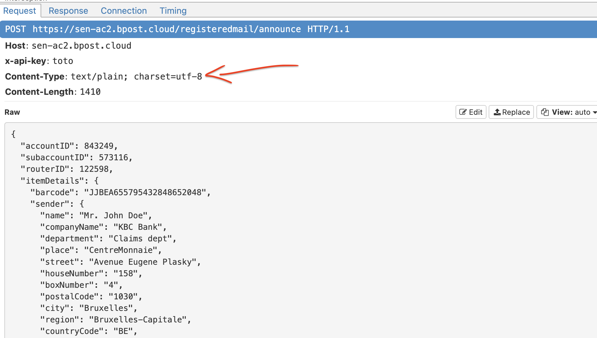
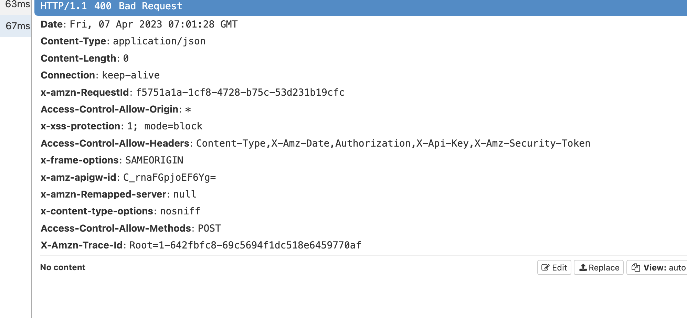
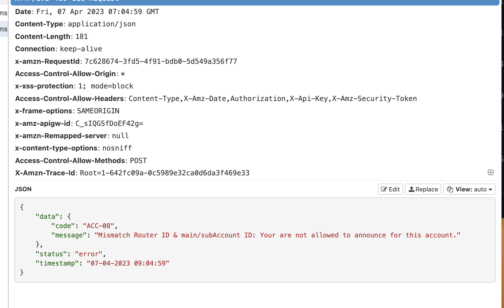

# AA.2 Bug avec `Bpost`

## Bug d'absence de contenu

Par défaut `request.Content` ajoute le `Header` : `Content-Type: text/plain`.

```cs
HttpRequestMessage request = new();

request.Content = new StringContent(json); // <- ici
request.Method = HttpMethod.Post;
request.RequestUri = new Uri("https://sen-ac2.bpost.cloud/registeredmail/announce");
// request.Content.Headers.ContentType = new MediaTypeHeaderValue("application/json");
request.Headers.TryAddWithoutValidation("x-api-key", "toto");

var response = await client.SendAsync(request);
var responseContent = await response.Content.ReadAsStringAsync();
```



Dans ce cas l'`API` de `BPost` ne renvoie pas de contenu:



Il faut modifier `Content-Type` au niveau de `requset.Content`:

```cs
HttpRequestMessage request = new();

request.Content = new StringContent(json);
request.Method = HttpMethod.Post;
request.RequestUri = new Uri("https://sen-ac2.bpost.cloud/registeredmail/announce");

request.Content.Headers.ContentType = new MediaTypeHeaderValue("application/json"); // <- ici

request.Headers.TryAddWithoutValidation("x-api-key", "toto");

var response = await client.SendAsync(request);
var responseContent = await response.Content.ReadAsStringAsync();
```

On a bien le bon `header`:


Et on reçoit bien le contenu `json`:



