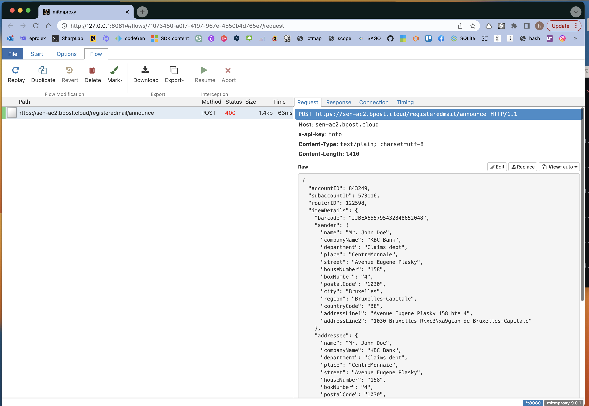

# BB `Mitm` et `Proxy`

Pour intercepter une requête `HttpClient` il faut un outil : `Mitm` et régler le `proxy` de `HttpClient`.


## Installation de `Mitm`

Avec `brew`:

```bash
brew install mitmproxy
```

Puis on le lance en ligne de commande (Version Browser):

```bash
mitmweb
```




## Le `Proxy` de `HttpClient`

Pour que cela focntionne et que les requêtes de `HttpClient` soient interceptées il faut maintenant régler le `proxy` dans l'application:

```cs
var proxy = new WebProxy
{
    Address = new Uri($"http://localhost:8080"),
    BypassProxyOnLocal = false,
    UseDefaultCredentials = false,
};

// Create a client handler that uses the proxy
var httpClientHandler = new HttpClientHandler
{
    Proxy = proxy,
};

// Disable SSL verification
httpClientHandler.ServerCertificateCustomValidationCallback = HttpClientHandler.DangerousAcceptAnyServerCertificateValidator;

// Finally, create the HTTP client object
var client = new HttpClient(handler: httpClientHandler, disposeHandler: true);
```

C'est `Mitm` qui spécifie (dans la doc) qu'il faut utiliser `http://localhost:8080`.

Pour que cela fonctionne il est important de `disable SSL`.