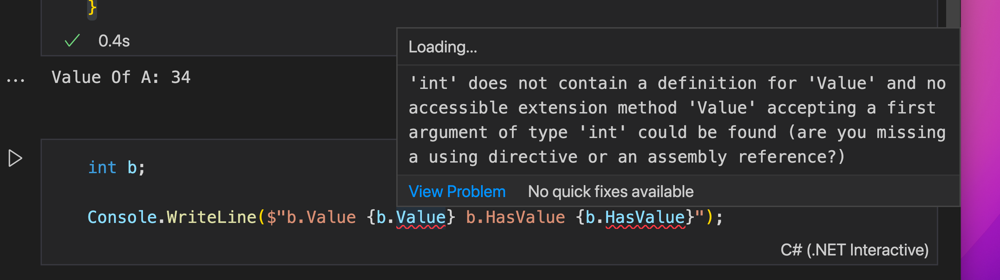
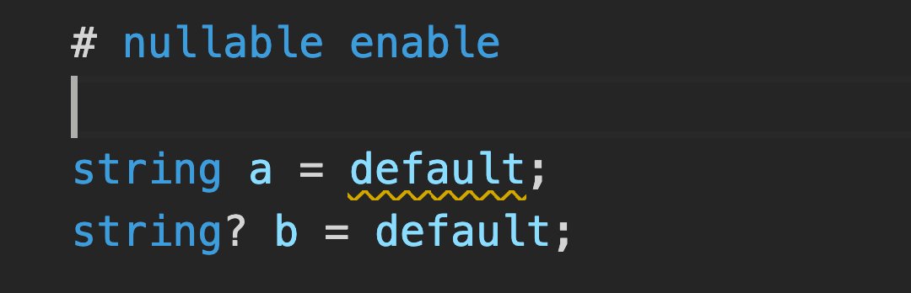

# 27 Value Type `Nullable`


## définition

Un `Type Nullable` peut avoir toutes les valeurs du type plus la valeur `null`.

C'est une instance de `System.Nullable<T>`.

Les notations `Nullable<T>` et `T?` Sont interchangeable.

```cs
Nullable<int> nb;

int? nb;
```


## Opérateur `is`

Test si un objet (une valeur) est d'un `type` et assigne sa valeur à une variable :

```cs
int? a = 34;

if(a is int valueOfA)
{
    Console.WriteLine($"Value Of A: {valueOfA}");
}
```

```
Value Of A: 34
```


## `Value` et `HasValue`



Si une variable n'est pas `nullable`, `Value` et `HasValue` ne sont pas définies.

```cs
int? b;

Console.WriteLine($"b.Value {b.Value} b.HasValue {b.HasValue}");
```

```
Error: System.InvalidOperationException: Nullable object must have a value.
```

```cs
int? b;

Console.WriteLine($"b.HasValue {b.HasValue}");
```

```
b.HasValue False
```

Donc si on ne veut pas d'`Exception` on doit écrire :

```cs
if(b.HasValue)
{
    DoSomething(b.Value);
}
```

On peut aussi utiliser :

```cs
b != null
    // ou
b is not null
```


## Assigné une valeur `nullable` à un `type non-nullable` : `??`

```cs
int? a;

int b = a ?? 8; // b vaut 8
```

 

## Calcul ou comparaison avec `null`

Lors d'une opération avec `null` on obtient `null` :

```cs
int? a;
int b = 4;

a = a + b;

Console.WriteLine(a is null);
```

```
True
```

Lors d'une comparaison avec `null` on obtient toujours `false` :

```cs
int? a;
int b = 4;

Console.WriteLine(a > b);
Console.WriteLine(a < b);
Console.WriteLine(a == b);
```

```
False
False
False
```


# Reference Type `Nullable`

## `myData!`

L'opérateur `!` Permet de dire au compilateur qu'une variable de type `T?` doit être considérée comme `non-null`.

Pour le compilateur une variable de type `T` et une autre de type `T?` sont représentées par le même type `T`.

Les types référence `Nullable` ne sont pas un nouveau `Type` mais plutôt une annotation sur le `Type` aidant le compilateur à déceller une erreur de référence `null`.

Au `runtime` il n'y a aucune différence entre `T` et `T?`.


## `default`



la valeur de `default` pour les `string` est `null`, il y a donc un `warning` pour un type `non-nullable`.

> Tous les types de valeurs déclarent implicitement un constructeur d'instance public sans paramètre appelé `constructeur par défaut`. Le `constructeur par défaut` renvoie une instance initialisée à zéro, appelée valeur par défaut pour le type de valeur :
>
> Pour tous les `simple_types`, la valeur par défaut est la valeur produite par un motif binaire (`bit pattern`) de tous à zéros :
> Pour `sbyte`, `byte`, `short`, `ushort`, `int`, `uint`, `long`, et `ulong`, la valeur par `default` est 0.
> Pour les `char`, la valeur par défaut est `'\x0000'`.
> Pour les `float`, la valeur par défaut est `0.0f`.
> Pour un `double`, la valeur par défaut est `0.0d`.
> Pour les `decimal`, la valeur par défaut est `0m` (c'est-à-dire la valeur zéro avec l'échelle `0`).
> Pour les `bool`, la valeur par défaut est `false`.
> Pour un `enum_type E`, la valeur par défaut est `0`, convertie au type `E`.
> Pour un `struct_type`, la valeur par défaut est la valeur produite en définissant tous les champs de type valeur à leur valeur par défaut et tous les champs de type référence à `null`.
> Pour un `nullable_value_type`, la valeur par défaut est une instance pour laquelle la propriété `HasValue` est fausse. La valeur par défaut est également connue comme la valeur `null` du **type de valeur nullable**. Toute tentative de lecture de la propriété `Value` d'une telle valeur entraîne l'apparition d'une `exception` de type `System.InvalidOperationException` 
>
> 
>
> https://docs.microsoft.com/en-us/dotnet/csharp/language-reference/language-specification/types#833-default-constructors