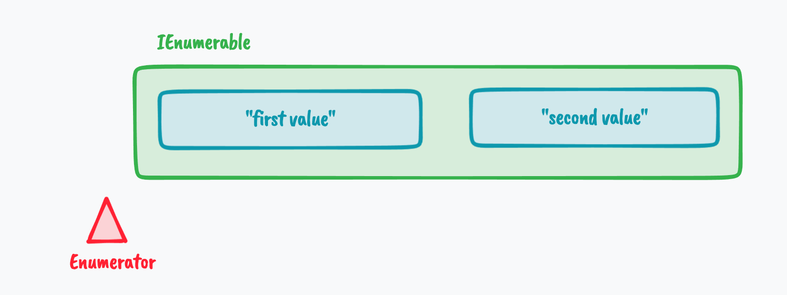
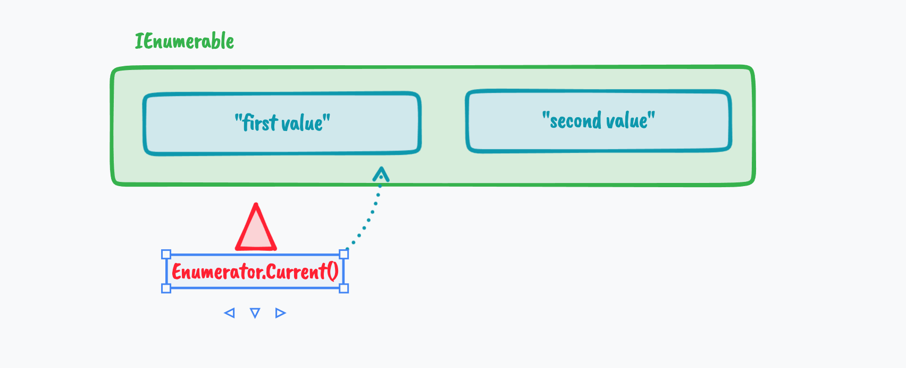

# 01 Les fondations de `Linq` : `Enumerable`


## `IEnumerable`

Cette `Interface` ne contient qu'une méthode `GetEnumerator`.


### `Enumerator`

Un `Enumerator` permet trois chose :

1. Obtenir la valeur à la position `Current` d'un `IEnumerable`
2. Aller à al prochaine position avec `MoveNext`
3. Revenir avant la première valeur avec `Reset`

Au début l'`Enumerator` est placé avant la première valeur :



Puis avec `MoveNext` on va déplacer l'`Enumerator` :


`Current` récupère la valeur où se trouve `Enumerator` :



`Reset` replace l'`Enumerator` comme dans le premier schéma.

```cs
IEnumerable<string> sentences = new List<string>() { "Value One", "Value Two" };

var sentencesEnumerator = sentences.GetEnumerator();

Console.WriteLine("1 " + sentencesEnumerator.Current);
sentencesEnumerator.MoveNext();
Console.WriteLine("2 " + sentencesEnumerator.Current);
sentencesEnumerator.MoveNext();
Console.WriteLine("3 " + sentencesEnumerator.Current);
sentencesEnumerator.MoveNext();
Console.WriteLine("4 " + sentencesEnumerator.Current);
sentencesEnumerator.Reset();
Console.WriteLine("5 " + sentencesEnumerator.Current);
```

```
1 
2 Value One
3 Value Two
4 
5 
```

Une fois que l'`Enumerator` est sortie des positions où se trouve les valeurs, il reste dehors et "ne bouge plus" (pas d'`exceptions` levées). `MoveNext` retourne `false`.


## Création d'un `IEnumerable ` avec `yield return`

```cs
IEnumerable<int> GenerateNumbers(int maximum)
{
    var random = new Random();

    foreach(var i in Enumerable.Range(1, 10))
    {
        yield return random.Next(maximum);
    }
}
```

```cs
var randomListOfNumbers = GenerateNumbers(12);

var listEnumerator = randomListOfNumbers.GetEnumerator();

listEnumerator.MoveNext();
Console.WriteLine($"random number : {listEnumerator.Current}");
listEnumerator.MoveNext();
Console.WriteLine($"random number : {listEnumerator.Current}");
listEnumerator.MoveNext();
Console.WriteLine($"random number : {listEnumerator.Current}");
listEnumerator.MoveNext();
Console.WriteLine($"random number : {listEnumerator.Current}");
```

```
random number : 5
random number : 10
random number : 10
random number : 11
```

