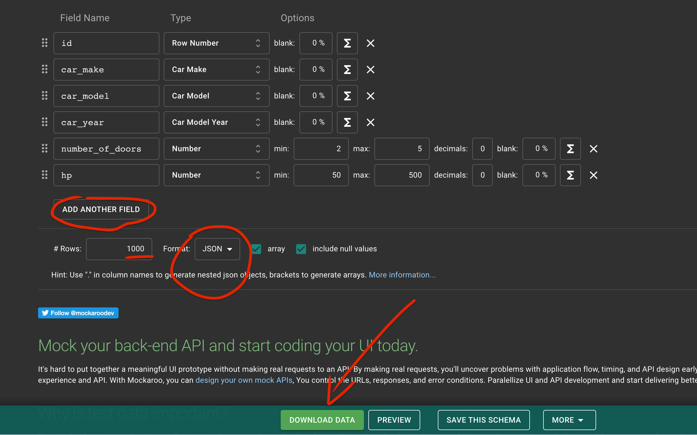
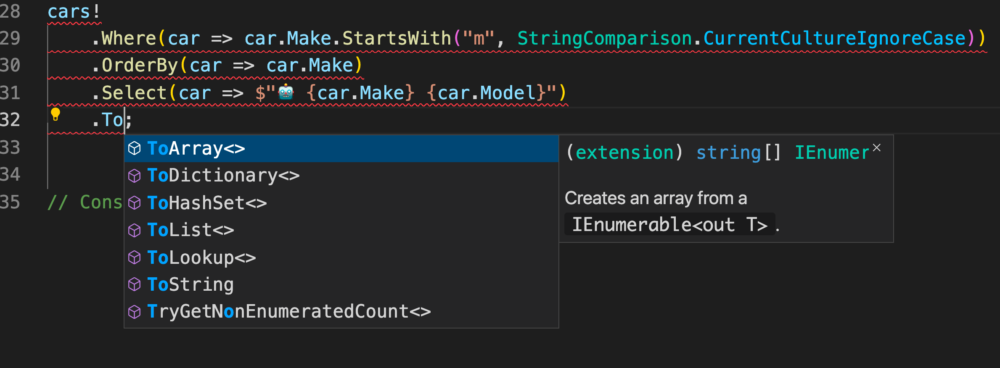

# 03 `Linq` un peu plus loin


## Générer des fausses données

On génére un fichier `json` grâce au site web `mockaroo` :

https://www.mockaroo.com/



```json
[{"id":1,"car_make":"Subaru","car_model":"Legacy","car_year":1989,"number_of_doors":4,"hp":248},
{"id":2,"car_make":"Hyundai","car_model":"XG350","car_year":2004,"number_of_doors":4,"hp":385},
 // ...
```


### Création de la classe `Car`

On utilise les `attribut` pour *mapper* notre classe au `json` :

```cs
using System.Text.Json.Serialization;

namespace LinqEFCoreStropek;

public class Car
{
    [JsonPropertyName("id")]
    public int Id { get; set; }
    [JsonPropertyName("car_make")]
    public string Make { get; set; } = string.Empty;
    [JsonPropertyName("car_model")]
    public string Model { get; set; } = string.Empty;
    [JsonPropertyName("car_year")]
    public int Year { get; set; }
    [JsonPropertyName("number_of_doors")]
    public int NumberOfDoors { get; set; }
    [JsonPropertyName("hp")]
    public int HorsePower { get; set; }
}
```

On va lire le fichier dans `Program.cs`

```cs
var fileContent = await File.ReadAllTextAsync("data.json");
var cars = JsonSerializer.Deserialize<Car[]>(fileContent);
```

Comme on utilise pas les `stream` on ne peut pas utiliser `DeserializeAsync`.

`fileContent` est de type `string`.


## Requêtes Les `cars` avec `4` portes ou plus 

```cs
// Cars with at least 4 doors
var carsWithAtLeastFourDoors =  cars!.Where(car => car.NumberOfDoors >= 4);

foreach(var car in carsWithAtLeastFourDoors)
{
    Console.WriteLine($"The car {car.Model} has {car.NumberOfDoors} doors");
}
```


## Plusieurs `Where`

On peut chaîner les `Where` il s'ajoute comme si on utilisait l'opérateur logique `AND`.

```cs
var carsWMWithAtLeastFourDoors = cars!
     .Where(car => car.NumberOfDoors >= 4)
     .Where(car => car.Make.Contains("m", StringComparison.CurrentCultureIgnoreCase))
     .Where(car => car.Make.Contains("w", StringComparison.CurrentCultureIgnoreCase));

foreach(var car in carsWMWithAtLeastFourDoors)
{
    Console.WriteLine($"The car {car.Make} {car.Model} has {car.NumberOfDoors} doors");
}
Console.WriteLine(carsWMWithAtLeastFourDoors.Count());
```

On pourrai tout écrire dans un seul `Where` mais c'est moins lisible.

De plus décomposer ainsi la requête donne la possibilité d'ajouter des conditions externe à certain `Where`.


## Projection avec `Select`

```cs
var carsStartWithM = cars!
    .Where(car => car.Make.StartsWith("m", StringComparison.CurrentCultureIgnoreCase))
    .OrderBy(car => car.Make)
    .Select(car => $"🤖 {car.Make} {car.Model}");
```

Ici avec la méthode `Select`, on récupère non plus un tableau de `Car`, mais un `IEnumerable<string>`.

On l'affiche donc comme ceci :

```cs
foreach(var carString in carsStartWithM)
{
    Console.WriteLine(carString);
}
```


## Transformation en `Collection` : `ToList`



`Linq` possède plusieurs méthode commençant par `To...` pour transformer un `IEnumerable` dans un type de `collection`.

En transformant le retour de la projection avec `Select` en `List<string>`, on peut utiliser les méthodes de `List<T>` : `ForEach` par exemple.

```cs
cars!
    .Where(car => car.Make.StartsWith("m", StringComparison.CurrentCultureIgnoreCase))
    .OrderBy(car => car.Make)
    .Select(car => $"🤖 {car.Make} {car.Model}")
    .ToList()
    .ForEach(car => Console.WriteLine(car));
```


## Séléctionner les `10` premiers : `Take`

On veut les `10` `cars` les plus puissantes :

```cs
cars!
    .OrderByDescending(car => car.HorsePower)
    .Select(car => $"🐴 {car.Make} {car.Model} {car.HorsePower}")
    .Take(10)
    .ToList()
    .ForEach(car => Console.WriteLine(car));
```

> ## `Max`
> `Max` va retourner la plus grande valeur d'une propriété pour tous les enregistrements.
>
> ```cs
> var maxCarHorsePower = cars!.Max(car => car.HorsePower);
> Console.WriteLine(maxCarHorsePower);
> ```
>
> ```
> 500
> ```
>
> 


