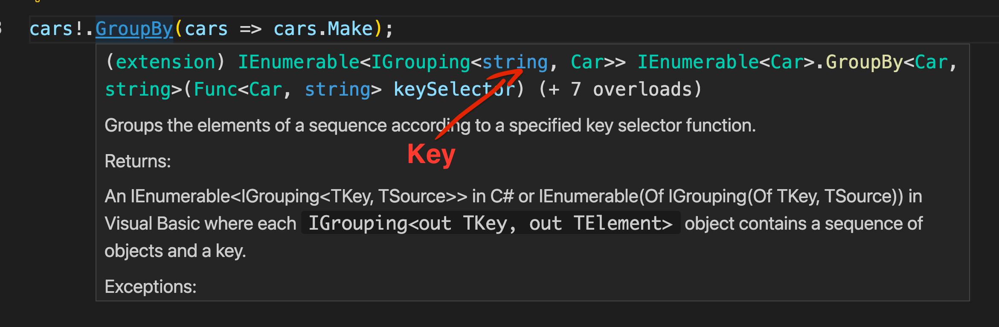
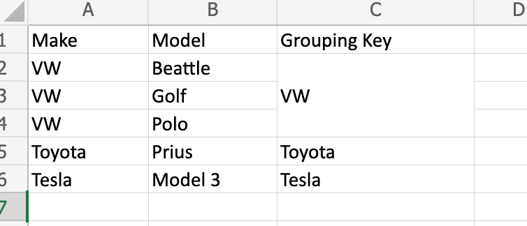
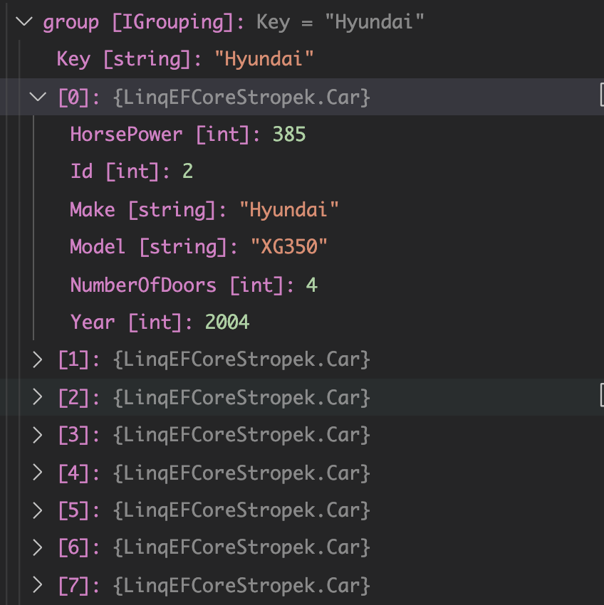
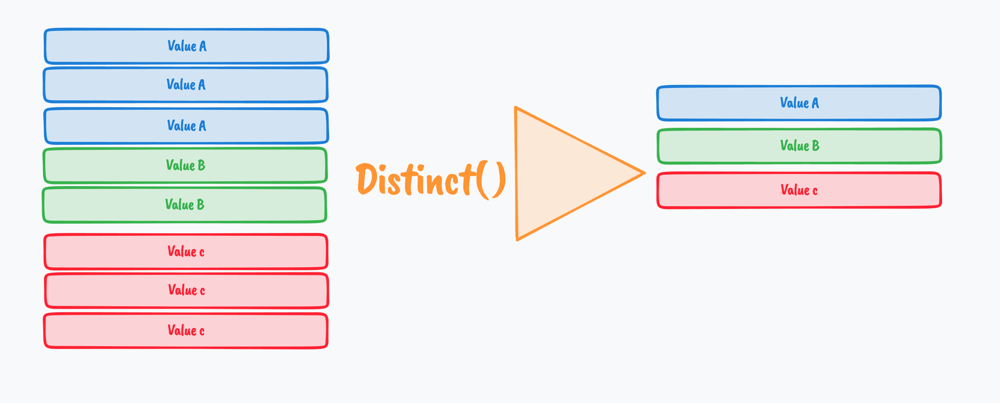

# 04 `Linq` avancé


## `GroupBy`

Si une requête nécéssite une liste par une propriété, il faut utiliser un `GroupBy`.

#### Afficher le nombre de `Models` par `Marque` apparu après `1995`

`GroupBy` va créer des `Grouping` contenant une `Key` et une collection d'object (ici `Car` ets le type de l'`IEnumerable` interne du `Grouping`) :





On a trois groupes avec chacun une `Group Key` :

```cs
var fileContent = await File.ReadAllTextAsync("data.json");
var cars = JsonSerializer.Deserialize<Car[]>(fileContent);

cars!.GroupBy(cars => cars.Make)
    .ToList()
    .ForEach(group => Console.WriteLine(group.Key));
```

```
Subaru
Hyundai
BMW
Toyota
Cadillac
Mazda
Saab
Ford
...
```


### `Count`

Maintenant qu'on a les `Groups`, on veut compter le nombre d'éléments  par `Group` :

```cs
cars!.GroupBy(cars => cars.Make)
    .Select(group => new { group.Key, NumberOfModels = group.Count() })
    .ToList()
    .ForEach(group => Console.WriteLine($"{group.Key} : {group.NumberOfModels}"));
```

```
Subaru : 17
Hyundai : 19
BMW : 40
Toyota : 76
Cadillac : 16
Mazda : 44
...
```

On peut ajouter une méthode `Where` avant le `GroupBy` :

```cs
cars!.Where(car => car.Year >= 1995)
    .GroupBy(cars => cars.Make)
    .Select(group => new { group.Key, NumberOfModels = group.Count() })
    .ToList()
    .ForEach(group => Console.WriteLine($"{group.Key} : {group.NumberOfModels}"));
```

On a pas le nombre de `Model` car il peut y avoir des doublons pour un même `Model` :

```json
{"id":122,"car_make":"Mitsubishi","car_model":"Lancer Evolution","car_year":2010,"number_of_doors":4,"hp":220},
// ...
{"id":315,"car_make":"Mitsubishi","car_model":"Lancer Evolution","car_year":2005,"number_of_doors":5,"hp":306},
```


### Code corrigé

```cs
cars!.Where(car => car.Year >= 1995)
    .GroupBy(cars => cars.Make)
    .Select(group => new { 
        group.Key, 
        ListOfModels = group.GroupBy(c => c.Model).Select(innerGroup => innerGroup.Key).ToList(), 
        CountOfModels =  group.GroupBy(c => c.Model).Count()
    })
    .ToList()
    .ForEach(group => {
        Console.WriteLine($"{group.Key} : {group.CountOfModels}");
        // group.ListOfModels.ForEach(model => Console.WriteLine($"- {model}"));
    });
```

```
Hyundai : 10
BMW : 19
Toyota : 25
Cadillac : 11
Saab : 2
Ford : 29
...
```



Chaque `Group` est composé d'une `Key` ainsi que de la collection (`IEnumerable`) de `Car` associées.

Comme un `Grouping` implémente `IEnumerable`, on peut lui appliquer les méthodes de `Linq`.


## Le nombre de toutes les `cars` d'après `2008` par `Make` même si c'est zéro

```cs
cars!
    .GroupBy(cars => cars.Make)
    .Select(groupByMake => new { groupByMake.Key, NumberOfCars = groupByMake.Where(car => car.Year >= 2008).Count() })
    .ToList()
    .ForEach(group => Console.WriteLine($"{group.Key} :{group.NumberOfCars}"));
```

```
Toyota :26
Cadillac :8
Mazda :8
Saab :0
Ford :19
GMC :14
```

On applique un `Where` et un `Count` sur le `Group` créer par le `GroupBy`.

### Raccourci d'écriture `Count(<Filter>)`

On peut mettre la `lambda` de `Where` directement dans le `Count` et supprimer le `Where` :

```cs
.Select(groupByMake => new { groupByMake.Key, NumberOfCars = groupByMake.Count(car => car.Year >= 2008) })
```


## Afficher la liste des marques (`Make`) qui ont au moins deux voitures de plus de 400 chevaux (`HorsePower`)

```cs
cars.Where(car => car.HorsePower >= 400)
    .GroupBy(car => car.Make)
    .Select(group => new {group.Key, NbCars = group.Count()})
    .Where(group => group.NbCars >= 2)
    .ToList()
    .ForEach(group => Console.WriteLine($"{group.Key} : {group.NbCars}"));
```

On peut utiliser deux `Where` un sur le tableau de `Car` et un autre sur le `IEnumerable<Grouping>`.

Le deuxième `Where` en `SQL` se nommerai `HAVING` car il est après un `GroupBy`.


## Afficher la moyenne des chevaux (`HorsePower`) par marques (`Make`) : `Average`

```cs
cars!.GroupBy(car => car.Make)
    .Select(group => new {
        Make = group.Key, 
        NumberOfCars = group.Count(), 
        HorsePowerAverage = group.Average(car => car.HorsePower)
    })
    .ToList()
    .ForEach(group => Console.WriteLine($"{group.Make} : average {group.HorsePowerAverage}, count {group.NumberOfCars}"));
```


## Combien de marques (`Make`) ont construit des voitures avec les chevaux (`HorsePower`) entre `[0..100]`, `[101..200]`, `[201..300]`, `[301..400]`, `[401..500]` : `switch`

```cs
cars!.GroupBy(car => car.HorsePower switch 
    {
        <= 100 => "0..100",
        <= 200 => "101..200",
        <= 300 => "201..300",
        <= 400 => "301..400",
        _ => "401..500"

    })
    .Select(group => new {HorsePowerRange = group.Key, NumberOfMakes = group.GroupBy(car => car.Make).Count()})
    .ToList()
    .ForEach(group => Console.WriteLine($"{group.HorsePowerRange} : {group.NumberOfMakes}"));
```

```
201..300 : 49
301..400 : 45
401..500 : 48
101..200 : 44
0..100 : 40
```

On peut faire un `GroupBy` par catégories grâce à `switch expression` (par contraste avec `switch statement`).


### Utilisation de `Distinct`

On peut éviter le deuxième `GroupBy` en utilisant `Distinct` :

```cs
.Select(group => new {
    HorsePowerRange = group.Key, 
    NumberOfMakes = group.Select(car => car.Make).Distinct().Count()
})
```



`Distinct` fusionne les doublons.


