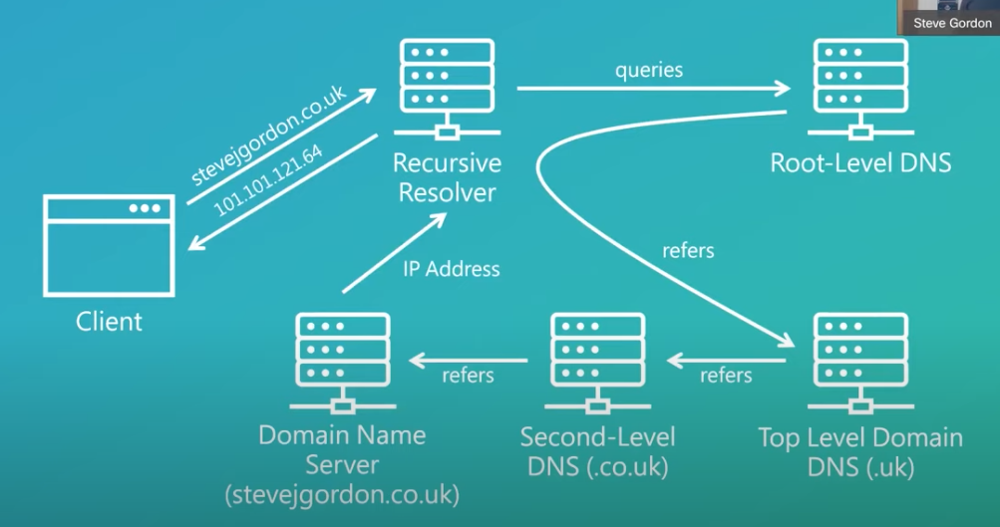
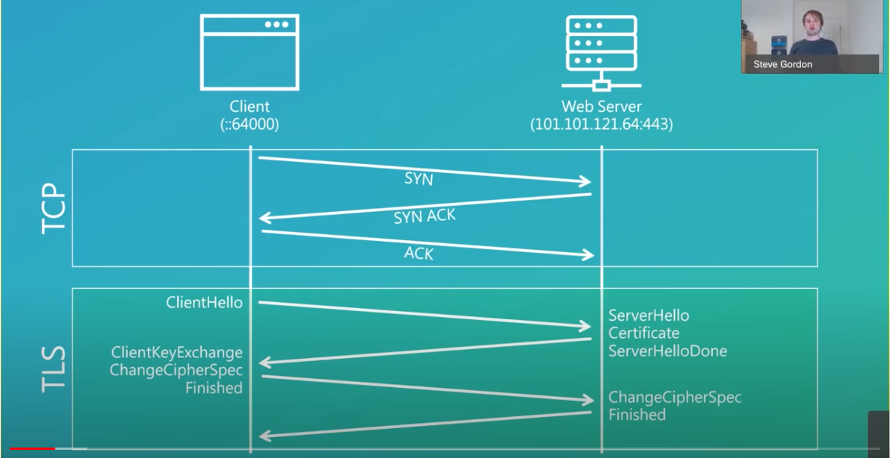
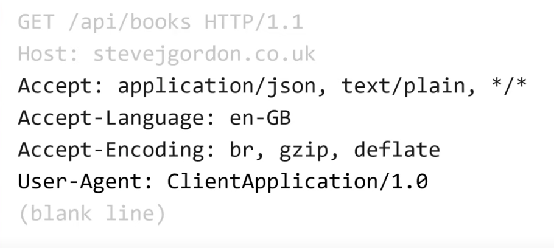
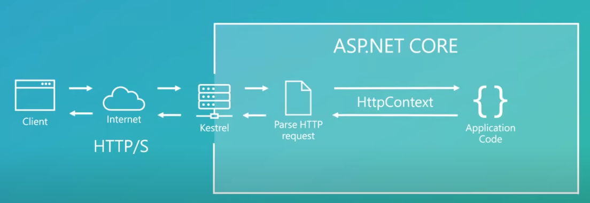
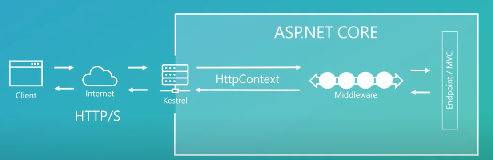
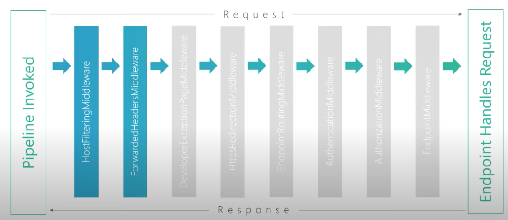
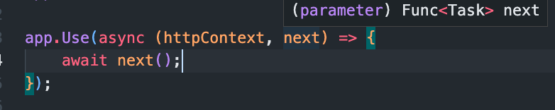
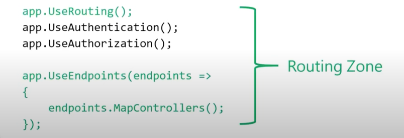
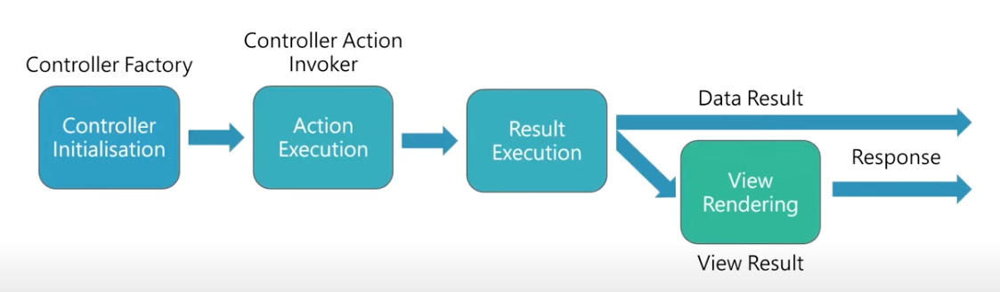
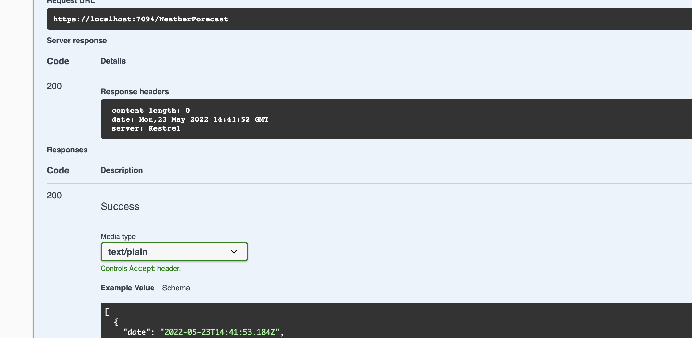

# Anatomie des `Request` dans `.net`


## 1. Serveurs `DNS`



On récupère ainsi l'`IP` du serveur web.


## Connexion `HTTPS`




## Requête `HTTP`

Simplement du texte `ASCII`.




## `Kestrel`

Serveur `web` créé par l'équipe `asp.net`.

L'application web n'est rien d'autre qu'une application console.

`Kestrel` héberge cette application et écoute et lui communique les requête entrantes.


Le pipeline de `middleware` de `Kestrel` est similaire à celui de `asp.net`.


## `HttpContext`

Le premier boulot de `Kestrel`, est de parser la requête `HTTP`.

Il transforme les données parsées en une représentation objet : `HttpContext` qu'il transmet au code de l'application `asp.net`, c'est le contrat entre `Kestrel` et `asp.net`.




## `Middleware`

Les `middleware` sont une série de composant ayant accès à la `requête` en entrée et à la `réponse` en sortie

C'est l'endroit pour gérer les préoccupations transversales (`cross-cutting concerns`).

Le bout étant la partie `endpoint/mvc`.




### `Middleware` Pipeline

```cs
// Configure the HTTP request pipeline.
if (app.Environment.IsDevelopment())
{
    app.UseSwagger();
    app.UseSwaggerUI();
}

app.UseHttpsRedirection();

app.UseAuthentication();
app.UseAuthorization();

app.MapControllers();

app.Run();
```


## `HostFilteringMiddleware` et `ForwardedHeadersMiddleware`



Les deux premiers `middleware` ne sont pas explicitement mentionné dans `Program.cs`.

Il sont accessible via une `interface` mais sont arbitrairement placés avant tous les autres `middleware`.

`HostFilteringMiddleware` sert à filtrer les requêtes suivant les `Hosts` avec une liste de `Hosts` autorisés (`allowed`).

`ForwardedHeadersMiddleware` utiliser pour les reverse proxy et les load balancer (`nginx`).


## Création  d'un `middleware`

C'est simplement une `Lambda` (une fonction) ayant accès au `context` et à la fonction `next` pour appeler le prochain `middleware` du pipeline



Exemple d'un `middleware` enregistrant le temps d'exécution du `endpoint` :

```cs
app.Use(async (httpContext, next) => {
    var sw = Stopwatch.StartNew();
    await next();
    sw.Stop();
    
    var recorder = httpContext.RequestServices.GetRequiredService<IMetricRecored>();
    recorder.RecordRequest(httpContext.Response.StatusCode, sw.ElapsedMilliseconds);
});
```

L'accès au `ServiceProvider` est un peu tarabiscoté.

Pour tout `middleware` un peu complex, le mieux est d'utiliser une classe :

```cs
public class MetricMiddleware
{
    private readonly RequestDelegate _next;
    private readonly IMetricRecorder _metricRecorder;
    
    public MetricMiddleware(RequestDelegate next, IMetricRecorder metricRecorder)
    {
        _next = next;
        _metricRecorder = metricRecorder;
    }
    
    public async Task InvokeAsync(HttpContext context)
    {
        var stopWatch = Stopwatch.StartNew();
        await _next(context);
        stopWatch.Stop();
        _metricRecorder.RecordRequest(context.Response.statusCode, stopWatch.ElapsedMilliseconds);
    }
}
```

On utilise maintenant `UseMiddleware<TMiddleware>` pour ajouter notre `CustomMiddleware` :

```cs
app.UseMiddleware<MettricMiddleware>();
```


### Cleaner un peu plus : `Méthode d'extension`

On peut utiliser les `méthodes d'extension` pour *cleaner* un peu plus le code :

```cs
public static class MetricMiddlewareExtensions
{
    public static IApplicationBuilder UseMetrics(this IApplicationBuilder builder)
    {
        return builder.UseMiddleware<MetricMiddleware>();
    }
}
```

```cs
app.UseMetrics();
```


## `Endpoint Routing`

À partir de `.Net 3`, le `Routing` a été séparé de la partie `MVC` et mis dans son propre `middleware`.

> ### `.NET 6`
>
> Dans `Program.cs` on ne trouve plus d'appel explicite à`UseRouting` :
>
> #### Doc Microsoft
>
>  Les applications n'ont généralement pas besoin d'appeler `UseRouting` ou `UseEndpoints`. `WebApplicationBuilder` configure un pipeline de `middleware` qui enveloppe le `middleware` ajouté dans `Program.cs` avec `UseRouting` et `UseEndpoints`. Toutefois, les applications peuvent modifier l'ordre d'exécution de `UseRouting` et `UseEndpoints` en appelant ces méthodes explicitement. 
>
> 


```cs
app.UseRouting();

app.UseAuthentication();
app.UseAuthorization();

app.UseEndpoint(endpoint => {
    endpoint.MapControllers();
});
```

`UseRouting` permet de déterminer quel `endpoint` va être appelé.

`UseEndpoint` sert à invoquer le bon `endpoint` (déterminé par `UseRouting`).



`UseAuthorization` n'existait pas comme `middleware` avant `.net 3` car il faisait partie de `mvc`.

Les `middleware` de la `Routing Zone`  on ainsi accès à la route ainsi qu'au nom du `endpoint` désigné (action, méthode).

L'`AuthorizationMiddleware` peut alors déterminer si cet `endpoint` peut être accéder ou déjà renvoyer une requête non-autorisé (`Challenge Response`).


## EndpointInfoMiddleware

```cs
public class EndpointInfoMiddleware
{
    private readonly RequestDelegate _next;
    public EndpointInfoMiddleware(RequestDelegate next)
    {
            _next = next;
        
    }
    
    public async Task InvokeAsync(HttpContext context)
    {
        var endpoint = context.GetEndpoint();
        
        switch(endpoint)
        {
            case RouteEndpoint routeEndpoint:
                Console.WriteLine($"Endpoint name : {routeEndpoint.DisplayName}");
                Console.WriteLine($"Route pattern : {routeEndpoint.RoutePattern}");
                
                foreach(var type in routeEndpoint.Metadata.select(md => md.GetType()))
                {
                    Console.WriteLine($"type : {type}")
                }
                break;
            case null:
                Console.WriteLine("Endpoint is null");
                break;
        }
        
        await _next(context);
    }
}
```

```cs
app.UseMiddleware<EndpointInfoMiddleware>();

app.UseRouting();

app.UseMiddleware<EndpointInfoMiddleware>();
```

```bash
Endpoint is null

Endpoint name : ApiForUnderTheHood.Controllers.WeatherForecastController.Get (ApiForUnderTheHood)
Route pattern : Microsoft.AspNetCore.Routing.Patterns.RoutePattern
type : System.Runtime.CompilerServices.NullableContextAttribute
type : System.Runtime.CompilerServices.NullableAttribute
type : Microsoft.AspNetCore.Mvc.ApiControllerAttribute
type : Microsoft.AspNetCore.Mvc.ControllerAttribute
// ...
```

On voit que le `middleware` appelé avant `UseRouting` n'a pas d'information sur le `endpoint` disponible.

Si on enlève `UseRouting`, par défaut il faut considérer les `middlewares` ajouté dans `Program.cs` comme *wrappé* entre `UseRouting` et `UseEndpoints`.


## `MVC`



`MVC` est une `state machine ` qui passe par différents états en même temps que la requête avance elle aussi d'état en état.


## MVC `Filter` Pipeline

Les `Filter` sont des `middleware` spécifique au `endpoint`.

Les filtres peuvent court-circuiter le `Filter Pipelene`

### `Authorization Filter`

La première chose par lequel passe la requête est le `Authorization Filter`.

Il est conseillé de na pas y touché et d'utiliser plutôt les `Policy` à l'intérieur du `middleware `: `UseAuthorization`.

Normalement les fonctionnalité haut niveau mettent en route et exécutent ces `AuthorizationFilter` pour nous (ou les désactivent).


### `Resource Filter`

Maintenant qu'il est possible de connaître le `endpoint` dans un `middleware`, il n'est peut être pas nécessaire d'utiliser ce `Filter`.


## Créer un `Resource filter`

```cs
public class CustomFilterAttribute : Attribute, IResourceFilter
{
    public void OnResourceExecuted(ResourceExecutedContext context)
    {
        Console.WriteLine("Executed");
    }

    public void OnResourceExecuting(ResourceExecutingContext context)
    {
        Console.WriteLine("Executing");
    }
}
```

Le `ResourceExecutingContext` contient le `ModelState` avec la validation du `Model`.

```cs
[ApiController]
[CustomFilter]
[Route("[controller]")]
public class WeatherForecastController : ControllerBase
{
    // ...
```

On peut mettre le filtre sur seulement une `action` aussi.

La méthode `OnResourceExecuting` permet de court-circuiter le traitement dans l'`Action`.

```cs
public void OnResourceExecuting(ResourceExecutingContext context)
{
    var ctx = context;
    Console.WriteLine("Executing");
    context.Result = new OkResult();
}
```




## `Model Binding`

C'est le procédé utilisé pour faire correspondre les données entrantes à des types et des objets dans le `Controller`.

