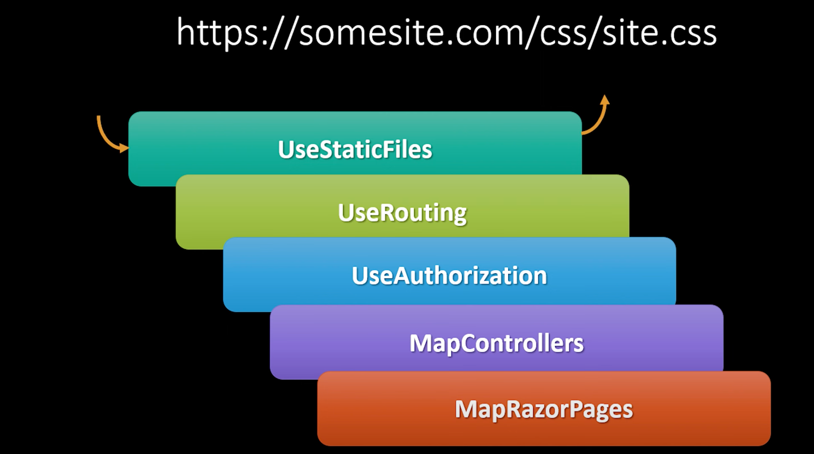
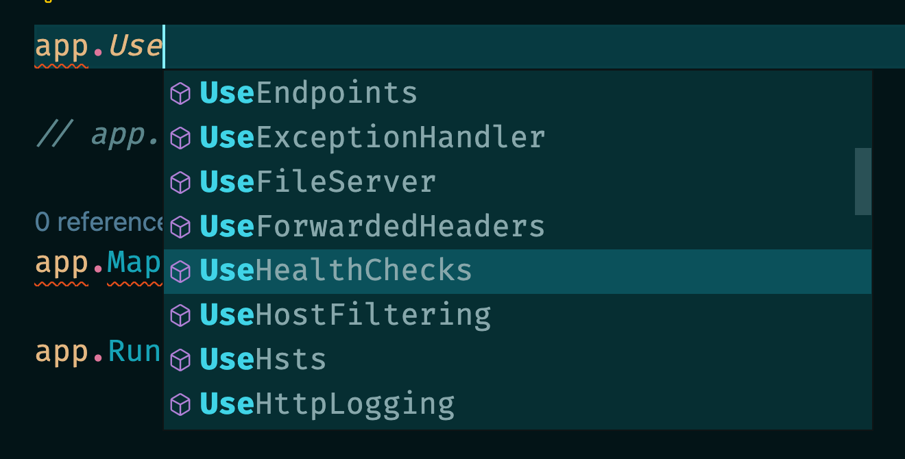
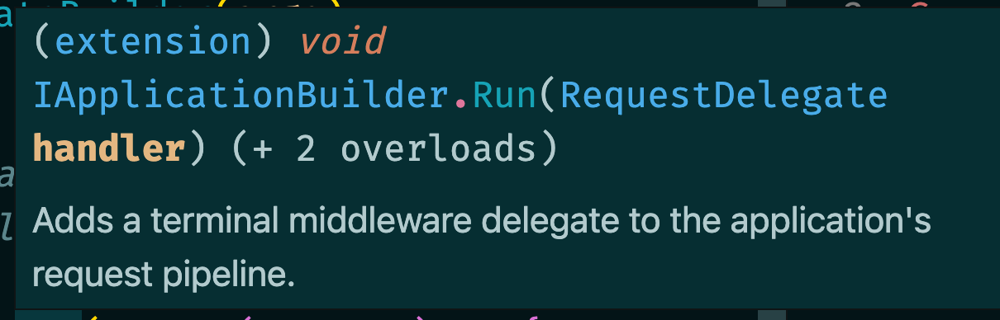
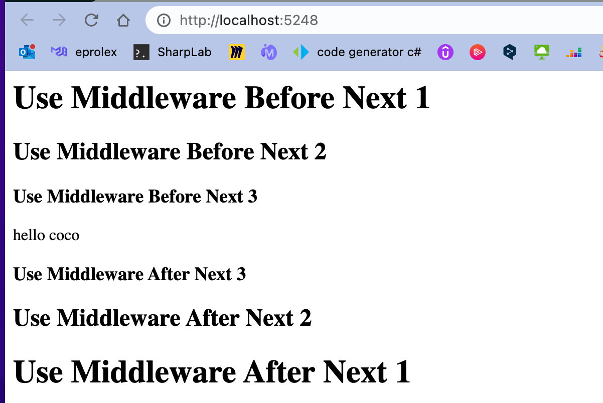
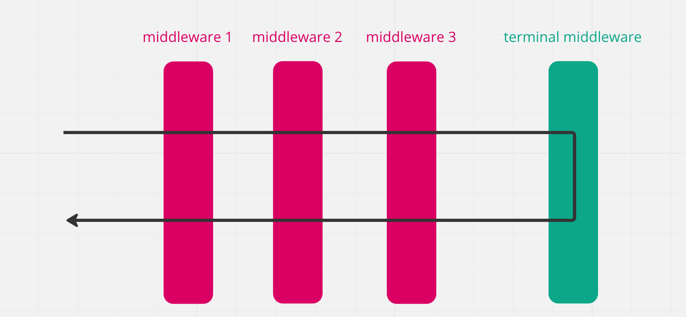
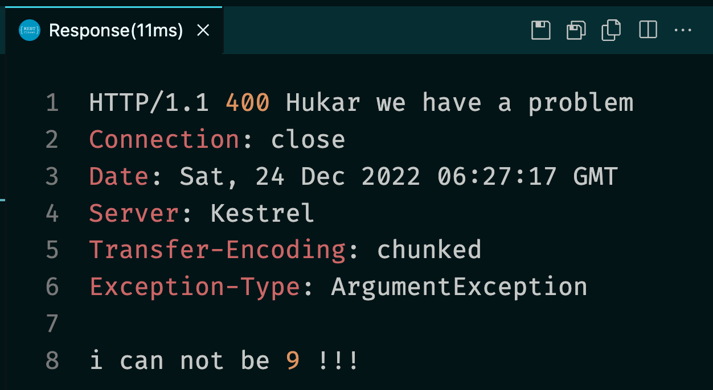

# 30.5 `Middleware`


## Le `pipeline` de `middlewares`

La requête traverse un en entrant et en sortant un `pipeline` constitué de différents `middlewares`.


Les `middlewares` sont enregistrés dans `Program.cs`, l'ordre est important, il correspond à qui va intercepter la requête avant l'autre.


Chaque `middleware` a une méthode `Invoke` (appelée par `asp.net`) et une méthode `Next()` pour passer au `middleware` suivant. Le dernier `middleware` (en fait `Invoke` appelle alors notre application (notre `Endpoint` ou notre `Controller`)) n'a pas de méthode `Next` mais renvoie la `response` dans le `pipeline`.



Les `middlewares` n'ont pas connaissances des autres `middlewares`, soit ils peuvent répondre soit ils passent la requête (`httpContext`) au suivant (`next`).

Il n'y a aucune garantie qu'un `middleware` soit appelé (sauf s'il est le premier du `pipeline`).

L'ordre des `middlewares` est donc très important.


## `Middlewares` fournies par `asp.net` : `UseSomething`



`WebApplication` ajoute un certain de nombre de `middleware` par défaut :

```cs
if (isDevelopment)
{
    app.UseDeveloperExceptionPage();
}

app.UseRouting();

if (isAuthenticationConfigured)
{
    app.UseAuthentication();
}

if (isAuthorizationConfigured)
{
    app.UseAuthorization();
}

// user middleware/endpoints
app.CustomMiddleware(...);
app.MapGet("/", () => "hello world");
// end user middleware/endpoints

app.UseEndpoints(e => {});
```


## Terminal `Middleware`

Certain `middleware` sont terminaux, c'est à dire que si les conditions de son utilisation sont établies, il n'a pas besoin d'appeler `Next` et retourne directement.

`UseStaticFiles` est un exemple de `middleware` terminal, s'il a bien le fichier demandé, il n'a pas besoin d'aller plus loin dans le `Pipeline`.

Pour `Court-Circuiter` le `pipeline`, il suffit qu'un `middleware` n'appelle pas `Next`.


## Custom `Middleware`

Les prérequis pour construire son propre `middleware` :

- Le constructuer a un argument `RequestDelegate`
- Un méthode `public` nommée `Invoke` ou `InvokeAsync`
  - le premier argument doit être `HttpContext`
  - Elle doit retourner une `Task`
  - Des arguments en plus peuvent être injéctés

Une classe `middleware` n'a qu'une seule instance de créée pour la durée de vie de l'application.

C'est un `singleton`, il ne faut pas lui donner un `state`, juste appeler des méthodes.


## Un `terminal middleware` dans la méthode `Run`



```cs
app.Run(async (context) => {
    await context.Response.WriteAsync("hello coco");
});

app.Run();
```

L'application exécute toujours la même fonction `RequestDelegate` quelque soit la requête.

Il faut un deuxième `app.Run()` pour lancer l'application.

> ! `Run(DelegateRequest handler)` ajoute un `terminal middleware` au `request pipeline` de l'application, c'est une méthode d'extension.
>
> `Run(string? url)` est une méthode directe de la classe `WebApplication`, elle fait tourner l'application, bloque la `Thread` appelante jusqu'à ce que l'`host` s'éteigne (?), en gros elle fait tournber l'`app`.


## `Terminal middleware` avec la méthode `Use`

```cs
// middlewares before

app.Use((HttpContext ctx, Func<Task> next) => {
    app.Logger.LogCritical("Terminating process");
    return Task.CompletedTask;
});

// middlewares after
```

Il faut préciser les types des argument (sinon la lambda est ambigu pour le compilateur).

Tous les `middlewares` après ce `terminal middleware` sont


## Un `custom middleware` avec la méthode `Use`

```cs
app.Use(async (context, next) => {
    await context.Response.WriteAsync("<h1>Use Middleware Before Next 1</H1>");
    await next();
    await context.Response.WriteAsync("<h1>Use Middleware After Next 1</h1>");
});
app.Use(async (context, next) => {
    await context.Response.WriteAsync("<h2>Use Middleware Before Next 2</H2>");
    await next();
    await context.Response.WriteAsync("<h2>Use Middleware After Next 2</h2>");
});
app.Use(async (context, next) => {
    await context.Response.WriteAsync("<h3>Use Middleware Before Next 3</H3>");
    await next();
    await context.Response.WriteAsync("<h3>Use Middleware After Next 3</h3>");
});

app.Run(async (context) => {
    await context.Response.WriteAsync("hello coco");
});

app.Run();
```






## `Middleware` de `Logging`

```cs
app.Use(async (ctx, next) => {
    var start = DateTime.UtcNow;

    await next(ctx);

    app.Logger.LogInformation($"{ctx.Request.Path}: {(DateTime.UtcNow - start).TotalMilliseconds}ms ");
});
```

```
info: Scratchpad[0]
      /11: 4,46ms 
info: Scratchpad[0]
      /11: 0,727ms 
info: Scratchpad[0]
      /hello: 0,246ms 
```

L'objet `HttpContext ctx` contient toutes les infos utiles de la requête (`ctx.Request`) et de la réponse (`ctx.Response`).

la `WebApplication app` contient elle un accès direct au service `Logger`.


## `Custom Middleware` dans une `class` séparée :

### `Exception Handling`

On veut centraliser les `exception` de l'application pour uniformiser la réponse de l'`api`.

Pour ne pas surcharger `Program.cs` de logique, on va créer notre `middleware` dans un fichier séparé et non plus avec `Run` ou `Use`.

Cette classe n'hérite ou n'implémente rien de particulier, mais elle a des prérequis.

Ce `middleware` doit être enregistré en tout premier si on veut intercepter toutes les `exception` possible des autres `middleware`.

`ExceptionHandlingMiddleware`

```cs
public class ExceptionHandlingMiddleware
{
    private readonly RequestDelegate _next;
    public ExceptionHandlingMiddleware(RequestDelegate next)
    {
            _next = next;  
    }

    public async Task InvokeAsync(HttpContext httpContext)
    {
        try
        {
            await _next(httpContext);
        }
        catch(Exception ex)
        {
            await HandleException(httpContext.Response, ex);
        }
    }
    
    private static async Task HandleException(HttpResponse httpResponse, Exception exception)
    {
        httpResponse.Headers.Add("Exception-Type", exception.GetType().Name);
        httpResponse.HttpContext.Features.Get<IHttpResponseFeature>().ReasonPhrase = "Hukar we have a problem";
        httpResponse.StatusCode = (int)HttpStatusCode.BadRequest;
        await httpResponse.WriteAsync(exception.Message).ConfigureAwait(false);
    }
}
```


### Enregistrer (`register`) son `middleware`

On le met en premier de tous les `middlewares`.

`Program.cs`

```cs
app.UseMiddleware<ExceptionHandlingMiddleware>();

// OU

app.UseMiddleware(typeof(ExceptionHandlingMiddleware));
```

On peut bien sûr utiliser une méthode d'extension pour rendre le code plus lisible.



On voit le `Header` ajouté `Exception-Type`, la `reason phrase` avec le code erreur, le code `400` : `Bad Request` ainsi que le message d'erreur dans le `body` de la requête.


### Améliorer le style de l'enregistrement : `Extension Method`

On va utiliser une méthode d'extension pour améliorer le style d'enregistrement du `middleware`.

Ce code peut se trouver dans le même fichier que le `middleware` :

```cs
using System.Diagnostics;

public class TimeOfRequestMiddleware
{
    private readonly RequestDelegate _next;
    private readonly ILogger _logger;
    public TimeOfRequestMiddleware(ILogger<TimeOfRequestMiddleware> logger, RequestDelegate next)
    {
            _logger = logger;
            _next = next;  
    }

    public async Task InvokeAsync(HttpContext context)
    {
        var stopWatch = new Stopwatch();
        
        stopWatch.Start();
        await _next(context);
        stopWatch.Stop();

        _logger.LogInformation($"{context.Request.Path}: {stopWatch.Elapsed.Microseconds} microseconds (stopwatch)");
    }
}

public static class TimeOfRequestMiddlewareExtension
{
    public static IApplicationBuilder UseTimeOfRequest(this IApplicationBuilder app)
    {
        return app.UseMiddleware<TimeOfRequestMiddleware>();
    }
}
```

Et dans `Program.cs`

```cs
app.UseTimeOfRequest();
```

```
info: Scratchpad.TimeOfRequestMiddleware[0]
      /11: 188 microseconds (stopwatch)
info: Scratchpad.TimeOfRequestMiddleware[0]
      /hello: 39 microseconds (stopwatch)
info: Scratchpad.TimeOfRequestMiddleware[0]
      /11: 145 microseconds (stopwatch)
info: Scratchpad.TimeOfRequestMiddleware[0]
      /hello: 33 microseconds (stopwatch)
```


