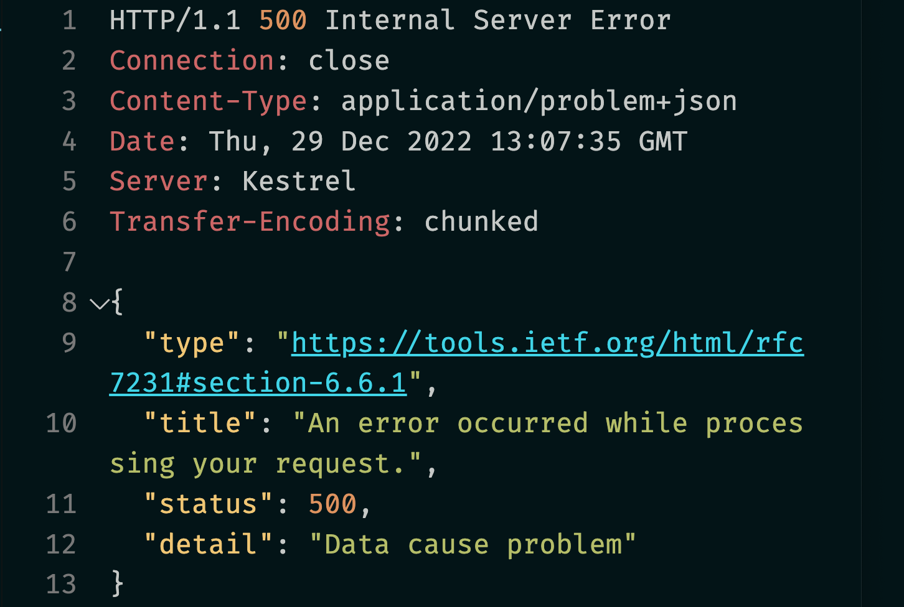
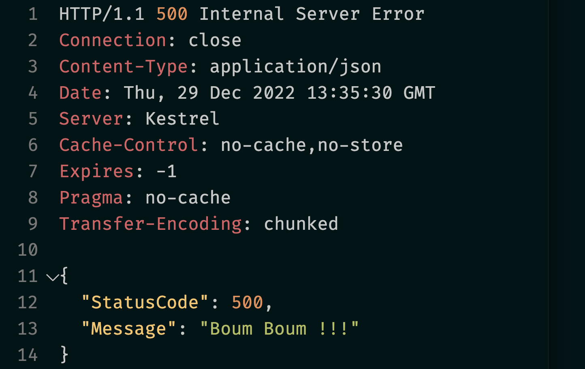
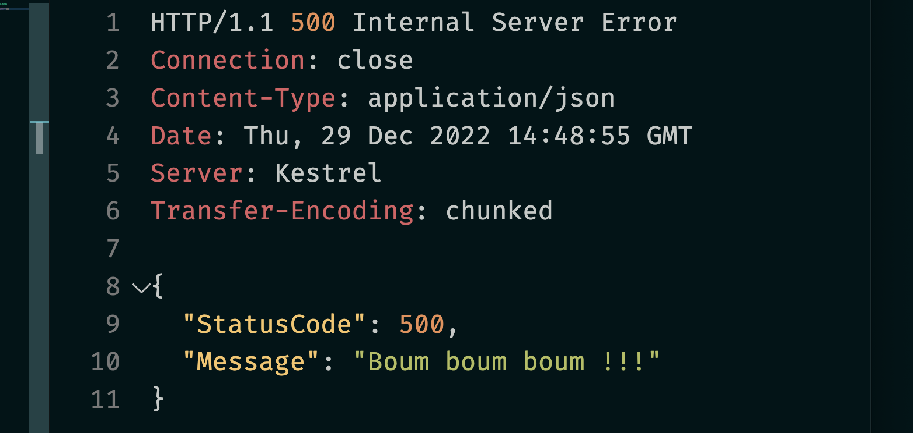

# 30.7 Gérer les `exceptions`

## Trois possibilités

- Utiliser un block `Try & Catch` dans le corps de la méthode
- Utiliser un `Builtin Middleware`
- Utiliser un `Custom Middleware`


## Block `Try & Catch`

```cs
app.MapGet("/student", (IStudentRepo db) => {
    try
    {
        app.Logger.LogInformation("Fetching all the students from the storage");

        var students = db.GetAll();

        app.Logger.LogInformation($"Retourning {students.Count} students");

        return Results.Ok(students);
    }
    catch (Exception ex)
    {
        
        app.Logger.LogError($"Something went wrong: {ex.Message}");
        return Results.Problem("Data cause problem");
    }
});
```

Si je lance une `exception` j'obtiens :



On voit un `object error builtin` avec le `status code` et le message `detail` passé à `Results.Problem`.


## Utiliser le `Builtin Middleware`

On créé une classe `ErrorDetails`

```cs
public class ErrorDetails
{
    public int StatusCode { get; set; }
    public string Message { get; set; } = string.Empty;

    public override string ToString()
    {
        return JsonSerializer.Serialize(this);
    }
}
```

On va créer une méthode d'extension `ExceptionMiddlewareExtension`

```cs
public static class ExceptionMiddlewareExtension
{
    public static void ConfigureExceptionHandler(this WebApplication app)
    {
        app.UseExceptionHandler(appError => {
            appError.Run(async context => {
                context.Response.StatusCode = (int)HttpStatusCode.InternalServerError;
                context.Response.ContentType = "application/json";
                
                var contextFeature = context.Features.Get<IExceptionHandlerFeature>();
                if(contextFeature is not null)
                {
                    app.Logger.LogError($"Something went wrong: {contextFeature.Error}");
                    
                    await context.Response.WriteAsync(new ErrorDetails {
                        StatusCode = context.Response.StatusCode,
                        Message = "Boum Boum !!!"
                    }.ToString());
                }
            });
        });
    }
}
```

> ### `HttpContext.Features`
>
> La propriété `Features` de `HttpContext` donne accès à une collection d'interface de fonctionnalités pour la requête courante. Ces fonctionnalités (`Features`) sont `mutables`, on peut les ajouter, les modifier, les étendre (`wrapped`), les remplacer ou aussi les supprimer.
>
> On y a ccès dans les `middleware`.
>
> C'est une collection avec des paires `Type-Instance`.
>
> Il existe des `getter` et des `setter` : `TFeature Get<TFeature>()` et `Set<TFeature>(TFeature instance)`.

On ajoute notre méthode d'extension dans `Program.cs`:

```cs
app.ConfigureExceptionHandler();
```

On peut retirer le block `Try & Catch` de notre `endpoint` :

```cs
app.MapGet("/student", (IStudentRepo db) =>
{
    app.Logger.LogInformation("Fetching all the students from the storage");

    var students = db.GetAll();

    throw new Exception("Hey you I'm an exception !!");

    app.Logger.LogInformation($"Retourning {students.Count} students");

    return Results.Ok(students);
});
```




## `Custom Middleware`

On va créer une classe `middleware` pour intercepter et gérer nos `exceptions`:

`ExceptionMiddleware`

```cs
public static class ExceptionMiddleware
{
    private readonly ILogger _logger;
    private readonly RequestDelegate _next;

    public ExceptionMiddleware(ILogger<ExceptionMiddleware> logger, RequestDelegate next)
    {
        _logger = logger;
        _next = next;
    }
    
    public async Task InvokeAsync(HttpContext context)
    {
        try
        {
            await _next(context);
        }
        catch (Exception ex)
        {
            _logger.LogError($"Something wrong in custom middleware {ex}");
            await HandleExceptionAsync(context);
        }
    }

    private Task HandleExceptionAsync(HttpContext context)
    {
        context.Response.ContentType = "application/json";
        context.Response.StatusCode = (int)HttpStatusCode.InternalServerError;
        
        return context.Response.WriteAsync(new ErrorDetails {
            StatusCode = context.Response.StatusCode,
            Message = "Boum boum boum !!!"
        }.ToString());
    }
}
```

On `log` l'`exception` mais on ne renvoie pas son message dans l'`api`.

On créé une méthode d'extension dans `ExceptionMiddlewareExtension` :

```cs
public static class ExceptionMiddlewareExtension
{
    // ...ConfigureExceptionHandler
    
    public static void ConfigureCustomExceptionMiddleware(this IApplicationBuilder app)
    {
        app.UseMiddleware<ExceptionMiddleware>();
    }
```

Et on l'utilise dans `Program.cs`:

```cs
//app.ConfigureExceptionHandler();
app.ConfigureCustomExceptionMiddleware();
```

> Il ne faut pas oublier de typer `ILogger` : `ILogger<ExceptionMiddleware>` sinon le `service` n'est pas résolu (trouvé).


