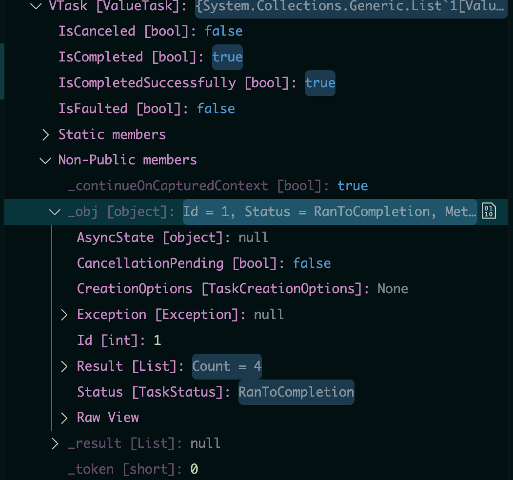
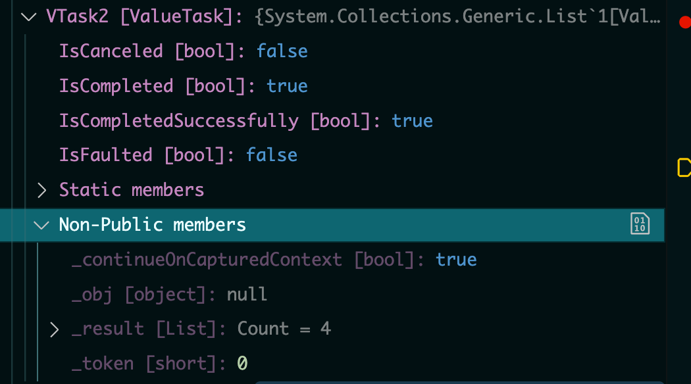

# 31 `ValueTask`

Source Youtube : https://www.youtube.com/watch?v=fj-LVS8hqIE&ab_channel=MicrosoftDeveloper

Inventeur de `ValueTask` : Stephen Toub

https://devblogs.microsoft.com/dotnet/understanding-the-whys-whats-and-whens-of-valuetask/?WT.mc_id=ondotnet-c9-cxa

## `Task`

C'est une classe dont chaque objet doit avoir de la mémoire allouée dans le tas (`Heap`) pour être accessible à n'importe quelle `thread`.

Dans une `API` le premier flux de données est véritablement `async` mais les suivants ne le sont plus vraiment.

Les données sont déjà là, il n'y a pas forcement d'utilité a utiliser une `Task`.

```cs
public class Robotservices
{
    private List<Robot> _robotsCache = new();
    private string _connectionString;

    public Robotservices(IConfiguration configuration)
    {
        _connectionString = configuration.GetConnectionString("HukarConnection")!;
    }


    public async Task<List<Robot>> GetRobotsAsync()
    {
        using var connection = new SqlConnection(_connectionString);
        var sql = "SELECT * FROM Robot";

        if(_robotsCache.Count == 0)
        {
            _robotsCache = (await connection.QueryAsync<Robot>(sql)).ToList();
            return _robotsCache;
        }

        return _robotsCache;
    }
}

public record Robot(int RobotCode, string Name, int? EngineRef);
```

Si maintenant dans mon `EndpointHandler` j'ai plusieurs appelle à la méthode `GetRobotsAsync`, chan créera une `Task` de retour alors que seul le premier appelle est véritablement `async`:

```cs
builder.Services.AddScoped<Robotservices>();

// ...
app.MapGet("/robots", async (Robotservices db) => {
    var robots = await db.GetRobots();
    robots = await db.GetRobots();
    robots = await db.GetRobots();
    robots = await db.GetRobots();
    robots = await db.GetRobots();

    return Results.Ok(robots);
});
```

Le service étant `scoped`, le `_robotCache` n'est pas remit à zéro.


## `ValueTask`

`ValueTask` est construit autour de `Task`.

Une méthode renvoyant `ValueTask` renverra dans ses membres non public, soit un objet représentant la `Task` : `_obj`, soit directement le résultat `_result`.

Il suffit de changer le type de retour `Task<T>` en `ValueTask<T>`.

```cs
public async ValueTask<List<Robot>> GetRobots()
{
    // ...

    if(_robotsCache.Count == 0)
    {
        _robotsCache = (await connection.QueryAsync<Robot>(sql)).ToList();
        return _robotsCache;
    }

    return _robotsCache;
}
```

Dans le `Endpoint`:

```cs
app.MapGet("/robots", async (Robotservices db) => {
    var VTask = db.GetRobots();
    
    var robots = await VTask;
    var VTask2 = db.GetRobots();
    
    return Results.Ok(robots);
});
```



Le premier appelle à `GetRobots()` renvoie une `ValueTask` contenant un objet qui lui contiendra le résultat la tache exécutée.



Un deuxième appelle à `GetRobot` renvoie une `ValueTask` contenant cette fois seulement le résultat.

> Le but est d'économiser la mémoire `heap` dans le cas où des données sont utilisées plusieurs fois lors d'une même requête.