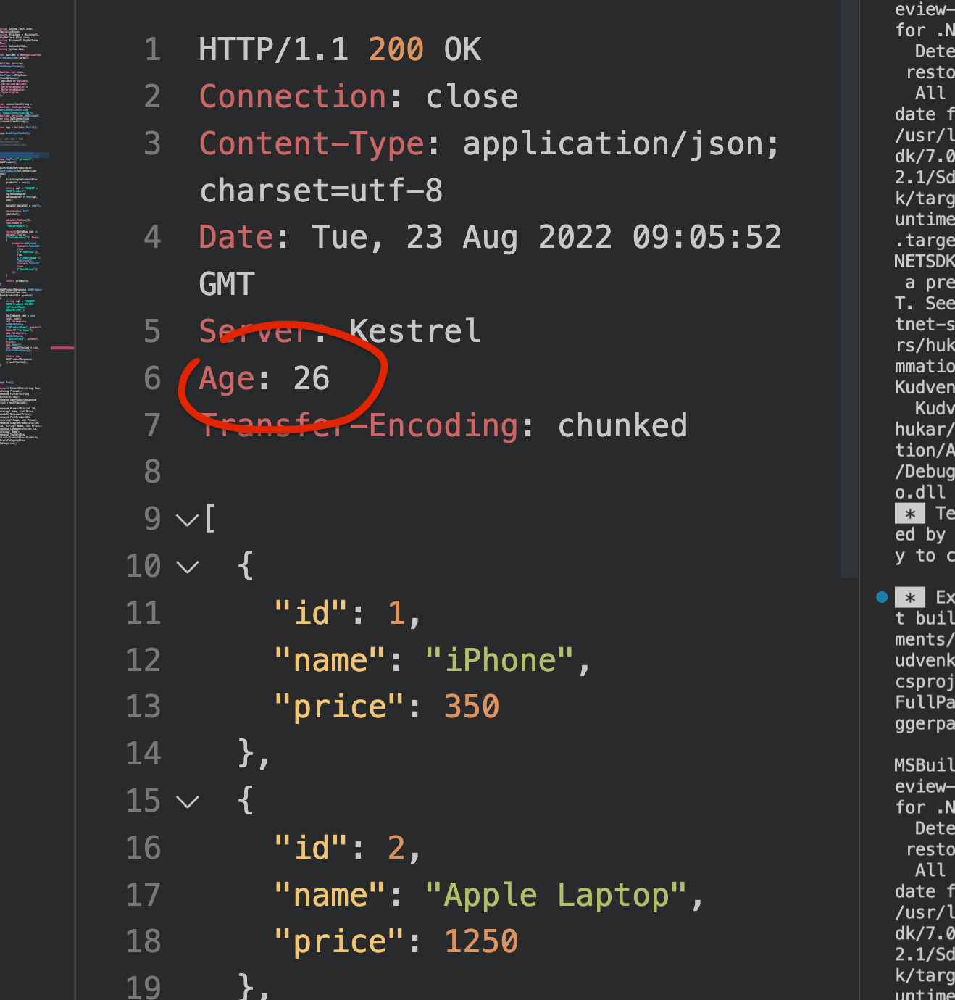

# 32 Le `cache`

## Mise en place

```cs
builder.Services.AddOutputCache();

// ...
app.UseOutputCache();
```

On ajoute ensuite `CacheOutput` au `endpoint` :

```cs
app.MapGet("/product", GetProducts).CacheOutput();
```

Si la première requête passe par la méthode `GetProducts`, les autres renvoient directement les données en ajoutant un `header` `age` :




## `options` de `OutputCache`

On peut ajouter des `options` :

### Ici on a désactivé le `cache`.

```cs
builder.Services.AddOutputCache(options => {
    options.AddBasePolicy(x => x.NoCache());
});
```


### Tester le `header` : `nocache`

```cs
builder.Services.AddOutputCache(options => {
    options.AddBasePolicy(x => x.With(xx => xx.HttpContext.Request.Query["nochache"] == "true").NoCache());
});
```


## Ajouter une `Policy`

```cs
builder.Services.AddOutputCache(options => {
    options.AddPolicy("nocache", x => x.NoCache());
});
```

```cs
app.MapGet("/product", GetProducts)
   .CacheOutput("nocache");
```

On peut aussi utiliser la syntaxe avec `attribut` :

```cs
app.MapGet("/product", [OutputCache(PolicyName = "nocache")] GetProducts);
```

ou bien mettre la logique dans la méthode d'extension :

```cs
app.MapGet("/product", GetProducts)
   .CacheOutput(x => x.NoCache());
```


## Gérer le temps d'expiration

```cs
app.MapGet("/product/filtered", GetProductsFiltered)
   .CacheOutput(x => x.Expire(TimeSpan.FromMilliseconds(2000)));
```

> Temps par défaut ?? certainement de l'ordre de la minute.


## Supprimer le `cache` lors de l'ajout d'un enregistrement

On peut tagué un `cacheOutput` :

```cs
app.MapGet("/product", GetProducts)
   .CacheOutput(x => x.Tag("products"));
```

Dans la méthode `Post` on va pouvoir vider ce `cache` :

```cs
async Task<AddProductResponse> AddProduct(SqlConnection con, PostProductDto product, IOutputCacheStore cache, CancellationToken ct)
{
    await cache.EvictByTagAsync("products", ct);
    // ...
```

Le `cache ` est ainsi vidé à chaque fois qu'on ajoute un élément.