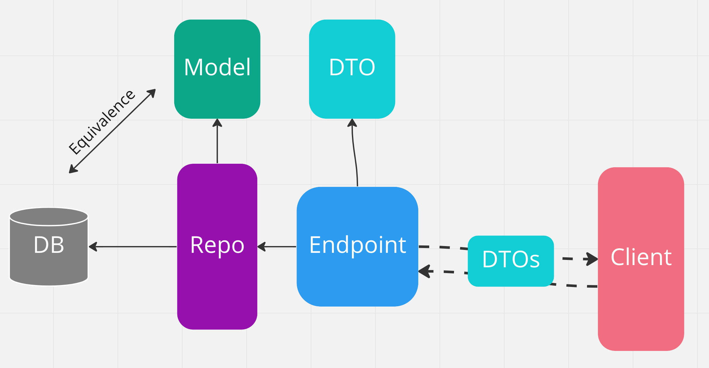

# 33 Les `DTOs`

## `Model` et `DTO`

Le `model` est une representation en classe (`POCO` Plain Old CLR Object) de la `DB`.

Le `repository` qui communique avec la `db`, utilise les classes du `Model`.

Les `DTO` (Data Transfert Object) servent quant à eux à la communication avec l'extérieur.

Ici ils sont utilisés par le `Endpoint` (le `Controller`) pour communiquer avec le client externe.

Ils servent à `mapper` le contenu entrant (`POST`) et sortant (`GET`).