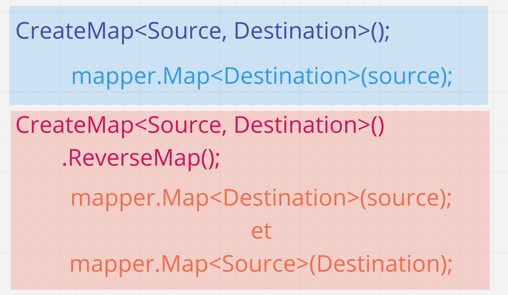
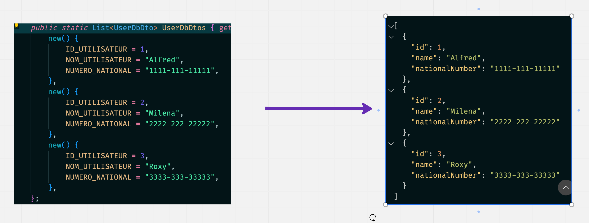

# 34 `AutoMapper`

C'est un `package` de Jimmy Bogard

## Installation

Il faut installer la version avec injection de dépendance `Dependency Injection` :

```bash
dotnet add package AutoMapper.Extensions.Microsoft.DependencyInjection
```


## Mise en place dans `Program.cs`

```cs
builder.Services.AddAutoMapper(typeof(Program).Assembly);
```

On peut passer plusieurs `Assembly` si nécessaire.

Alternative, mais nécessite `using System.Reflection` :

```cs
builder.Services.AddAutoMapper(Assembly.GetExecutingAssembly());
```

On peut aussi fournir le `type` seulement :

```cs
builder.Services.AddAutoMapper(typeof(Program));
```


## `Profile` : `CreateMap<Source, destination>()`

`AutoMapper` à besoin d'une configuration pour fonctionner.

On la place dans le constructeur d'un classe héritant de `Profile` :

`MyAppProfile.cs`

```cs
using AutoMapper;

namespace Mapster;

public class MyAppProfile : Profile
{
    public MyAppProfile()
    {
        CReateMap<User, UserDto>();
    }
}
```


## Exemple : `mapper.Map<Dst>(Src)`

### `User.cs`

```cs
public class User
{
    public int Id { get; set; }
    public string Name { get; set; } = string.Empty;
    public string NumeroNational { get; set; } = string.Empty;
}
```

### `UserDto.cs`

```cs
public class UserDto
{
    public string Name { get; set; } = string.Empty;
    public string NumeroNational { get; set; } = string.Empty;
}
```

Puis dans un `endpoint` :

```cs
app.MapGet("/dtos", (IMapper mapper) => {
    var userDtos = DB.Users.Select(user => mapper.Map<UserDto>(user));

    return Results.Ok(userDtos);
});
```

On peut directement passer une liste à `Map<List<TValue>>` :

```cs
app.MapGet("/dtosTwo", (IMapper mapper) => {
    var userDtos = mapper.Map<List<UserDto>>(DB.Users);

    return Results.Ok(userDtos);
});
```

### `mapper.Map<List<Dst>>(Src)`


## *Mapper* dans les deux sens : `ReverseMap`



```cs
public class MyAppProfile : Profile
{
    public MyAppProfile()
    {
        CreateMap<User, UserDto>()
            .ReverseMap();
    }
}
```

Dans un `endpoint` :

```cs
app.MapPost("/dtos", (IMapper mapper, UserDto userToCreate) => {
    var userForDb = mapper.Map<User>(userToCreate);
    userForDb.Id = DB.Users.Count + 1;
    DB.Users.Add(userForDb);

    return Results.Ok(DB.Users);
});
```

Cette fois la `source` est `UserDto` et la `destination` `User`. Grâce à `ReverseMap` on peut *mapper* dans les deux sens.


## *Mapper* avec des noms de propriétés différents : `ForMember`

```cs
CreateMap<UserDbDto, User>()
    .ForMember(dest => dest.Name, opt => opt.MapFrom(src => src.NOM_UTILISATEUR))
	.ForMember(dest => dest.NationalNumber, opt => opt.MapFrom(src => src.NUMERO_NATIONAL));
```

Ici on a deux logique de nomade, celle de la `DB` et celle des classes `C#`.

Utilisation dans un `endpoint` :

```cs
app.MapGet("userfromdb", 
    (IMapper mapper) =>  Results.Ok(mapper.Map<List<User>>(DB.UserDbDtos))
);
```




### Utilisation avec `ReverseMap`

On peut cumuler toutes nos configurations :

```cs
public class MyAppProfile : Profile
{
    public MyAppProfile()
    {
        CreateMap<User, UserDto>()
            .ReverseMap();

        CreateMap<UserDbDto, User>()
            .ForMember(dest => dest.Id, opt => opt.MapFrom(src => src.ID_UTILISATEUR))
            .ForMember(dest => dest.Name, opt => opt.MapFrom(src => src.NOM_UTILISATEUR))
            .ForMember(dest => dest.NationalNumber, opt => opt.MapFrom(src => src.NUMERO_NATIONAL))
            .ReverseMap();;
    }
}
```

Et obtenir le résultat inverse :

```cs
app.MapGet("userfromdb", 
    (IMapper mapper) =>  Results.Ok(mapper.Map<List<UserDbDto>>(DB.Users))
);
```

On peut avoir plusieurs `CreateMap` dans le même constructeur.


## Applatir un objet (`Flatten`)

> Trop compliqué, voire impossible dans mon cas.
