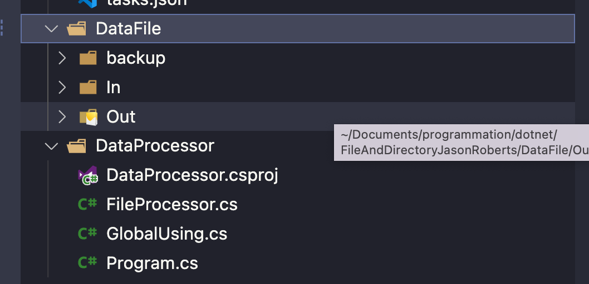

# 01 gérer les `fichiers` et les `dossiers`


## Vérifier qu'un `fichier` existe : `File.Exists`

On créé un programme `console` :

> `args[nb]` est le tableau d'arguments de la commande, la commande en elle-même étant à l'indice `0`.
>
> On peut renseigner les arguments du `debugger` de `vscode` dans `.vscode/launch.json` comme ceci :
>
> ```json
> // ...
> "program": "${workspaceFolder}/DataProcessor/bin/Debug/net7.0/DataProcessor.dll",
>             "args": ["--file","/Users/hukar/Documents/programmation/dotnet/FileAndDirectoryJasonRoberts/DataFile/FileText01.txt"],
> // ...
> ```
>
> 

```cs
WriteLine("Parsing command line options");

string command = args[0]; 

if(command == "--file")
{
    string filePath = args[1];
    WriteLine($"Single file {filePath} selected");
    ProcessSingleFile(filePath);
}
else if(command == "--dir")
{
    string directoryPath = args[1];
    string fileType = args[2];
    
    WriteLine($"Durectory {directoryPath} selected for {fileType} files");
    ProcessDirectory(directoryPath, fileType);
}
else
{
    WriteLine("Invalid command line options");
}

WriteLine("Press enter to quit.");
ReadLine();

static void ProcessSingleFile(string filePath)
{
    FileProcessor fileProcessor = new(filePath);
    fileProcessor.Process();
}

static void ProcessDirectory(string directoryPath, string fileType)
{
    
}
```


Et une classe `FileProcessor` :

```cs
public class FileProcessor
{
    public string InputPathFile { get; }

    public FileProcessor(string inputPathFile)
    {
        InputPathFile = inputPathFile;
    }

    public void Process()
    {
        WriteLine($"Begin process of {InputPathFile}");
        
        // check if file exists
        if(File.Exists(InputPathFile) == false)
        {
            WriteLine($"ERROR: file {InputPathFile} does not exist.");
            return;
        }
    }
}
```


### Vérifier que c'est un chemin absolu : `Path.IsPathFullyQualified`

```cs
public void Process()
{
    WriteLine($"Begin process of {InputPathFile}");

    if(Path.IsPathFullyQualified(InputPathFile) == false)
    {
        WriteLine($"ERROR: path {InputPathFile} must be fully qualified.");
        ReadLine();
        return;
    }
    // ...
```

```bash
dotnet run --file ./DataFile/In/FileText01.txt
```

```
Single file ./DataFile/In/FileText01.txt selected
Begin process of ./DataFile/In/FileText01.txt
ERROR: path ./DataFile/In/FileText01.txt must be fully qualified.
```


## Parent `directory` : `DirectoryInfo`

```cs
string? rootDirectoryPath = new DirectoryInfo(InputFilePath).Parent?.FullName;

WriteLine($"Root data path is {rootDirectoryPath}");
```

```
Root data path is /Users/hukar/Documents/programmation/dotnet/FileAndDirectoryJasonRoberts/DataFile/In
```

On peut remonter dans la chaîne des parents :

```cs
// ...
rootDirectoryPath = new DirectoryInfo(InputPathFile)
 .Parent?.Parent?.Parent?.Parent?.Parent?.Parent?.Parent?.Parent?.Parent?.FullName;
WriteLine($"Root data path is {rootDirectoryPath}");

rootDirectoryPath = new DirectoryInfo(InputPathFile)
 .Parent?.Parent?.Parent?.Parent?.Parent?.Parent?.Parent?.Parent?.Parent?.Parent?.FullName;
WriteLine($"Root data path is {rootDirectoryPath}");

rootDirectoryPath = new DirectoryInfo(InputPathFile)
 .Parent?.Parent?.Parent?.Parent?.Parent?.Parent?.Parent?.Parent?.Parent?.Parent?.Parent?.FullName;
WriteLine($"Root data path is {rootDirectoryPath}");
```

```
Begin process of /Users/hukar/Documents/programmation/dotnet/FileAndDirectoryJasonRoberts/DataFile/In/FileText01.txt
Root data path is /Users/hukar/Documents/programmation/dotnet/FileAndDirectoryJasonRoberts/DataFile
Root data path is /Users/hukar/Documents/programmation/dotnet/FileAndDirectoryJasonRoberts
Root data path is /Users/hukar/Documents/programmation/dotnet
Root data path is /Users/hukar/Documents/programmation
Root data path is /Users/hukar/Documents
Root data path is /Users/hukar
Root data path is /Users
Root data path is /
Root data path is 
Root data path is 
```

Remonter plus haut que le dernier dossier possible renvoie `""` mais ne génère pas d'erreur.

Comme `rootDirectoryPath` peut être `null`, on va mettre un test :

```cs
string? rootDirectoryPath = 
    new DirectoryInfo(InputFilePath).Parent?.FullName;

if(rootDirectoryPath is null)
{
    throw new InvalidOperationException($"Cannot determine root directory path {rootDirectoryPath}");
}
```


## Vérifier qu'un `dossier` existe

```cs
internal class FileProcessor
{
	private const string BackupDirectoryName = "backup";
    private const string InProgressDirectoryName = "processing";
    private const string CompletedDeirectoryName = "complete";

```


### Créer le chemin (`path`) de ces dossiers : `Path.Combine`

```cs
string backupDirectoryPath = Path.Combine(rootDirectoryPath, BackupDirectoryName);
```


### Vérifier si le `directory` existe et le créer si nécessaire : `Directory.Exists` et `Directory.CreateDirectory`

```cs
if(Directory.Exists(backupDirectoryPath) == false)
{
    WriteLine($"Creating {backupDirectoryPath}");
    Directory.CreateDirectory(backupDirectoryPath);
}
```

```
Root data path is /Users/hukar/Documents/programmation/dotnet/FileAndDirectoryJasonRoberts/DataFile
Creating /Users/hukar/Documents/programmation/dotnet/FileAndDirectoryJasonRoberts/DataFile/backup
Press enter to quit.

```



Si le `directory` existe déjà, `Directory.CreateDirectory` ne fait rien et ne lance pas d'`Exception`.

Mais pour que l'affichage de création ai un sens il vaut mieux mettre un test avant : `Directory.Exists`.


