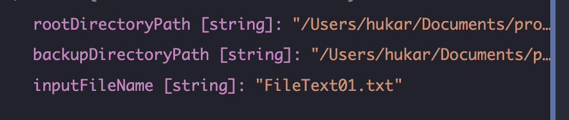
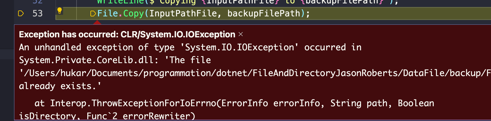
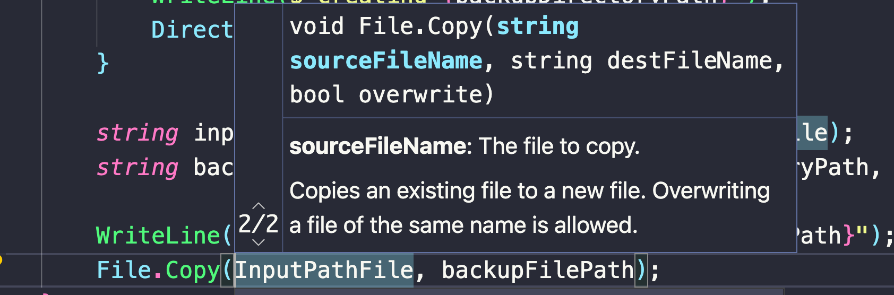

# 02 Copier et déplacer un `fichier`


## Copier un `fichier`

### récupérer le nom d'un `fichier` :  `Path.GetFileName`

```cs
string inputFileName = Path.GetFileName(InputFilePath);
```

Ceci va récupérer le `nom` et l'`extension` d'un `fichier` :




### Créer le `path` de `backup` : `Path.Combine`

```cs
string backupFilePath = Path.Combine(backupDirectoryPath, inputFileName);
```


### Copier le `fichier` : `File.Copy(source, dest)`

```cs
WriteLine($"copying {inputFilePath} to {backupFilePath}");
File.Copy(InputPathFile, backupFilePath);
```

Si on relance le programme on a alors une `exception` :



#### Le `fichier` existe déjà !

On a un `overload` permettant d'écraser un fichier existant sans lancer une erreur :



### `File.Copy(source, dest, overwrite)`

> `overload` : méthodes de la même classe avec le même nom mais avec des paramètres et une valeur de retour différents (compile time static polymorphism).
>
> `override` Réécriture d'une méthode de la classe mère avec la même signature dans la classe fille. (Runtime dynamic polymorphism)

```cs
File.Copy(InputPathFile, backupFilePath, overwrite:true);
```

#### Attention ! Mon ancien `fichier` est écrasé.


## déplacer un `fichier` : 

## `File.Move(source, dest[, overwrite])`

```cs
// Ensure the directory exists
Directory.CreateDirectory(Path.Combine(rootDirectoryPath, InProgressDirectoryName));
string inProgressFilePath 
    = Path.Combine(rootDirectoryPath, InProgressDirectoryName, inputNameFile);

if(File.Exists(inProgressFilePath))
{
    WriteLine($"ERROR: a file with the name {inProgressFilePath} is already in the directory");
}

WriteLine($"Moving {InputFilePath} to {inProgressFilePath}");
File.Move(InputFilePath, inProgressFilePath);
```

Comme `Directory.CreateDirectory` ne lance pas d'exception, on peut le faire par défaut à chaque fois que le programme est exécuté.