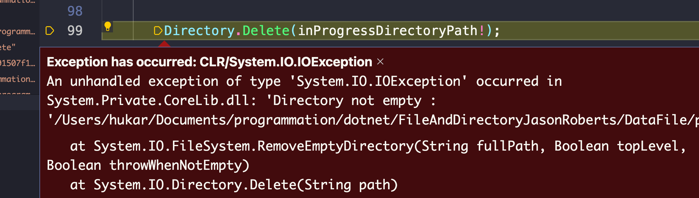

# 04 Supprimer un `dossier`

## Récupérer le nom d'un `dossier` : `Path.GetDirectoryName`

```cs
string? inProgressDirectoryPath 
    = Path.GetDirectoryName(inProgressDirectoryPath);
```

> attention ! `Path.GetDirectoryName` retourne un `string` `nullable` : `string?`, le résultat peut valoir `null`.


## Supprimer le `dossier` : `Directory.Delete`

```cs
Directory.Delete(inProgressDirectoryPath!);
```

On spécifie pour l'exemple que `inProgressDirectoryPath` n'est pas `null` avec le `!` (`bang`).

`Directory.Delete` attend un dossier vide.



Si on essaye de supprimer un dossier contenant au moins un `fichier`, une exception est levé : `Directory Not empty`.


### Supprimer un `dossier` non-vide : `Directory.Delete(string DirectoryPath, bool recursive)`

```cs
Directory.Delete(inProgressDirectoryPath!, recursive:true);
```


