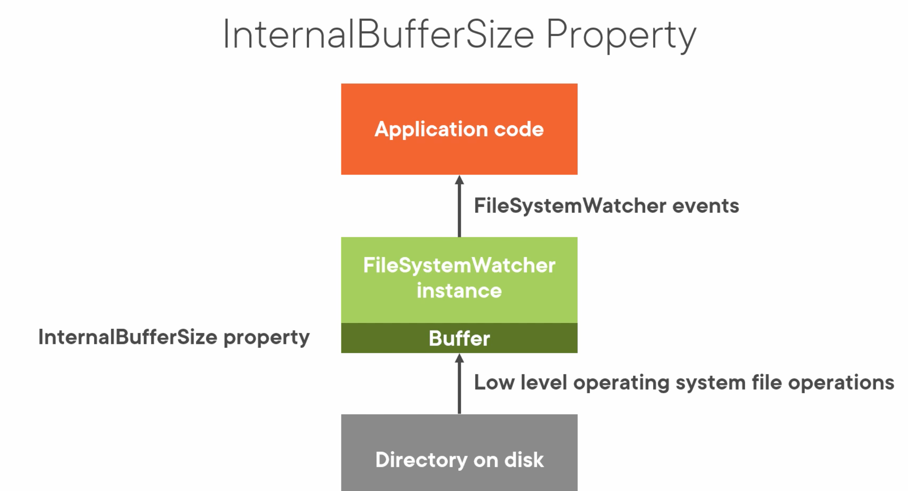
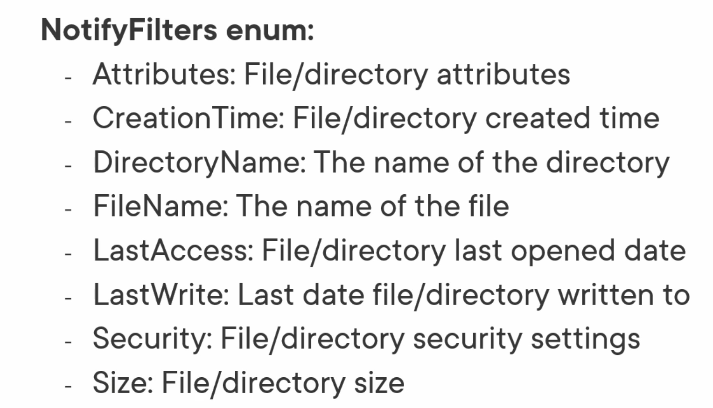
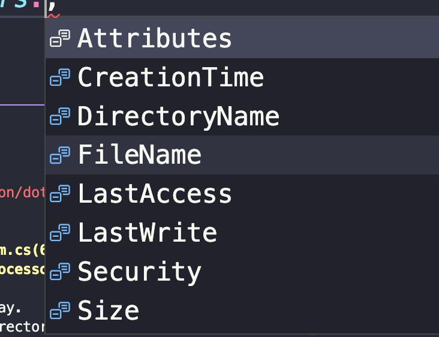
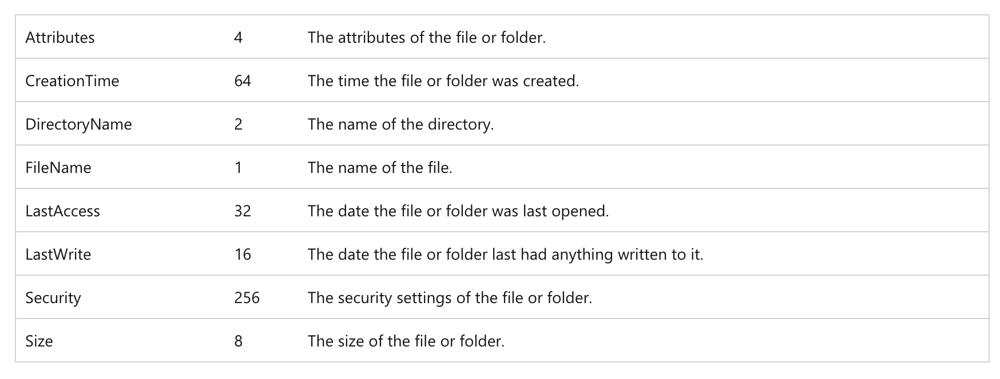

# 06 `FileSystemWatche`

Surveille les notifications de changement du `file system` et déclenche un événement (`event`) quand un répertoire ou un fichier est modifié.


## Les différents `events`

### `Created`

Création d'un fichier ou d'un répertoire.


### `Changed`

Un fichier ou un répertoire est modifié.


### `Renamed`

Un fichier ou un répertoire est renommé.


### `Deleted`

Un fichier ou un répertoire est supprimé.


### `Error`

Impossible de continuer de monitorer les changements / `internal buffer overflow`.


## `Buffer`

Une seul opération sur un fichier peut induire que plusieurs `event` soient déclenchés.

`FileSystemWatcher` possède un `Buffer` pour avoir le temps de générer les `events` si il y a plusieurs activités simultanées dans le `file system`.



On a une propriété `InternalBufferSize` en `int` pour pouvoir gérer cette taille.

Ce `buffer` peut avoir une taille de `4KB` à `64KB`.

Par défaut il est de `8KB`.

Chaque événement nécessite `16 octets` + l'enregistrement du nom du fichier (`filename`).

`Microsoft` recommande de fixer (`set`) cette valeur comme multiple de `4KB` sur les `CPU Intel`.

> ### Doc Microsoft
>
> S'il y a beaucoup de changement en peu de temps, le `buffer` peut déborder de ses limites (`overflow`).
>
> Cela a pour conséquence que le composant perd la surveillance des changements dans le répertoire.
>
> Augmenter la taille du `buffer` peut empêcher de rater des événements de changement du `file system`.
>
> Malgré tout, augmenter la taille du `buffer` coûte cher car il vient de la mémoire `non-paged` (mémoire en `RAM` ) et ne peut pas être échanger avec un espace du disque.
>
> Donc il faut garder le `buffer` le plus petit possible.


## La propriété `NotifyFilter`

Pour réduire le nombre d'`event` reçus, on peut utiliser `NotifyFilter`.

C'est un `Enum` qui permet de régler sur quoi on veut être notifier :



On peut combiner plusieurs `NotifyFilters` ensembles.

Par défaut on a :

```cs
NotifyFilters.LastWrite | NotifyFilters.FileName | NotifyFilters.DirectoryName
```


## Autres propriétés

### `Path`

 le chemin vers le fichier ou le répertoire devant être surveillé (`Watch`).

### `Filter`

Peremt d'inclure certain type de fichier : `*.txt`, `*.gif`, `*.*` (valeur par défaut).

### `EnableRaisingEvents`

Pour recevoir les notifications il faut mettre cette propriété à `true`.

### `IncludeSubdirectories`

Pour savoir si les sous-répertoires doivent être aussi monitorés, `false` par défaut.


## Mise en place

`Program.cs`

```cs
WriteLine("Parsing command line options");

string directoryToWatch = args[0]; 

if(Directory.Exists(directoryToWatch) == false)
{
    WriteLine($"ERROR: {directoryToWatch} doesn't exist");
    WriteLine("press enter to quit");
    ReadLine();
    return;
}

WriteLine($"Watching directory: {directoryToWatch}");

using FileSystemWatcher fileSystemWatcher = new(directoryToWatch);

fileSystemWatcher.IncludeSubdirectories = false; // default value
fileSystemWatcher.InternalBufferSize = 32_768; // 32KB
fileSystemWatcher.Filter = "*.*"; // default value
fileSystemWatcher.NotifyFilter = NotifyFilters.LastWrite;

fileSystemWatcher.Created += FileCreated;
fileSystemWatcher.Changed += FileChanged;
fileSystemWatcher.Deleted += FileDeleted;
fileSystemWatcher.Renamed += FileRenamed;
fileSystemWatcher.Error += WatcherError;

fileSystemWatcher.EnableRaisingEvents = true;

WriteLine("Press enter to quit");
ReadLine();

static void FileCreated(object sender, FileSystemEventArgs e)
{
    WriteLine($"* File created: {e.Name} - type: {e.ChangeType}");
}

static void FileChanged(object sender, FileSystemEventArgs e)
{
    WriteLine($"* File changed: {e.Name} - type: {e.ChangeType}");
}

static void FileDeleted(object sender, FileSystemEventArgs e)
{
    WriteLine($"* File deleted: {e.Name} - type: {e.ChangeType}");
}

static void FileRenamed(object sender, RenamedEventArgs e)
{
    WriteLine($"* File created: {e.OldName} to {e.Name} - type: {e.ChangeType}");
}

static void WatcherError(object sender, ErrorEventArgs e)
{
    WriteLine($"ERROR: file system watching may no longer be active: {e.GetException()}");
}

static void ProcessSingleFile(string filePath)
{
    FileProcessor fileProcessor = new(filePath);
    fileProcessor.Process();
}

```

`FileSystemWatcher` implément `IDisposable`, on utilise une déclaration `using`.

> `_` : `digit separator` est un séparateur de chiffre.
>
> On peut utiliser le `digit separator` avec tous les types de numériques littéraux.

`RenamedEventArgs` amène des informations en plus comme le `OldName` et le `OldFullPath`.


Pour activer les événements sur le `file system`, il ne faut pas oublier de mettre `fileSystemWatcher.EnableRaisingEvent` à `true` (car il est à `false` par défaut).

`ErrorEventArgs` lui hérite de `EventArgs`.

## `NotifyFilter`



C'est ce qui va déterminer le scénario de `watch`.




### `NotifyFilters.LastWrite`

```cs
fileSystemWatcher.NotifyFilter = NotifyFilters.LastWrite;
```

- Copier/Coller un fichier dans le répertoire => type: `Changed`

```
* File changed: HukarText01.txt - type: Changed
```

> Dans la demo sur `Windows`, il y a `4` `events` déclenchés.
>
> Sur `MacOS`, je n'en ai que `1`.

- Utiliser `replace` dans le `Finder` (remplacer un fichier)

```
* File changed: HukarText01.txt - type: Changed
```

- Écrire dans un fichier `Changed` (un simple `cmd + s` déclenche les `2` `events`)

```
* File changed: HukarText03.txt - type: Changed
* File changed: HukarText02.txt - type: Changed
```


### `NotifyFilters.FileName`

```cs
fileSystemWatcher.NotifyFilter = NotifyFilters.FileName;
```

- Ajouter un fichier `Created`
- Créer un fichier `Created`
- Supprimer un fichier `Deleted`
- Renommer un fichier `Renamed`

```
* File created: Toto.txt - type: Created
* File created: HukarText01.txt - type: Created
* File deleted: Toto.txt - type: Deleted
* File created: HukarText01.txt to HukarText011.txt - type: Renamed
```

- Remplacer un fichier (`replace`), ce n'est pas le cas sur `Windows` mais sur `MacOS` on a `3 events` :

```
* File created: HukarText02.txt - type: Created
* File deleted: HukarText02.txt - type: Deleted
* File created: HukarText02.txt - type: Created
```


### Combiner les `NotifyFilters`

```cs
fileSystemWatcher.NotifyFilter = NotifyFilters.LastWrite | NotifyFilters.FileName;
```


