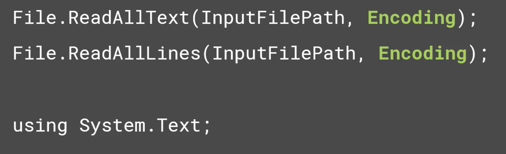
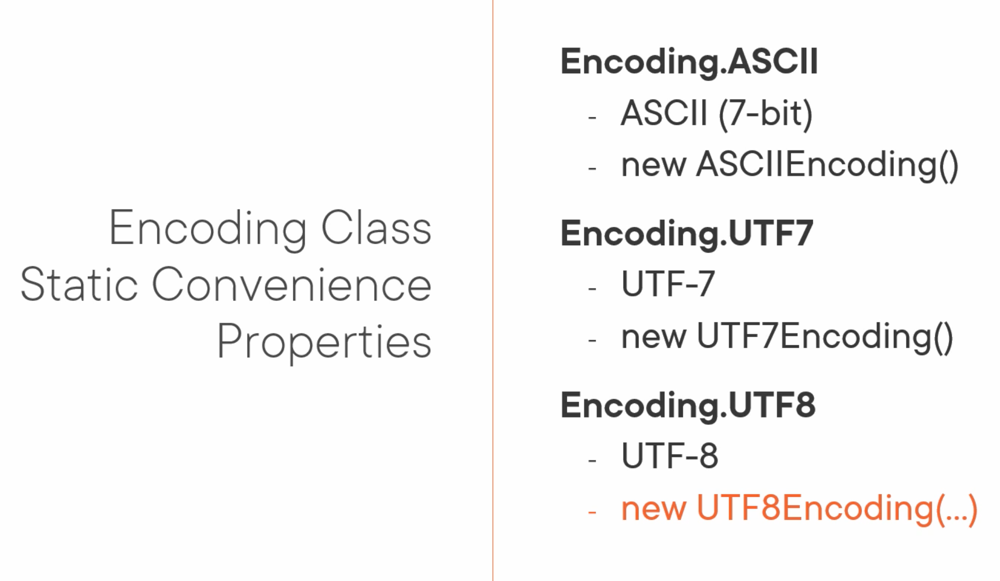
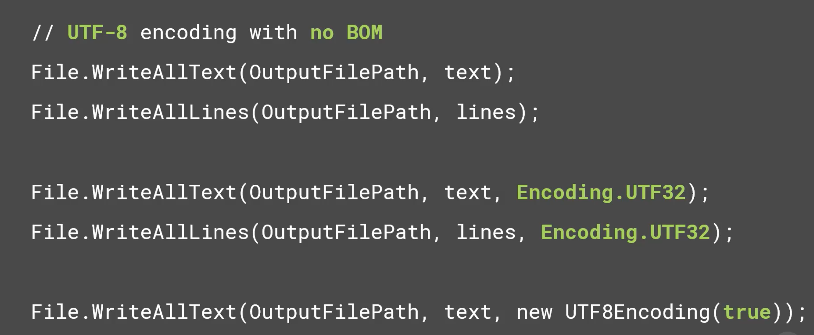
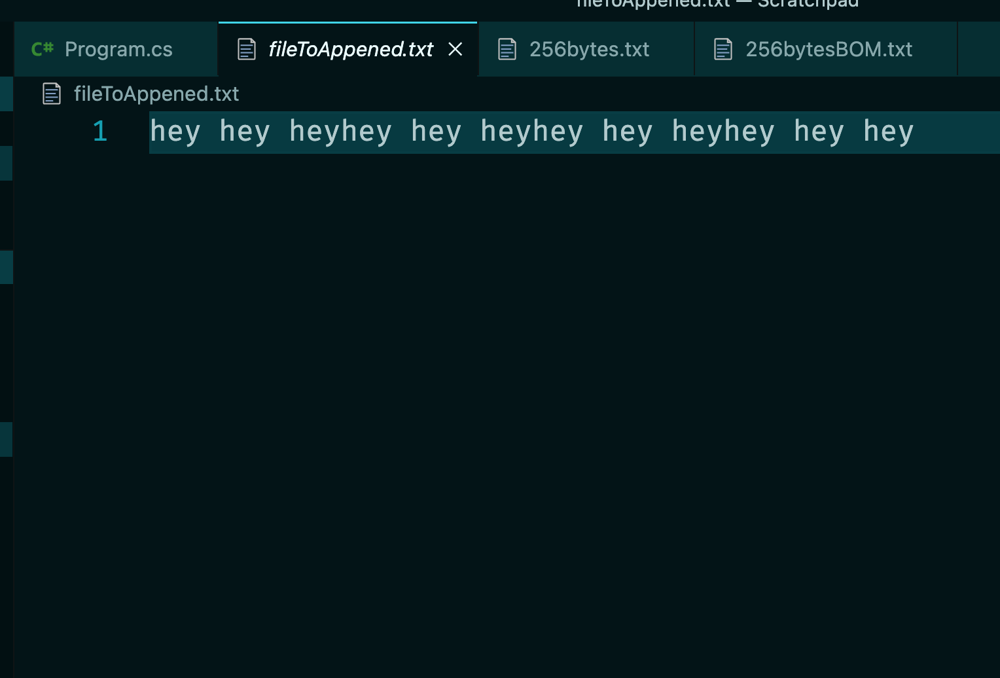
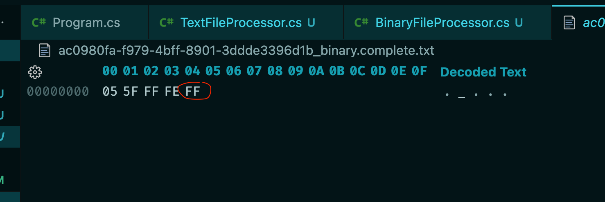

# 07 `reading` et `writing`


## Classe `TextFileProcessor`

```cs
namespace DataProcessor;

public class FileTextProcessor
{
    public string InputFilePath { get; set; }
    public string OutputFilePath { get; set; }

    public FileTextProcessor(string inputFilePath, string outputFilePath)
    {
        InputFilePath = inputFilePath;
        OutputFilePath = outputFilePath;
    }

    public void Process()
    {
        
    }
}
```

On va modifier le fichier `FileProcessor` pour utiliser notre `TextFileProcessor` dans le `switch` :

```cs
// ...
switch (extension)
{
    case ".txt":
        var textProcessor = new TextFileProcessor(inProgressFilePath, completedFilePath);
        textProcessor.Process()
        break;
    default:
        WriteLine($"{extension} is not supported\n");
        break;
}
```

Après le traitement on supprime le fichier `In Progress` :

```cs
WriteLine($"Completed processing of {Path.GetFileNameWithoutExtension(inProgressFilePath)}");

WriteLine($"Deleting {Path.GetFileNameWithoutExtension(inProgressFilePath)}");
File.Delete(inProgressFilePath);
```

`Path.GetFileNameWithoutExtension` : Pour une meilleur lisibilité.


## `File.ReadAllText`  `File.WriteAllText`

On va maintenant implémenter la méthode `Process` :

```cs
public void Process()
{
    // Read All Text
    string oridinalText = File.ReadAllText(InputFilePath);
    string processedText = originalText.ToUpperInvariant();
    
    // Write All Text
    File.WriteAllText(OutputFilePath, processedText);
}
```

On met juste le texte en capital avec `ToUpperInvariant`.


## Lire dans un tableau de `string` : `File.ReadAllLines`

```cs
// Read All Lines
string[] lines = File.ReadAllLines(InputFilePath);
lines[1] = lines[1].ToUpperInvariant();

// Write All Lines
File.WriteAllLines(OutputFilePath, lines);
```

Comme c'est une opération sur les `I/O`, on ne sait pas ce qui pourrait se passer, on devrait donc utiliser un bloc `try/catch` :

```cs
try
{
    var lines = File.ReadAllLines(InputFilePath);
    lines[1] = lines[1].ToUpperInvariant();

    File.WriteAllLines(OutputFilePath, lines);
}
catch (IOException ex)
{
    // log / Retry
    WriteLine(ex);
    throw;
}
```

Une ligne est ajoutée dans le fichier final, car un caractère de saut de ligne `\n` est ajouté à la fin de chaque `string` du tableau :


On a donc `3` lignes dans le fichier final au lieu des `2` de l'original.


## `Text Encoding`

`.net` essaye de déterminer l'`encoding` en détectant le `BOM` (`Byte` `Order` `Mark`), s'il n'y arrive pas il considère que c'est `UTF-8`.

On peut aussi spécifier l'`encoding` explicitement.



On utilise les propriétés `static` de la classe `Encoding`.

Elles renvoient des instances des différents encodage :




### Exemple de code

```cs
using System.Text;

File.ReadAllText(InputFilePath, Encoding.UTF32);
File.ReadAllLines(InputFilePath, Encoding.ASCII);

// UTF_32 Big Endian
File.ReadAllLines(InputFilePath, new UTF32Encoding(true, true));
```




## Ajouter (`append`) du texte

```cs
File.AppendAllText(filePath, text)
```

- Il ouvre le fichier s'il existe ou le crée.
- Il ajoute le `text` fournit
- Il ferme le fichier

```cs
for(int i = 0; i < 4; i++)
{
    File.AppendAllText("./fileToAppened.txt", "hey hey hey");
}
```

Le texte est placé à la suite sans créer de saut de ligne :



Utilise par défaut `UTF-8 no BOM`.

On peut spécidfier l'`encoding` :

```cs
File.AppendAllText("./fileToAppened.txt", "hey hey hey", Encoding.UTF32);
```

Si on veut plutôt ajouter des lignes on a la méthode `File.AppendAllLines`.

```cs
string[] lines = new string[] { "line 1", "line 2", "line 3"};

File.AppendAllLines("./multipleLine.txt", lines);
```

De même si le fichier n'existe pas il est alors créé.


## `Binary Data`

On crée une nouvelle classe pour traiter les fichiers binaire.

```cs
namespace DataProcessor;

public class BinaryFileProcessor
{
    public string InputFilePath { get; set; }
    public string OutputFilePath { get; set; }

    public BinaryFileProcessor(string inputFilePath, string outputFilePath)
    {
        InputFilePath = inputFilePath;
        OutputFilePath = outputFilePath;
    }

    public void Process()
    {
        
    }
}
```

On modifie le `switch` de `FileProcessor`

```cs
switch (extension)
{
    case ".txt":
        var textProcessor = new TextFileProcessor(inProgressFilePath, completedFilePath);
        textProcessor.Process();
        break;
    case ".data":
        var binaryProcessor = new BinaryFileProcessor(inProgressFilePath, completedFilePath);
        binaryProcessor.Process();
        break;
    default:
        WriteLine($"{extension} is not supported\n");
        break;
}
```

### Implémentation de `Process`

```cs
public void Process()
{
    byte[] data = File.ReadAllBytes(InputFilePath);
    byte largest = data.Max();
    
    byte[] newData = new byte[data.Length + 1];
    
    Array.Copy(data, newData, data.Length);
    newData[newData.Length - 1] = largest;
    
    File.WriteAllBytes(OutputFilePath, newData);
}
```

On peut écrire :

```cs
newData[newData.Length - 1] = largest;

// comme ceci

newData[^1] = largest;
```



On voit que la plus grande valeur a été ajouter à la fin par `Process()`.

> Extension `VSCode` : `HEX Editor`


## Avantages et Inconvenients (`Benefits and Drawbacks`)

### `Avantages`

- Le code est simple
- Facile à écrire
- Facile à lire et à maintenir

### `Inconvenients`

- Peut être lent (pour de gros fichiers)
- Peut crasher le programme (`Out Of Memory`)
- Il n'y a pas de `Random Access` / `Seeking` (coup d'œil), on doit lire le fichier en entier.

> Il existe une technique pour les très gros fichiers appelée `Memory Mapped File`.
>
> https://learn.microsoft.com/en-us/dotnet/standard/io/memory-mapped-files


