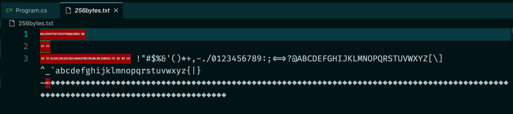
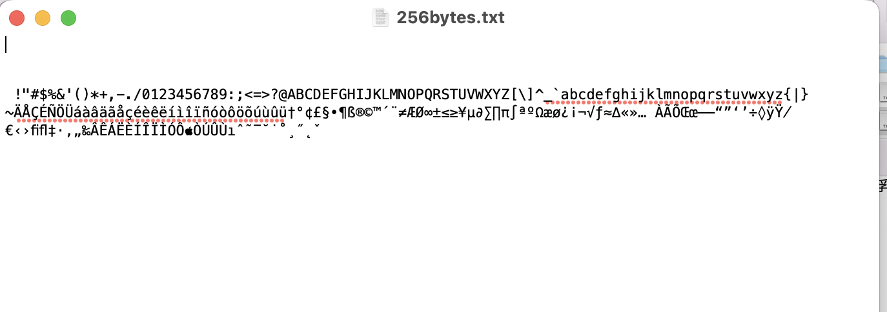
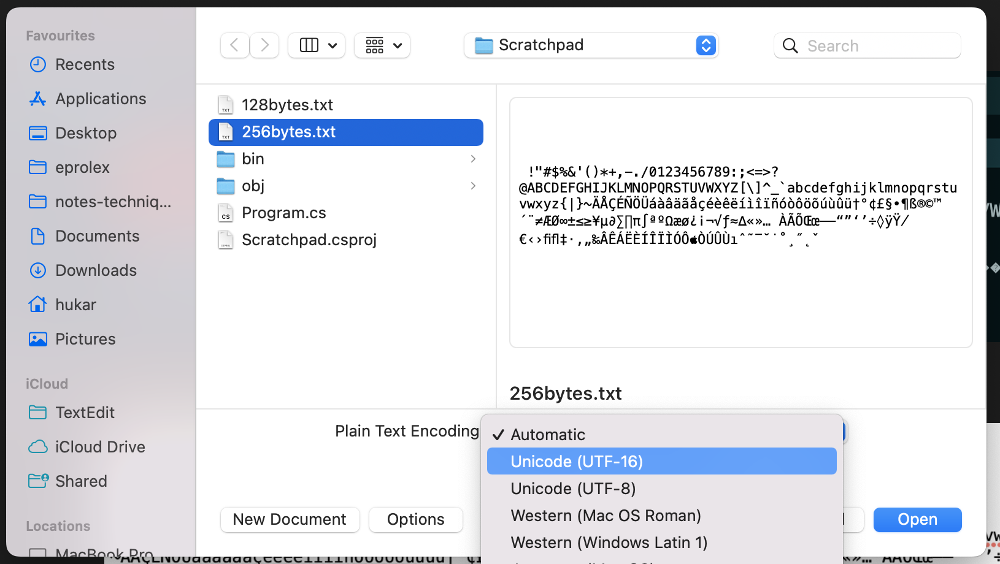
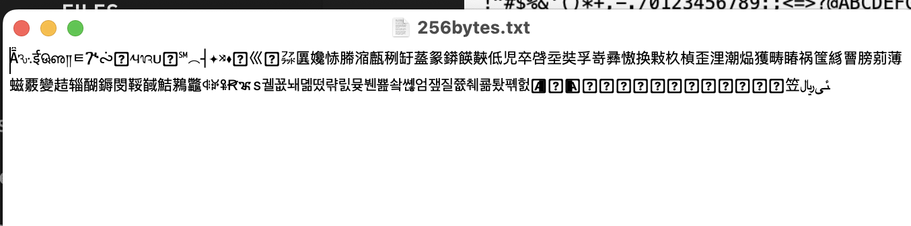
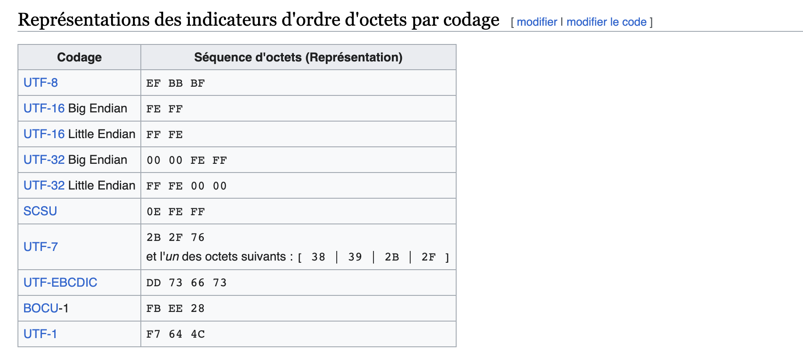

# 07.5 Comprendre l'`encoding`


## Mise en place 

On va créer grâce à une application `console` deux fichiers :

```cs
byte[] bytes = new byte[128];

for(byte i = 0; i < 128; i++)
{
    bytes[i] = i;
}

File.WriteAllBytes("./128bytes.txt", bytes);

byte[] bytes2 = new byte[256];

for(int i = 0; i < 256; i++)
{
    bytes2[i] = (byte)i;
}

File.WriteAllBytes("./256bytes.txt", bytes2);
```

Si on ouvre le fichier dans `vscode` on a :



Dans `TextEdit`



`TextEdit` choisi automatiquement l'encodage, si je choisi manuellement j'obtient tout autre chose :



On obtient alors avec le même fichier :




## Hard-Coder le BOM

> `Byte Order Mark` indique l'ordre des octets dans l'utilisation d'un encodage `UNICODE`, généralement situé au début des fichiers.
>
> 
>
> Le standard `UNICODE` n'impose pas le `BOM` en début des données, mais le permet.

```cs

byte[] bytes = new byte[259];

// C'est le BOM Byte Order Mark
bytes[0] = 0xEF;
bytes[1] = 0xBB;
bytes[2] = 0xBF;

for(int i = 3; i < 259; i++)
{
    bytes[i] = (byte)i;
}

File.WriteAllBytes("./256bytesBOM.txt", bytes);
```

