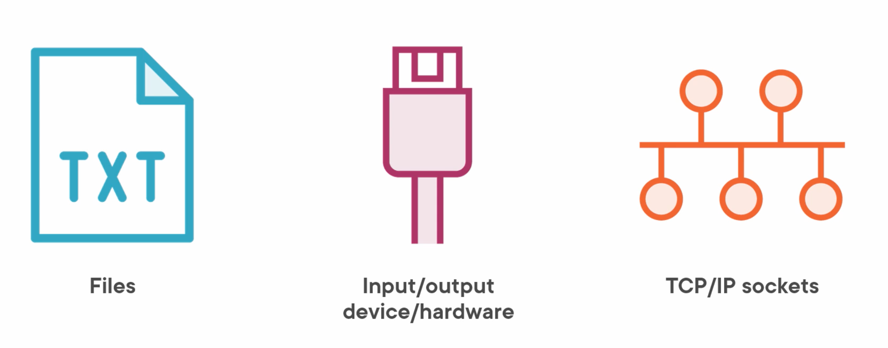
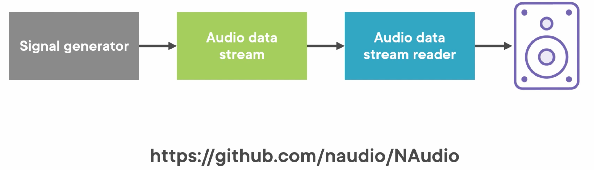
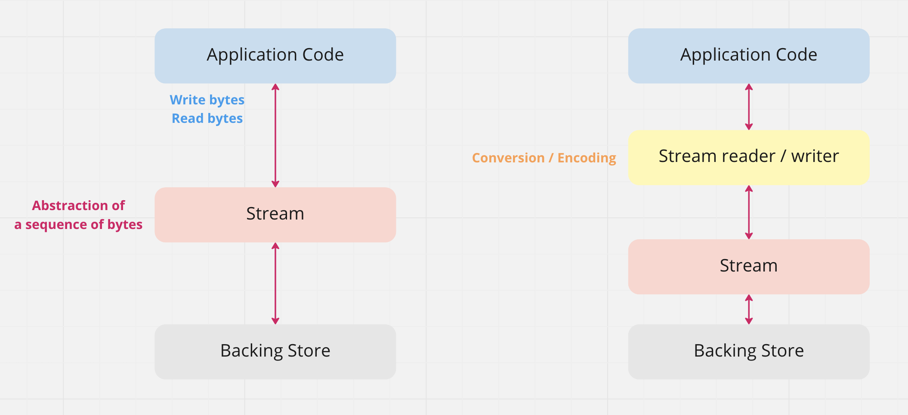
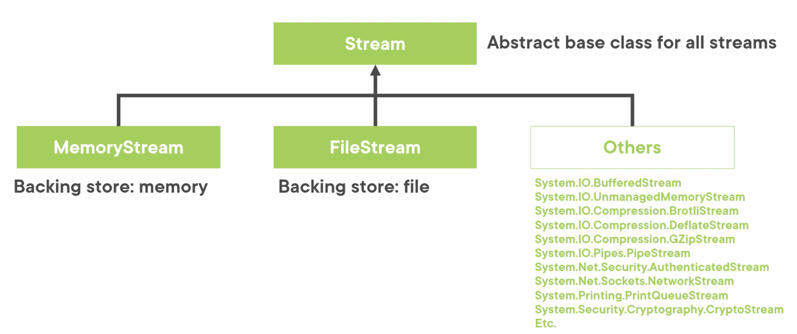
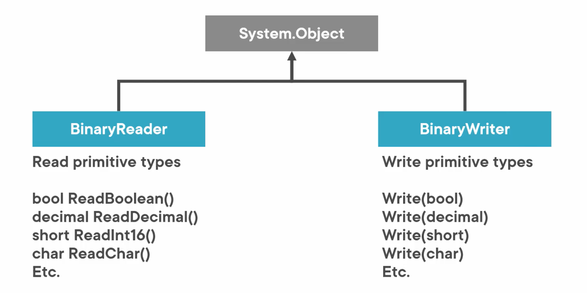
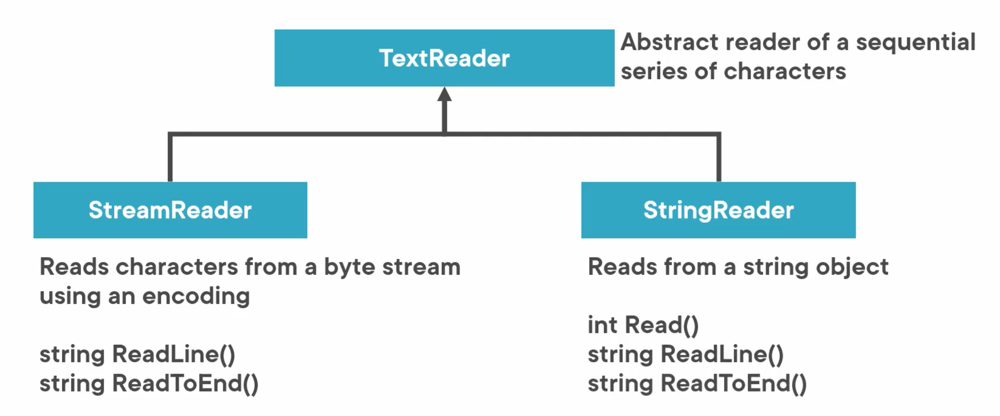
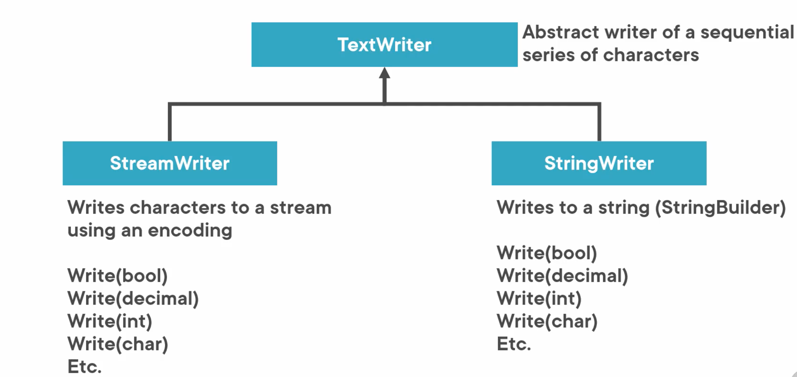

# 08 `Stream`

## Définition

> A `stream` is a sequence of bytes that you can use to read from and write to a backing store, which can be one of several storage mediums.
>
> Un `stream` est une séquence d'octets que vous pouvez utiliser pour lire et écrire dans une mémoire d'échange (disque de stockage), qui peut être l'un des nombreux supports de stockage disponible.

### Exemples de `Backing Store`

Cela peut être :

- Un fichier
- un périphérique d'entrée ou de sortie (clé usb, disque dur, ...)
- Les sockets `TCP/IP`

### Exemple de `Stream` sans `backing store`

Un signal audio généré et anvoyé comme `stream` :

## Représentation

On a ici une abstraction `Stream reader / writer` pour nous faciliter le travail avec les `streams`.

## Bénéfices

- On traite les données par petits morceaux (incrément)
- Ils fournissent une abstraction par rapport au `Backing Store` (on ne se soucie plus du `Backing Store`)
- Il apporte de la flexibilité dans le contrôle
- On peut utiliser des `Random Access` pour aller directement à l'endroit qui nous intéresse
- On peut les composer avec un système de `Pipeline`

## Hiérachie dans `.net` des classes `Stream`

La classe `Stream` principale est abstraite et sert de base pour toutes les autres classe de `stream`.

Dans notre cas on utilise `FileStream` dont le `backing store` est le `file`.

## `Readers` et `Writers`

### `Binary`

On peut utiliser des `Readers` et des `Writers` pour interagir avec des instances de `Stream`.

Si on travail avec des données binaires on a un `BinaryReader` et un `BinaryWriter`.

Les classes `BinaryReader` et `BinaryWriter` n'ont pas d'ancêtre hiérachique et héritent toutes les deux directement de `System.Object`.

Elle possèdent des méthodes pour transformer les `bits` reçus en types primitifs :

### `Text`

Si on travaille avec du texte, on a un `TextReader` et un `TextWriter`, ce sont des classes abstraites.

#### `TextReader`

Il existe deux classes concrètes dérivant de `TextReader` :

- `StreamReader` qui lit des caractères d'un `stream` d'octets en utilisant un `Encoding`
- `StringReader` qui permet de traiter un `string` comme un `stream`

`Read` lit un caractère (comme un `int`)

`ReadLine` lit une ligne

`ReadToEnd` lit jusqu'à la fin

#### `TextWriter`

C'est aussi une classe abstraite qui représente l'écriture d'une séquence de caractères.

- `StreamWriter` qui permet d'écrire des caractères en utilisant un `Encoding` dans un `stream`
- `StringWriter` qui utilise en arrière plan un `StringBuilder`.

