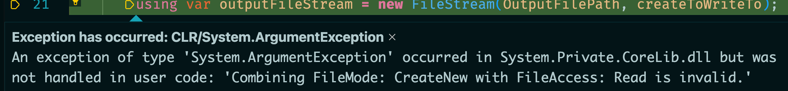

# 09 Utilisation des `Stream`


## `Filemode`

Lorsqu'on crée un `FileStream`, on doit préciser un `FileMode` :

- `Open` ouvre un fichier, lance une `exception` s'il n'existe pas
- `OpenOrCreate` ouvre un fichier ou le crée s'il n'existe pas
- `Create` crée un fichier ou l'écrase s'il existe déjà
- `CreateNew` crée un fichier ou lance une `exception` s'il existe déjà
- `Append` ouvre ou crée un fichier et se place à la finc du fichier pour y ajouter des données
- `Truncate` supprime le contenu d'un fichier (met à 0 `byte`)


## `FileStream`

```cs
public void Process()
{
    using var inputFileStream = new FileStream(InputFilePath, FileMode.Open);
    using var outputFileStream = new FileStream(OutputFilePath, FileMode.CreateNew);
}
```

`using` car `FileStream` implémente `IDisposable`, en générale tout appelle à l'extérieur du programme nécessite un `using` pour disposer proprement les ressources.

`FileMode.CreateNew` car on ne souhaite pas que le fichier de sortie existe déjà.


### `FileStreamOptions`

On peut définir les `options` dans un objet `FileStreamOptions` :

```cs
var openToReadFrom = new FileStreamOptions { Mode = FileMode.Open };
using var inputFileStream = new FileStream(InputFilePath, openToReadFrom);

var createToWriteTo = new FileStreamOptions { Mode = FileMode.CreateNew };
using var outputFileStream = new FileStream(outputFilePath, createToWriteTo);
```


### Ajout de `StreamReader` et `StreamWriter`

```cs
var openToReadFrom = new FileStreamOptions { Mode = FileMode.Open };
using var inputFileStream = new FileStream(InputFilePath, openToReadFrom);
using var inputStreamReader = new StreamReader(inputFileStream);

var createToWriteTo = new FileStreamOptions { Mode = FileMode.CreateNew };
using var outputFileStream = new FileStream(OutputFilePath, createToWriteTo);
using var outputStreamWriter = new StreamWriter(outputFileStream);

while(!inputStreamReader.EndOfStream)
{
    string inputLine = inputStreamReader.ReadLine()!;
    string processedLine = inputLine.ToUpperInvariant();
    outputStreamWriter.WriteLine(processedLine);
}
```

`streamReader.EndOfStream` retourne `true`à la fin d'un `stream`.

`inputStreamReader.ReadLine()!` on sait qu'il n'est pas `null` avec la condition du `while`, on le spécifie au compilateur avec le `bang operator` : `!`.



On obtient une `exception` :

> Combiner `FileMode: CreateNew` et `FileAccess: Read` est invalide.

C'est parce que par défaut `FileAccess` vaut `Read`, on va donc modifier les options :

```cs
var createToWriteTo = new FileStreamOptions { 
    Mode = FileMode.CreateNew,
    Access = FileAccess.Write
};
```

