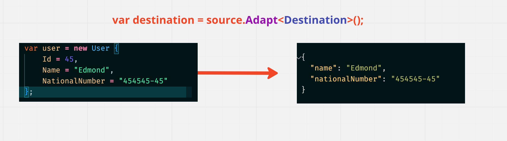
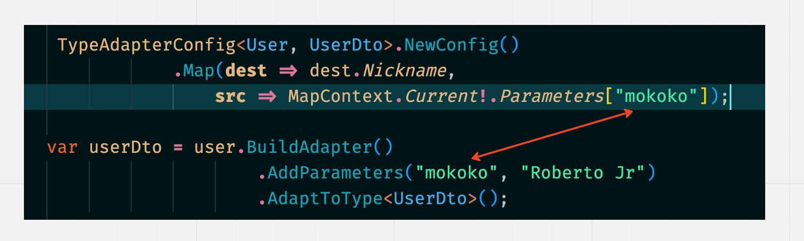
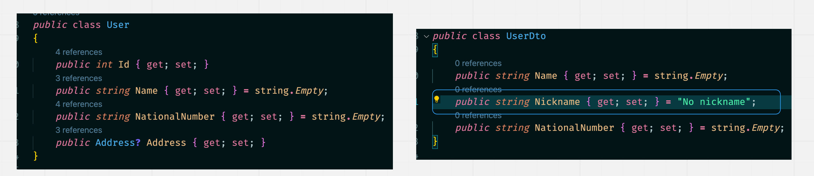
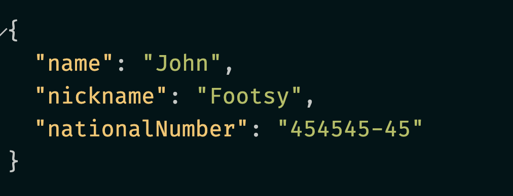
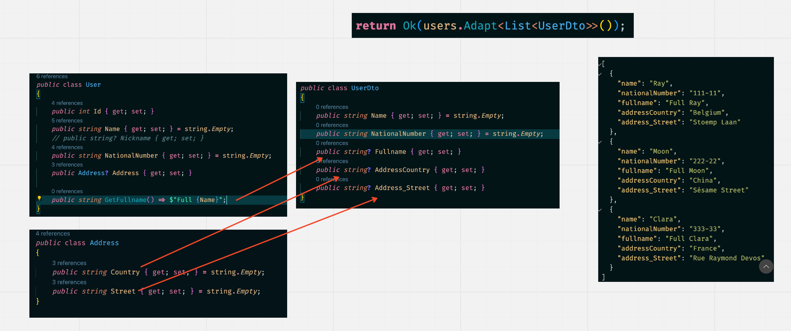
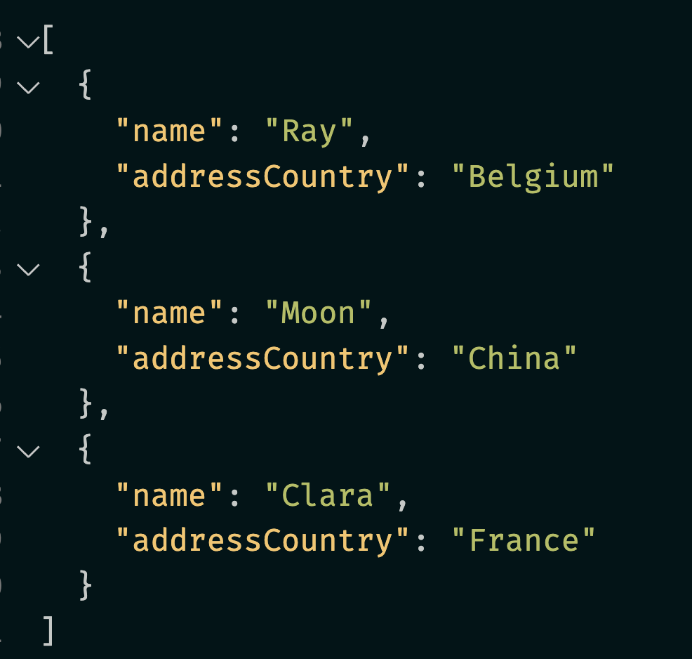

# 35 `Mapster`

à voir plus tard, ne s'installe pas sur `.net 7`.

> S'installe pour le moment uniquement sur `.net 6`

## Installation

```bash
dotnet add package Mapster
```


## Simple utilisation

```cs
var userDto = user.Adapt<UserDto>();
```



Avec un objet déjà existant :

```cs
objSource.Adapt(objDestination)
```

```cs
var userDto = new UserDto();

user.Adapt(userDto);
```

`Adapt` est une méthode d'extension appellable de n'importe où.

Avec des types `value` il faut utiliser la deuxième méthode d'extension :

```cs
var dest = src.Adapt<TSource, TDestination>();
```

Cela évite le `boxing` et `unboxing`.


## `Mapper` instance

Il est possible d'utiliser une instance de `Mapper` (et la passer par `Dependency Injection`)

```cs
using MapsterMapper;

IMapper mapper = new Mapper();
var userDto = mapper.Map<UserDto>(user);
```


## `Builder`

Il faut configurer le *mapping* en explicitant vers quelle propriété le paramètre doit être *mappé* :

```cs
TypeAdapterConfig<User, UserDto>.NewConfig()
                .Map(dest => dest.Nickname,
                    src => MapContext.Current!.Parameters["Nickname"]);
```

Ici le nom du paramètre `"Nickname"` correspond au nom de la propriété `Nickname` de la classe `UserDto`, mais ce n'est pas obligatoire.




```cs
var userDto = user.BuildAdapter()
    			   .AddParameters("Nickname", "Footsy")
    			   .AdaptToType<UserDto>();
```

Ici la propriété `Nickname` est dans le `Dto` mais pas dans la classe `source` :



Cela peut servir à passer une valeur définie pendant le `runtime`.



### Avec un `mapper`

```cs
var userDto = mapper.From(user)
    				.AddParameters("Nickname", "jo")
    				.AdaptToType<UserDto>();
```


## Cast de `type`

`Mapster` permet de *caster* des valeurs d'un type vers un autre.

Si on peut caster les types en `C#` alors on peut aussi avec `Mapster`.

```cs
var num = "12".Adapt<int>(); // int.Parse("12")

var numStr = 566.Adapt<string>(); // 566.ToString()

var color = "Red".Adapt<Colors>(); // color = Colors.Red
```


## Mapping de `List`

Super simple, fonctionne avec les `IEnumerable`, `IList`, `ICollection`, `ISet` et toutes les collections.

```cs
List<User> users = DB.Users;

return Ok(users.Adapt<List<UserDto>>());
```


## Mapping automatique d'objet à objet

Basé sur les même conventions que `AutoMapper` :

- la source et la destination ont le même nom de propriété `dest.Name = src.Name`
- La source a une méthode `Get` : `dest.Name = src.GetName()`
- Une propriété de la source a un objet enfant qu'on peut applatir pour l'objet de destination (`flatten`) : `dest.ContactName = src.Contact.Name` ou `dest.Contact_Name = src.Contact.Name`.



C'est valable pour les `classes`, les `structs`, les `interfaces`, les `IDictionary<string, T>` et les `record`.

> ! Attention il y a des limitations avec les `record` : voir la doc
>
> Il y a des limitations au *mapping* automatique du type `Record`. Le type `Record` ne doit pas avoir de `setter` et n'avoir qu'un seul constructeur non vide, et tous les noms de paramètres doivent correspondre aux propriétés. Sinon, vous devez ajouter la configuration `MapToConstructor`.


## Exemple avec un objet anonyme et un dictionaire

```cs
var point = new { Y = 12, X = 78 };
var dicPoint = point.Adapt<Dictionary<string, int>>();
```


## Exemple avec un `record`

```cs
record MinimalUserDto(string Name, string AddressCountry);
```

```cs
List<User> users = DB.Users;

return Ok(users.Adapt<List<MinimalUserDto>>());
```




