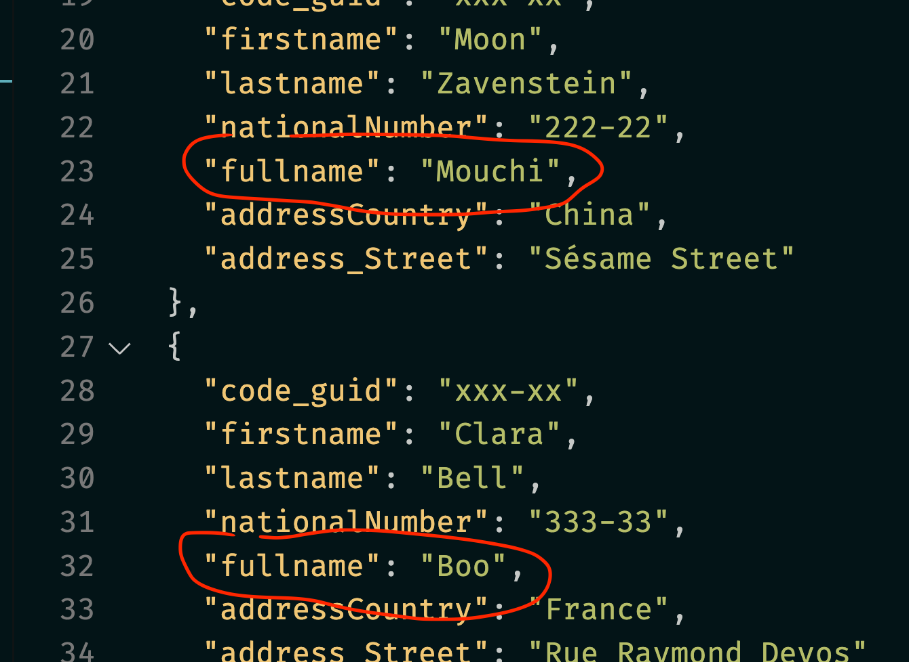

# 35.2 `Mapster` configuration

## Réglage pour une paire de `types` 

### On utilise `TypeAdaptaterConfig<TSource, TDestination>`.

On a deux méthodes :

- `NewConfig()` qui remplace et supprime toutes autres configs pour c ette paire de `types`
- `ForType()` qui créer un nouveau *mapping* s'il n'y en a aucun, sinon il s'ajoute (renforce) le ou les *mapping* existants

Les deux méthodes s'utilise de la même façon.

```cs
TypeAdapterConfig<User,UserDto>
        .NewConfig()
        .Ignore("code_guid")
        .Map(dest => dest.Fullname, src => $"{src.Firstname} {src.Lastname}");
```

`Ignore("code_guid")` permet de ne pas *mapper* cette valeur dans la destination.

On peut aussi l'écrire : `Ignore(dest => dest.code_guid)`

`Map` fait correspondre une propriété de la destination à une valeur de la source.

Cette valeur n'est pas forcement une propriété :

```cs
public class User
{
    // ...
    public string NicknameRandom()
    {
        Random random = new();
        string[] nicknames = new [] {"Poo", "Popopo", "Pitou", "Boo", "Mouchi" };

        var randomInt = random.Next(0, nicknames.Length);

        return nicknames[randomInt];
    }
```

Une méthode renvoyant un surnom de manière aléatoire.

```cs
TypeAdapterConfig<User,UserDto>
        .NewConfig()
        .Ignore(dest => dest.code_guid)
        .Map(dest => dest.Fullname, src => src.NicknameRandom());
```




## réglage au niveau global

On peut faire des réglages valables ppour tous les *mapping*, on a pour ça `TypeAdaptaterConfig.GlobalSettings.Default`

```cs
TypeAdaptaterConfig.GlobalSettings.default.PreserveReference(true);
```

On peut facilement redéfinir ce réglage pour une paire de `type` :

```cs
TypeAdaptaterConfig<SimplePoco, SimpleDto>().NewConfig().PreserveReference(false);
```

 

## Map

### `Map(dest => dest.Property, src => src.Property)`

```cs
.Map(dest => dest.NN, src => src.NationalNumber)
```


### `Map(DestPropertyName, SrcPropertyName)`

```cs
.Map("NN", "NationalNumber")
```

