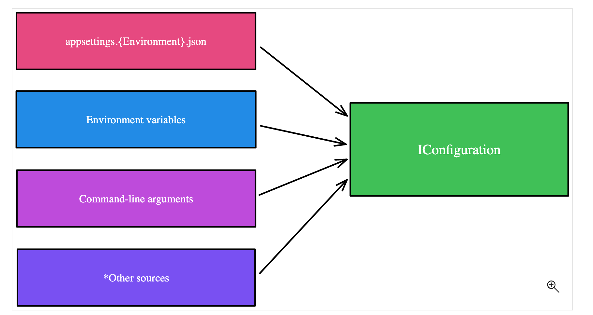
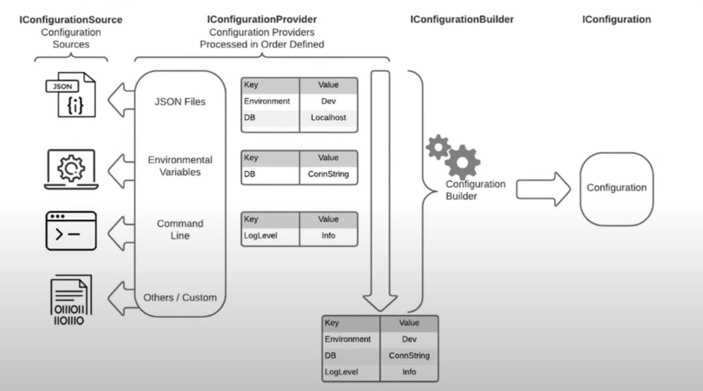
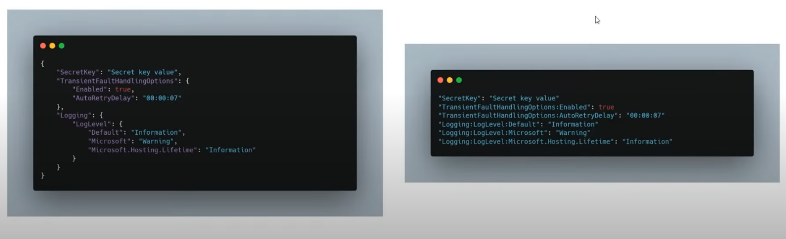
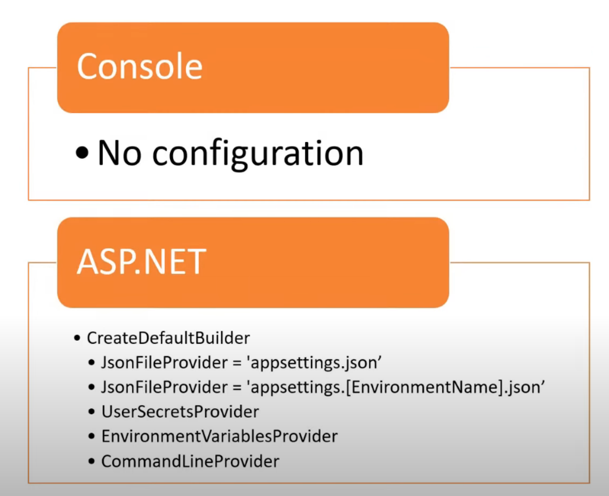

# 36 `Configuration` dans `.net`

## `configuration provider`

La `configuration` est fournit par toutes sortes de `Provider`.

Il sont tous `readonly` et doivent respecter le contrat `IConfiguration`.




## Préséance des différents `Configuration Provider`



La dernière `configuration` l'emporte, cela permet de surcharger sans modifier `appsettings.json` par une variable d'environnement dans un conteneur `Docker` par exemple.


## Paire de `Key/Value`

La `configuration` fonctionne avec des couples `key/value`.

les `structures` (`xml`, `json`) sont applaties (`flattened`):



```json
"ConnectionStrings": {
    "hukconnection": "sqlite connection"
}
```

```cs
configuration["ConnectionStrings:hukconnection"] => "sqlite connection"
```


## Par défaut dans une `Web App`



Contrairement à une `Console App`, une `Web App` arrive avec déjà des outils de `configuration` par défaut.

## Ajout manuel dans une `Console app`

On doit ajouter le package `Microsoft.Extensions.Configuration.Json` qui permet de gérer sa `configuration` grâce à un fichier `json`.

Normalement ce fichier s'appelle `appsettings.json` dans un `IHost`, mais pour l'exemple on peut lui donner le nom que l'on souhaite.

On doit aussi ajouter un lien vers ce fichier directement dans le fichier `.csproj`:

`ConfigurationConsoleApp.csproj`

```cs
<Project Sdk="Microsoft.NET.Sdk">

  <PropertyGroup>
    <OutputType>Exe</OutputType>
    <TargetFramework>net7.0</TargetFramework>
    <ImplicitUsings>enable</ImplicitUsings>
    <Nullable>enable</Nullable>
  </PropertyGroup>

  <ItemGroup>
    <PackageReference Include="Microsoft.Extensions.Configuration.Json" Version="7.0.0" />
  </ItemGroup>

  <ItemGroup>
    <None Update="hukarsettings.json">
    <CopyToOutputDirectory>PreserveNewest</CopyToOutputDirectory>
    </None>
  </ItemGroup>

</Project>

```

`hukarsettings.json`

```cs
{
    "MySecret": "Hukar is marvelous",
    "ConnectionStrings": {
        "hukconnection": "sqlite connection db"
    }
}
```


### `ConfigurationBuilder`

On doit maintenant construire notre objet `configuration` pour l'exemple dans `Program.cs`:

```cs
using Microsoft.Extensions.Configuration;

var configuration = new ConfigurationBuilder().AddJsonFile("hukarsettings.json").Build();
```

Puis on peut l'utiliser:

```cs
Console.WriteLine($"my secret : {configuration["MySecret"]}");
Console.WriteLine($"my secret : {configuration["ConnectionStrings:hukconnection"]}");
Console.WriteLine($"my secret : {configuration.GetConnectionString("hukconnection")}");
```

```
my secret : Hukar is marvelous
my secret : sqlite connection db
my secret : sqlite connection db
```

### Chemin vers le fichier `*settings.json`

On peut utiliser les directive vue plus haut dans le fichier `.csproj`

```xml
<ItemGroup>
	<None Update="hukarsettings.json">
		<CopyToOutputDirectory>PreserveNewest</CopyToOutputDirectory>
	</None>
</ItemGroup>
```

ou bien directement dans le `ConfigurationBuilder`: `SetBasePath`

```cs
var configuration = new ConfigurationBuilder()
                            .SetBasePath(Directory.GetCurrentDirectory())
                            .AddJsonFile("hukarsettings.json")
                            .Build();
```

Pour que le fichier de `config` soit copié dans le repértoire de l'exécutable (`bin`), il faut utiliser les directives dans `.csproj`.

## Dans une `variable d'environement`

On doit ajouter un `package`:

```bash
dotnet add package Microsoft.Extensions.Configuration.EnvironmentVariables
```

Puis on ajoute le `Provider` à notre `ConfigurationBuilder`:

```cs
IConfigurationRoot configuration = new ConfigurationBuilder()
                                    .AddJsonFile("hukarconfig.json")
                                    .AddEnvironmentVariables()
                                    .Build();
```

Le dernier ajouter écrase les précédent. On peut ici surcharger la valeur dans `hukarconfig.json` par une `variable d'environement`:

`hukarconfig.json`

```json
{
    "key": "key value pair"
}
```

```bash
export key="surcharge de key"
```

```cs
Console.WriteLine($"Key: {configuration["key"]}");
```

```bash
❯ dotnet run
Key: surcharge de key
```


## Depuis la `Command Line`

On ajoute le `package` nécessaire:

```bash
dotnet add package Microsoft.Extensions.Configuration.CommandLine
```

On ajoute le `Configuration Provider`:

```cs
IConfigurationRoot configuration = new ConfigurationBuilder()
                                    .AddJsonFile("hukarconfig.json")
                                    .AddEnvironmentVariables()
                                    .AddCommandLine(args)
                                    .Build();
```

La règle de surcharge (`override`) reste la même, le dernier gagne.

```bash
❯ dotnet run --key="chala la lala"
Key: chala la lala
```


## Depuis `User Secrets`

On peut créer des `secrets` et les récupérer via la configuration.

On. crée un `Secret ID`: `user-secrets init`

```bash
dotnet user-secrets init
```

Dans `.csproj`:

```xml
 <PropertyGroup>
    // ...
    <UserSecretsId>9d430b34-0161-4da2-b94d-4ce36731fa29</UserSecretsId>
  </PropertyGroup>
```


On ajoute le `package`:

```bash
dotnet add package Microsoft.Extensions.Configuration.UserSecrets
```

Et on ajoute le `Configuration Provider` au `ConfigurationBuilder`:

```cs
IConfigurationRoot configuration = new ConfigurationBuilder()
                                    .AddJsonFile("hukarconfig.json")
                                    .AddEnvironmentVariables()
                                    .AddCommandLine(args)
                                    .AddUserSecrets<Program>() // <-
                                    .Build();
```

On ajoute un `secret` : `user-secrets set`

```bash
> dotnet user-secrets set "key" "one key very secret on local machine"
```
```bash
Successfully saved key = one key very secret on local machine to the secret store.
```

Cela crée un fichier `secret` sur le `file system` de la machine local.

```cs
❯ dotnet run --key="chala la lala"                                    
Key: one key very secret on local machine
```

> Ne pas utiliser `user-secrets` en production. Plutôt pour des config sur sa machine locale.


## Configuration `Imbriquée` : `Nested`

`hukarconfig.json`

```json
{
    "color": {
        "header": "blue",
        "body": "red"
    }
}
```

Accès aux valeurs imbriquées avec `:` (`colon`)

```cs
Console.WriteLine($"Key: {configuration["color:header"]}");
Console.WriteLine($"Key: {configuration["color:body"]}");
```

```bash
❯ dotnet run
Key: blue
Key: red
```

Avec le `Command Line Provider`:

```bash
❯ dotnet run --color:header="violet" --color:body="light pink"
Key: violet
Key: light pink
```

### `Mappings`

On peut créer un `mapping` des chemins avec un `Dictionary`

```cs
var mappings = new Dictionary<string, string> {
    {"--header", "color:header"},
    {"--body", "color:body"},
;
```

```cs
IConfigurationRoot configuration = new ConfigurationBuilder()
                                    .AddJsonFile("hukarconfig.json")
                                    .AddCommandLine(args, mappings)
                                    .Build();
```

```cs
Console.WriteLine($"Key: {configuration["color:header"]}");
Console.WriteLine($"Key: {configuration["color:body"]}");
```

```bash
❯ dotnet run --header="violet" --body="light pink" 
Key: violet
Key: light pink
```


## `GetSection`

Pour simplifier l'écriture d'accès à la configuration dans une structure `json` imbriquée, on peut utiliser `GetSection`.

```cs
IConfigurationRoot configurationRoot = new ConfigurationBuilder()
                                    .AddJsonFile("hukarconfig.json")
                                    .AddEnvironmentVariables()
                                    .AddCommandLine(args, mappings)
                                    .AddUserSecrets<Program>()
                                    .Build();
                                    
var configuration = configurationRoot.GetSection("Color");

Console.WriteLine($"[Color] Key: {configuration["header"]}");
Console.WriteLine($"[Color] Key: {configuration["body"]}");
```


## `Bind` dans un objet : `config.Bind(myObj)`

Il faut installer le `package`:

```bash
dotnet add package Microsoft.Extensions.Configuration.Binder
```

On peut créer une `class` qui représentera les valeurs des options:

`ColorOptions.cs`

```cs
public class ColorOptions
{
    public string? Header { get; set; }
    public string? Body { get; set; }
}
```

Et l'utilisation:

```cs
ColorOptions colorOptions = new();

configuration.GetSection("Color").Bind(colorOptions);

Console.WriteLine($"header: {colorOptions.Header}");
Console.WriteLine($"body: {colorOptions.Body}");
```

### `Type` des valeurs

Avec `configution["key"]` on obtient toujours un `string`, car c'est un `Dictionary<string, string>`, quelque soit le format des données `json`:

```json
{
    "color": {
        "header": "blue",
        "body": "red",
        "alpha": 0.7,
        "trueTone": false
    }
}
```

On peut  `Bindant` une `class` typer les valeurs de la `configuration`:

```cs
public class ColorOptions
{
    public string? Header { get; set; }
    public string? Body { get; set; }
    public decimal Alpha { get; set; }
    public bool TrueTone { get; set; }
}
```

Avec le `Bind` on a donc un `mapping` typé:

```cs
ColorOptions colorOptions = new();

configuration.GetSection("Color").Bind(colorOptions);

decimal alpha = colorOptions.Alpha;
bool trueTone = colorOptions.TrueTone;
```

Avec une `configuration` classique on a que des `string`:

```cs
var configColors = configuration.GetSection("Color");

string? alphaStr = configColors["alpha"];
string? trueToneStr = configColors["trueTone"];
```


## *binder* avec `Get<T>`

`hukarsettings.json`

```json
{
    "dbConnections": {
        "sqliteConnection": "Data Source=mydb.db;",
        "sqlServerConnection": "Server=myServerAddress;Database=myDataBase;User Id=myUsername;Password=myPassword;"
    },
    "urlEndpoints": {
        "customerEndpoint": "https://MyApp.be/customer",
        "productEndpoint": "https://MyApp.be/product",
        "isRetryOn": true,
        "numberOfTries": 10,
        "dateMaybeNull": "2023-12-08"
    }
}
```

> Nécessite toujours:
>
> ```
> Microsoft.Extensions.Configuration.Binder
> ```
>
> 

On peut aussi laisser le *binder* instancier l'objet lui-même:

```cs
public class EndpointConfiguration
{
    public string CustomerEndpoint { get; init; } = string.Empty;
    public string ProductEndpoint { get; init; } = string.Empty;
    public bool IsRetryOn { get; init; }
    public int NumberOfTries { get; init; }
    public DateTime? dateMaybeNull { get; init; }
}
```

```cs
var endpointConfiguration = configuration.GetSection("urlEndpoints").Get<EndpointConfiguration>();
```

On peut ensuite utiliser l'objet de configuration:

```cs
var customerEndpoint = endpointConfiguration.CustomerEndpoint;
var IsRetryOn = endpointConfiguration.IsRetryOn;
var NumberOfTries = endpointConfiguration.NumberOfTries;
var dateMaybeNull = endpointConfiguration.dateMaybeNull;

WriteLine(customerEndpoint); // https://MyApp.be/customer
WriteLine(IsRetryOn); // true
WriteLine(NumberOfTries); // 10
WriteLine(dateMaybeNull); // 12/8/2023 12:00:00 AM
```

### On peut aussi utiliser un `record` le reste du code ne change pas.

```cs
public record EndpointConfiguration(
    string CustomerEndpoint, 
    string ProductEndpoint, 
    bool IsRetryOn, 
    int NumberOfTries, 
    DateTime? dateMaybeNull
);
```


### `Init-Only`

Si on utilise une classe pour *binder*, il faut veiller à ne pas avoir la possibilitté de réécrire une propriété:

```cs
public class EndpointConfiguration
{
    public string CustomerEndpoint { get; set; } = string.Empty;
    // ...
```

```cs
endpointConfiguration.CustomerEndpoint = "new route to customer";
WriteLine(endpointConfiguration.CustomerEndpoint); // new route to customer
```

Ce qui n'est pas souhaitable, la configuration doit rester en `read-only`.

Il suffit pour les classes d'utiliser `init` à la place de `set` ou directement un `record`.


## Avec un `IHost`

Il faut ajouter le package `Microsoft.Extensions.Hosting`.

On crée un fichier `appsettings.json`:

```json
{
    "ConnectionStrings": {
        "hukconnection": "my connection string"
    },
    "MySecret": "my secret"
}
```

Une classe `MyDataProvider` utilisant la `configuration`:

```cs
public class MyDataProvider
{
    private readonly IConfiguration _configuration;

    public MyDataProvider(IConfiguration configuration)
    {
        _configuration = configuration;
    }

    public void TestConfiguration()
    {
        Console.WriteLine($"my secret: {_configuration["MySecret"]}");
        Console.WriteLine($"my connection string: {_configuration["hukconnection"]}");
    }
}
```

Puis dans `Program.cs`:

```cs
using Microsoft.Extensions.Hosting;

using IHost host = Host.CreateDefaultBuilder(args).Build();

IConfiguration config = host.Services.GetRequiredService<IConfiguration>();

var dataProvider = new MyDataProvider(config);

dataProvider.TestConfiguration();

await host.RunAsync();
```

l'`injection de dépendance` est faite manuellement.


### Avec `Dependency Injection`

`Program.cs`

```cs
using ConfigurationConsoleApp;
using Microsoft.Extensions.DependencyInjection;
using Microsoft.Extensions.Hosting;

using IHost host = Host
                    .CreateDefaultBuilder(args) 
                    .ConfigureServices(services =>
                    {
                        services.AddSingleton<MyDataProvider>();
                    })
                    .Build();

// IConfiguration config = host.Services.GetRequiredService<IConfiguration>();

var dataProvider = host.Services.GetRequiredService<MyDataProvider>();

dataProvider.TestConfiguration();

await host.RunAsync();
```

