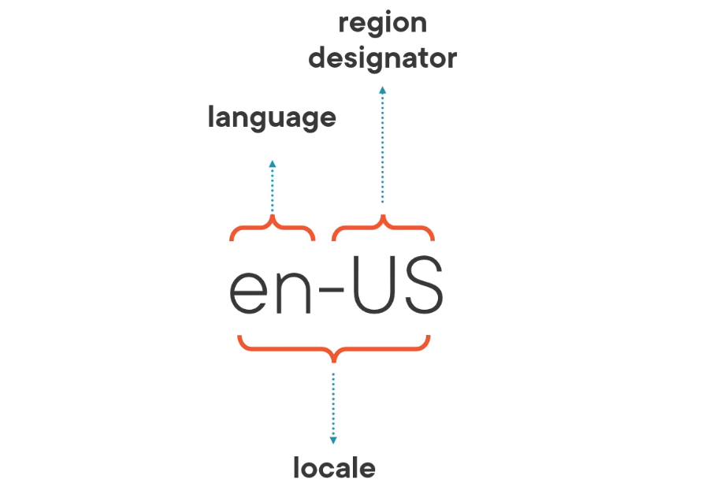
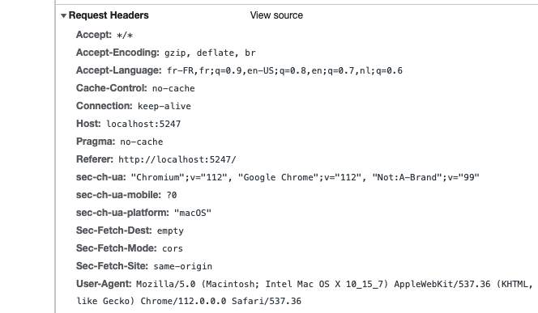
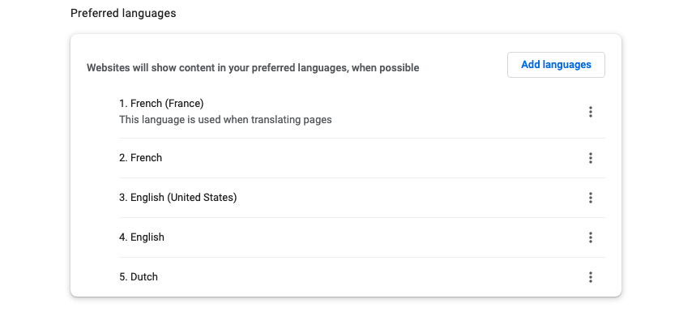
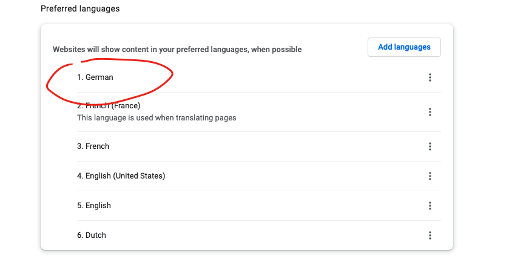
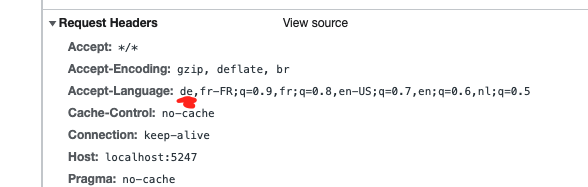

# 01 `Globalization` et `Internationalization` les bases

## Terminologies

### `Localization` : `l10n`

C'est adapter un site au spécification d'un pays (nombres de langues, GDPR).

### `Internationalization` : `i18n`

C'est ce qui vient avant la `Localization` et qui la permet.

C'est par exemple utilisé `Unicode`, que le site soit capable d'afficher un texte de droite à gauche et de gauche à droite ou que la taille du texte puisse varier de court à long.

### `Translation` : `t9n`

C'est transférer un texte dans une autre langue.

### `Globalization` : `g11n`

Pour un site c'est la possibilité d'avoir une audience global grâce au trois précédents principe.

## `Language` vs `Region` vs `Locale`

Dans certain cas seul le `language` suffit, mais s'il y a des dates ou des devises, on a alors besoin du `region designator`. l'ensemble forme un `Locale`.

Pour certaine langue, on ajoute un encodage spécifique au `Locale`.

## Choix de la langue dans le navigateur

Lorsqu'on charge un site (ou une page) sur le navigateur, celui-ci ajoute dans les `headers` de sa requête `Accept-Language`:

#### `Accept-Language:fr-FR,fr;q=0.9,en-US;q=0.8,en;q=0.7,nl;q=0.6`

Le fait que le premier choix soit `fr-FR` dépend de mes réglages dans `Chrome`:

On voit que le coefficient d'importance `q` suit ce qui est enregistré dans les réglages.

Je vais modifier la langue en `1`:

Cette fois le navigateur met `de` en premier, ce qui permet au serveur appelé de savoir ce qui est préférable de renvoyer.