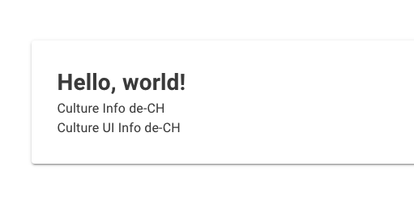
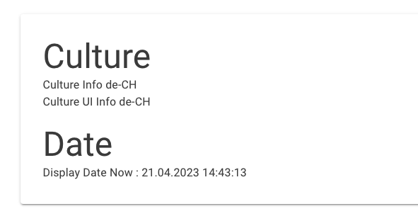
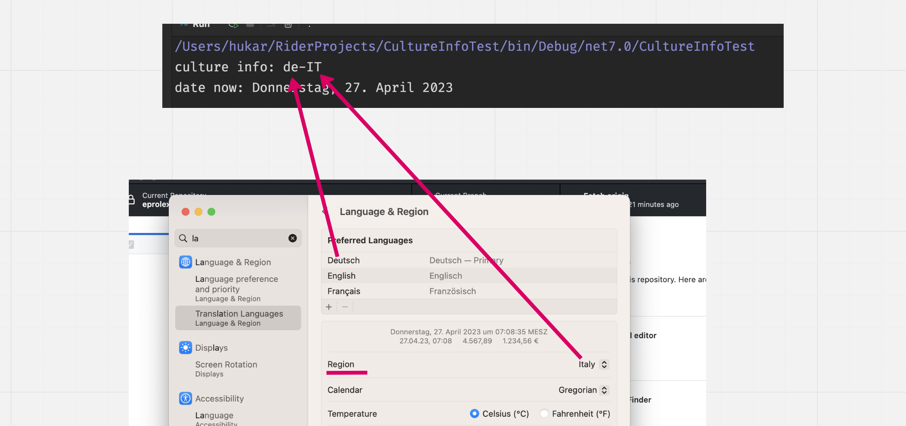
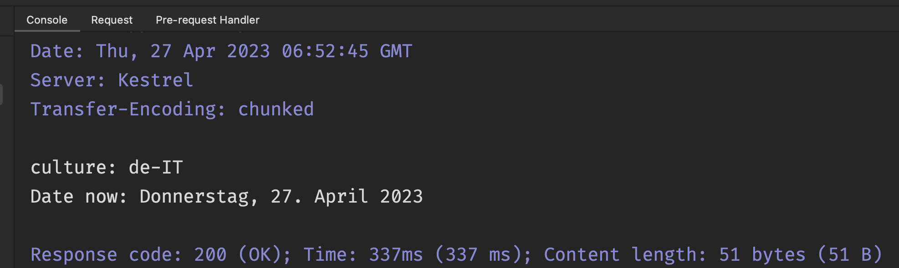
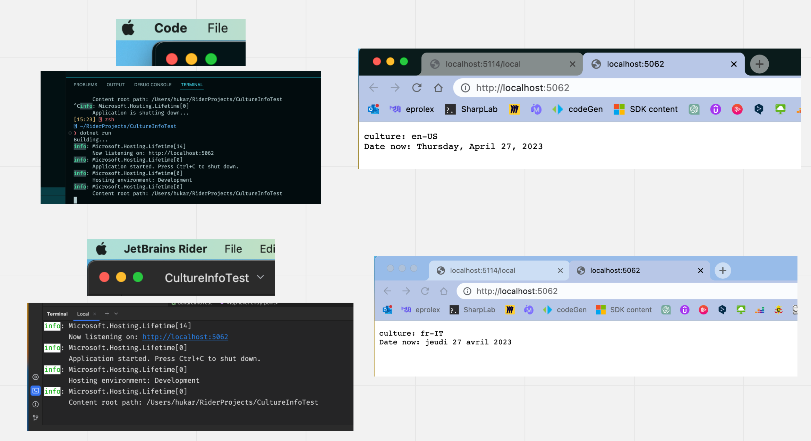

# 02 Les `cultures` dans `ASP.NET`


## `2` types de `Culture` dans `asp.net`

### `CurrentCulture`/ `SupportedCultures`

Qui détermine comment la `date`/`time` et les `Number`/`currency` s'affichent.


### `CurrentUICulture`/`SupportedUICultures`

Utilisé pour les `traductions` depuis des `Resource Files`.


### `CultureInfo`

C'est une classe de `System.Globalization`.

```cs
using System.Globalization;

var cultureInfo = CultureInfo.CurrentCulture;
var cultureUIInfo = CultureInfo.CurrentUICulture;

WriteLine($"Culture : {cultureInfo}");
WriteLine($"Culture UI : {cultureUIInfo}");
```

```
Culture : en-US
Culture UI : en-US
```

Si j'utilise la même classe `CultureInfo` dans `Blazor Wasm`, j'obtiens le `Locale` définit dans le navigateur:

```csharp
@using System.Globalization

<h1>Hello, world!</h1>

<MudText Typo="Typo.body1">
    Culture Info @CultureInfo.CurrentCulture<br />
    Culture UI Info @CultureInfo.CurrentUICulture
</MudText>
```




## Représentation de la `Date`

### Dans une application `console`

```cs
var cultureInfo = CultureInfo.CurrentCulture;
var cultureUIInfo = CultureInfo.CurrentUICulture;

var dateNow = DateTime.Now;

WriteLine($"Culture : {cultureInfo}");
WriteLine($"Culture UI : {cultureUIInfo}\n");
WriteLine($"Date Now : {dateNow}");
```

```
Culture : en-US
Culture UI : en-US

Date Now : 4/21/2023 2:35:28 PM
```


### dans une application `Blazor` (déterminé par les réglages du navigateur)

```cs
@using System.Globalization

<MudPaper Class="pa-8 ma-8" Elevation="2">

	<MudText Typo="Typo.h3"> Culture </MudText>
    <MudText Typo="Typo.body1">
        Culture Info @CultureInfo.CurrentCulture<br/>
        Culture UI Info @CultureInfo.CurrentUICulture
    </MudText>
    
    <br/>
    
    <MudText Typo="Typo.h3"> Date </MudText>
    <MudText Typo="Typo.body1">
        Display Date Now : @DateTime.Now
    </MudText>
            
</MudPaper>
```



Si je change vers `en-US` puis en `fr-FR`:


### Modification de l'affichage de la `date` dans une application `console`

```cs
using System.Globalization;

var dateNow = DateTime.Now;

WriteLine($"Culture : {CultureInfo.CurrentCulture}");
WriteLine($"Date Now : {dateNow}\n");

CultureInfo.CurrentCulture = new CultureInfo("fr-FR");

WriteLine($"Culture : {CultureInfo.CurrentCulture}");
WriteLine($"Date Now : {dateNow}\n");

CultureInfo.CurrentCulture = new CultureInfo("de-CH");

WriteLine($"Culture : {CultureInfo.CurrentCulture}");
WriteLine($"Date Now : {dateNow}\n");
```

```
Culture : en-US
Date Now : 4/21/2023 2:55:37 PM

Culture : fr-FR
Date Now : 21/04/2023 14:55:37

Culture : de-CH
Date Now : 21.04.2023 14:55:37
```

`CultureInfo.CurrentCulture` est une propriété en lecture/écriture.

Pour l'affichage d'une application `console` c'est `CurrentCulture` et non `CurrentUICulture` qu'il faut assigner.


### Dans une application `console`

`CurrentCulture` va chercher les réglages de l'ordinateur:

```cs
using System.Globalization;

var cultureInfo = CultureInfo.CurrentCulture;
var dateNow = DateTime.Now.ToLongDateString();
var dateNowShort = DateTime.Now.ToShortDateString();

Console.WriteLine($"culture info: {cultureInfo}\ndate now: {dateNow}");
```



On voit que le résultat dépend des `settings` au niveau de `MacOS`.

### De même dans une application `web`

```cs
app.MapGet("/", () =>
{
    var currentCulture = CultureInfo.CurrentCulture;
    var dateNow = DateTime.Now.ToLongDateString();

    return $"culture: {currentCulture}\nDate now: {dateNow}";
});
```



> ## Différence entre `VSCode` et `Rider`
>
> Les exemples sont ceux de `Rider`, si je lance le même code sur `VSCode`, la `current culture` sera systématiquement `en-US`, ce qui n'est plus en relation avec les `settings` de `MacOS`:
>
> 

## Configurer le `Localisation Middleware`

Cette fois-ci on part d'une `minimal api`:

```cs
app.MapGet("/date", () => {
    var output = $"Current Culture: {CultureInfo.CurrentCulture}\n";
    output += $"Current UI Culture: {CultureInfo.CurrentUICulture}\n";
    output += $"Date: {DateTime.Now}";

    return output;
});
```

```http
HTTP/1.1 200 OK
Connection: close
Content-Type: text/plain; charset=utf-8
Date: Fri, 21 Apr 2023 13:15:32 GMT
Server: Kestrel
Transfer-Encoding: chunked

Current Culture: en-US
Current UI Culture: en-US
Date: 4/21/2023 3:15:32 PM
```


### Modifier la `Culture` par défaut de l'application

On utilise le `middleware` : `UseRequestLocalization`.

```cs
app.UseRequestLocalization(
    new RequestLocalizationOptions()
        .SetDefaultCulture("de-CH")
    );
```

```python
Current Culture: de-CH
Current UI Culture: de-CH
Date: 21.04.2023 15:19:33
```

On fournit la `Culture` par défaut de l'application avec `.SetDefaultCulture`, on peut aussi définir une liste des `Cultures` supportées par notre application avec `.AddSupportedCultures` et `.AddSupportedUICultures`.

> Par défaut il semble que l'unique `supported culture` soit `en-US`.

Syntaxe avec `lambda` pour passer les options:

```cs
var supportedCultures = new[] { "en", "de", "es" };

app.UseRequestLocalization(options => {
    options
        .AddSupportedCultures(supportedCultures)
        .AddSupportedUICultures(supportedCultures)
        .SetDefaultCulture("de");
});
```

Cette liste des `supported cultures` a du sens avec des `Razor Pages` ou `MVC` et supplante les réglages du navigateur afin de ne gérer que les `cultures` que l'on souhaite et imposé une `culture` par défaut.

 


