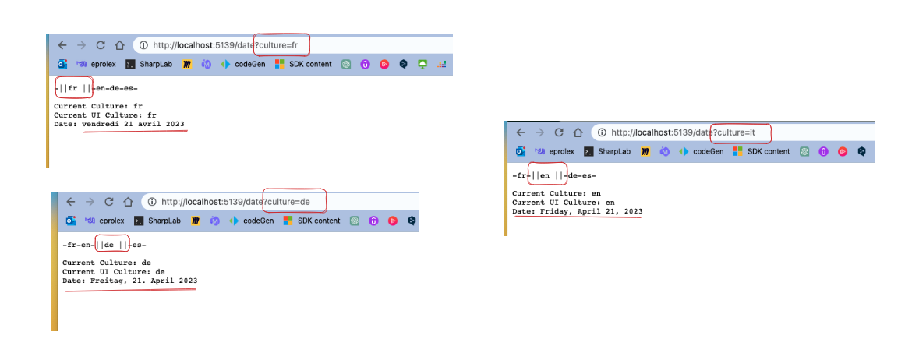
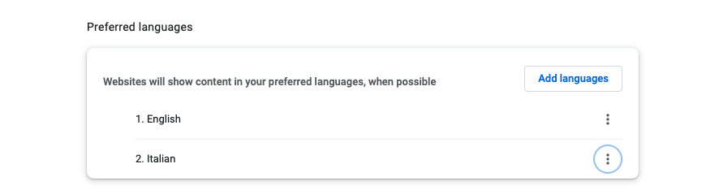
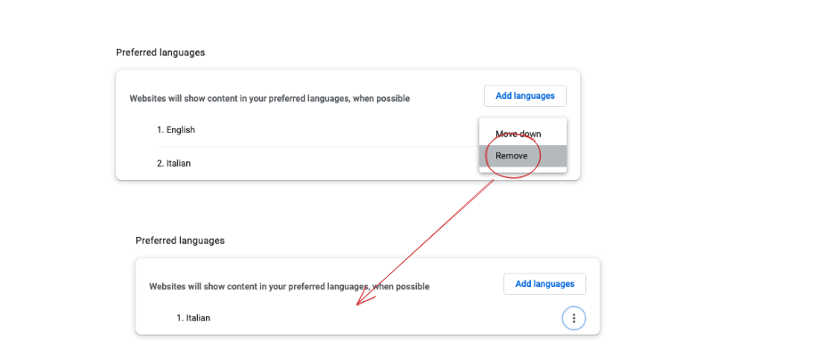
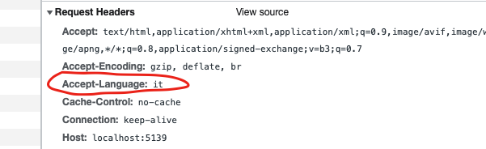
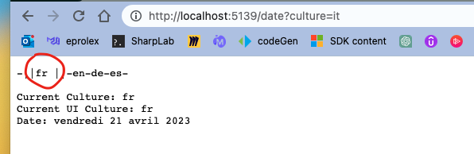

# 02 Les `cultures` dans `ASP.NET`


## `2` types de `Culture` dans `asp.net`

### `CurrentCulture`/ `SupportedCultures`

Qui détermine comment la `date`/`time` et les `Number`/`currency` s'affichent.


### `CurrentUICulture`/`SupportedUICultures`

Utilisé pour les `traductions` depuis des `Resource Files`.


### `CultureInfo`

C'est une classe de `System.Globalization`.

```cs
using System.Globalization;

var cultureInfo = CultureInfo.CurrentCulture;
var cultureUIInfo = CultureInfo.CurrentUICulture;

WriteLine($"Culture : {cultureInfo}");
WriteLine($"Culture UI : {cultureUIInfo}");
```

```
Culture : en-US
Culture UI : en-US
```

Si j'utilise la même classe `CultureInfo` dans `Blazor Wasm`, j'obtiens le `Locale` définit dans le navigateur:

```csharp
@using System.Globalization

<h1>Hello, world!</h1>

<MudText Typo="Typo.body1">
    Culture Info @CultureInfo.CurrentCulture<br />
    Culture UI Info @CultureInfo.CurrentUICulture
</MudText>
```


## Représentation de la `Date`

### Dans une application `console`

```cs
var cultureInfo = CultureInfo.CurrentCulture;
var cultureUIInfo = CultureInfo.CurrentUICulture;

var dateNow = DateTime.Now;

WriteLine($"Culture : {cultureInfo}");
WriteLine($"Culture UI : {cultureUIInfo}\n");
WriteLine($"Date Now : {dateNow}");
```

```
Culture : en-US
Culture UI : en-US

Date Now : 4/21/2023 2:35:28 PM
```


### dans une application `Blazor` (déterminé par les réglages du navigateur)

```cs
@using System.Globalization

<MudPaper Class="pa-8 ma-8" Elevation="2">

	<MudText Typo="Typo.h3"> Culture </MudText>
    <MudText Typo="Typo.body1">
        Culture Info @CultureInfo.CurrentCulture<br/>
        Culture UI Info @CultureInfo.CurrentUICulture
    </MudText>
    
    <br/>
    
    <MudText Typo="Typo.h3"> Date </MudText>
    <MudText Typo="Typo.body1">
        Display Date Now : @DateTime.Now
    </MudText>
            
</MudPaper>
```


Si je change vers `en-US` puis en `fr-FR`:


### Modification de l'affichage de la `date` dans une application `console`

```cs
using System.Globalization;

var dateNow = DateTime.Now;

WriteLine($"Culture : {CultureInfo.CurrentCulture}");
WriteLine($"Date Now : {dateNow}\n");

CultureInfo.CurrentCulture = new CultureInfo("fr-FR");

WriteLine($"Culture : {CultureInfo.CurrentCulture}");
WriteLine($"Date Now : {dateNow}\n");

CultureInfo.CurrentCulture = new CultureInfo("de-CH");

WriteLine($"Culture : {CultureInfo.CurrentCulture}");
WriteLine($"Date Now : {dateNow}\n");
```

```
Culture : en-US
Date Now : 4/21/2023 2:55:37 PM

Culture : fr-FR
Date Now : 21/04/2023 14:55:37

Culture : de-CH
Date Now : 21.04.2023 14:55:37
```

`CultureInfo.CurrentCulture` est une propriété en lecture/écriture.

Pour l'affichage d'une application `console` c'est `CurrentCulture` et non `CurrentUICulture` qu'il faut assigner.


## Configurer le `Localisation Middleware`

Cette fois-ci on part d'une `minimal api`:

```cs
app.MapGet("/date", () => {
    var output = $"Current Culture: {CultureInfo.CurrentCulture}\n";
    output += $"Current UI Culture: {CultureInfo.CurrentUICulture}\n";
    output += $"Date: {DateTime.Now}";

    return output;
});
```

```http
HTTP/1.1 200 OK
Connection: close
Content-Type: text/plain; charset=utf-8
Date: Fri, 21 Apr 2023 13:15:32 GMT
Server: Kestrel
Transfer-Encoding: chunked

Current Culture: en-US
Current UI Culture: en-US
Date: 4/21/2023 3:15:32 PM
```


### Modifier la `Culture` par défaut de l'application

On utilise le `middleware` : `UseRequestLocalization`.

```cs
app.UseRequestLocalization(
    new RequestLocalizationOptions()
        .SetDefaultCulture("de-CH")
    );
```

```python
Current Culture: de-CH
Current UI Culture: de-CH
Date: 21.04.2023 15:19:33
```

On fournit la `Culture` par défaut de l'application avec `.SetDefaultCulture`, on peut aussi définir une liste des `Cultures` supportées par notre application avec `.AddSupportedCultures` et `.AddSupportedUICultures`.

Syntaxe avec `lambda` pour passer les options:

```cs
var supportedCultures = new[] { "en", "de", "es" };

app.UseRequestLocalization(options => {
    options
        .AddSupportedCultures(supportedCultures)
        .AddSupportedUICultures(supportedCultures)
        .SetDefaultCulture("de");
});
```

Cette liste des `supported cultures` a du sens avec des `Razor Pages` ou `MVC` et supplante les réglages du navigateur afin de ne gérer que les `cultures` que l'on souhaite et imposé une `culture` par défaut.


## `Culture` provider

Il y a prévalence des `provider` pour la détermination de la `culture` a employer.


Le `3rd` est celui déterminé par les réglages du navigateur et qui se traduit par le `header` : `Accept-Language`.

Le `4th` est celui définit par le `middleware` : `AddRequestLocalization`, c'est le dernier à être choisi, seulement si aucun autre `provider` n'est présent ou compatible avec l'application.


## `Query String Culture` provider

```cs
builder.Services.Configure<RequestLocalizationOptions>(options => {
    var supportedCultures = new[] { "fr", "en", "de", "es" };
    
    options
        .AddSupportedCultures(supportedCultures)
        .AddSupportedUICultures(supportedCultures)
        .SetDefaultCulture("fr");
});

// ...

app.UseRequestLocalization();
```

On va ensuite pouvoir récupérer cette liste par injection de dépendance dans notre `endpoint`:

```cs
app.MapGet("/date", (IOptions<RequestLocalizationOptions> LocalizationOptions) => {
    // ...
```

On va aussi récupérer le `HttpContext` pour regarder quelle culture est passée par la requête :

```cs
app.MapGet("/date", (IOptions<RequestLocalizationOptions> LocalizationOptions, 
                     HttpContext context) => {
	var requestCulturInfo = context.Features.Get<IRequestCultureFeature>();

    var output = "-";
    
    foreach(var culture in LocalizationOptions.Value.SupportedCultures!)
    {
        if(requestCulturInfo!.RequestCulture.Culture.ToString() == culture.ToString())
            output += $"||{culture} ||-";
        else
            output += $"{culture}-";
    }

    output += "\n\n";


    output += $"Current Culture: {CultureInfo.CurrentCulture}\n";
    output += $"Current UI Culture: {CultureInfo.CurrentUICulture}\n";
    output += $"Date: {DateTime.Now.ToLongDateString()}";

    return output;
});
```

On met en évidence quelle culture est passée par la requête pour simuler une classe sur un bouton par exemple:



On passe donc la culture qui fera préséance grâce à un `query string`:

```python
http://localhost:5139/date?culture=fr
```

Dans le dernier cas comme la `culture` : `it` n'est pas supportée par l'application, c'est le `provider` navigateur qui détermine la culture `en` ( car il n'y a pas de `cookie`).



Si on supprime cette possibilité:



Ce qui va engendrer le `Accept-Language` de la requête:



1. `Query String` : `it` => pas accepté par l'application (cf `supportedCulture`)

2. `Accept-Language` : `it`

3. `Cookie`: il n'y en a pas

4. Le `middleware` : `UseRequestLocalization` qui a sa valeur par défaut sur `fr`
   ```cs
   // pour rappel
   builder.Services.Configure<RequestLocalizationOptions>(options => {
       var supportedCultures = new[] { "fr", "en", "de", "es" };
       
       options
           .AddSupportedCultures(supportedCultures)
           .AddSupportedUICultures(supportedCultures)
           .SetDefaultCulture("fr");
   });
   ```





 


