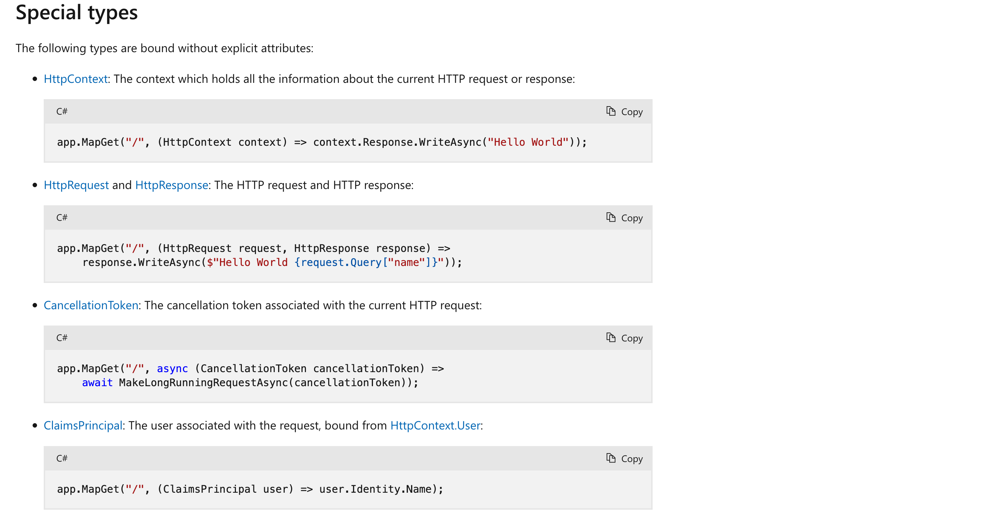
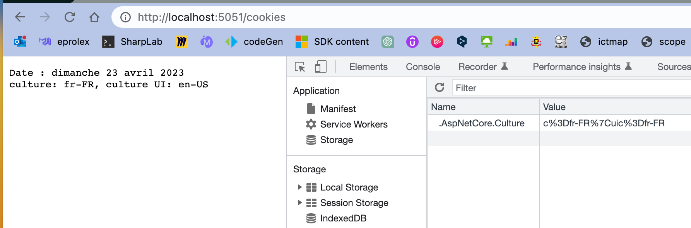
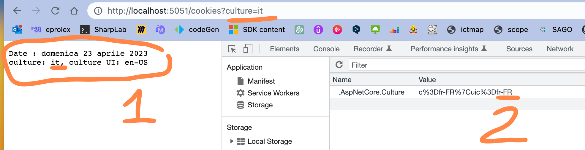

# 03 `Culture` provider

Il y a prévalence des `provider` pour la détermination de la `culture` a employer.


Le `3rd` est celui déterminé par les réglages du navigateur et qui se traduit par le `header` : `Accept-Language`.

Le `4th` est celui définit par le `middleware` : `AddRequestLocalization`, c'est le dernier à être choisi, seulement si aucun autre `provider` n'est présent ou compatible avec l'application.


## `Query String Culture` provider

```cs
builder.Services.Configure<RequestLocalizationOptions>(options => {
    var supportedCultures = new[] { "fr", "en", "de", "es" };
    
    options
        .AddSupportedCultures(supportedCultures)
        .AddSupportedUICultures(supportedCultures)
        .SetDefaultCulture("fr");
});

// ...

app.UseRequestLocalization();
```

On va ensuite pouvoir récupérer cette liste par injection de dépendance dans notre `endpoint`:

```cs
app.MapGet("/date", (IOptions<RequestLocalizationOptions> LocalizationOptions) => {
    // ...
```

On va aussi récupérer le `HttpContext` pour regarder quelle culture est passée par la requête :

```cs
app.MapGet("/date", (IOptions<RequestLocalizationOptions> LocalizationOptions, 
                     HttpContext context) => {
    
    // Nous permet de retrouver le `Query String`
	var requestCulturInfo = context.Features.Get<IRequestCultureFeature>();

    var output = "-";
    
    foreach(var culture in Localizat`onOptions.Value.SupportedCultures!)
    {
        if(requestCulturInfo!.RequestCulture.Culture.ToString() == culture.ToString())
            output += $"||{culture} ||-";
        else
            output += $"{culture}-";
    }

    output += "\n\n";


    output += $"Current Culture: {CultureInfo.CurrentCulture}\n";
    output += $"Current UI Culture: {CultureInfo.CurrentUICulture}\n";
    output += $"Date: {DateTime.Now.ToLongDateString()}";

    return output;
});
```

On met en évidence quelle culture est passée par la requête pour simuler une classe sur un bouton par exemple:


On passe donc la culture qui fera préséance grâce à un `query string`:

```python
http://localhost:5139/date?culture=fr
```

Dans le dernier cas comme la `culture` : `it` n'est pas supportée par l'application, c'est le `provider` navigateur qui détermine la culture `en` ( car il n'y a pas de `cookie`).


Si on supprime cette possibilité:


Ce qui va engendrer le `Accept-Language` de la requête:


1. `Query String` : `it` => pas accepté par l'application (cf `supportedCulture`)

2. `Accept-Language` : `it`

3. `Cookie`: il n'y en a pas

4. Le `middleware` : `UseRequestLocalization` qui a sa valeur par défaut sur `fr`

   ```cs
   // pour rappel
   builder.Services.Configure<RequestLocalizationOptions>(options => {
       var supportedCultures = new[] { "fr", "en", "de", "es" };
       
       options
           .AddSupportedCultures(supportedCultures)
           .AddSupportedUICultures(supportedCultures)
           .SetDefaultCulture("fr");
   });
   ```


## `Cookie` Provider

On va définir la culture grâce à un `Cookie`

### Liste des cultures supportées

```cs
app.UseRequestLocalization(options => {
    options
        .AddSupportedCultures("fr-FR", "en", "it");
});
```


### `Endpoint` créant et renvoyant un `Cookie`

```cs
app.MapGet("/cookies", (HttpResponse response) => {

    var cultureInfo = CultureInfo.CurrentCulture;
    var cultureUIInfo = CultureInfo.CurrentUICulture;

    var culture = new RequestCulture("fr-FR");
    response.Cookies.Append(
        CookieRequestCultureProvider.DefaultCookieName,
        CookieRequestCultureProvider.MakeCookieValue(culture)
    );

    var output = $"Date : {DateTime.Now.ToLongDateString()}\n";
    output += $"culture: {cultureInfo}, culture UI: {cultureUIInfo}";
    
    return output;
});
```

> La `lambda` d'un `endpoint` supporte l'injection automatique de
>
> - `HttpContext`, `HttpRequest` et `HttpResponse`, `CancellationToken`, `ClaimsPrincipal`
>
> 

Créer un `Cookie` est assez facile avec `Response.Cookie.Append(string key, string value)`



> Décodage propre du `cookie`:
>
> ```
> c%3Dfr-FR%7Cuic%3Dfr-FR ==> c=fr-FR|uic=fr-FR
> ```

La prévalance des `Query String` fait que je peux écraser la `culture` du `cookie` comme ceci:




## `Custom` provider

Comme souvent avec `.net` on peut créer son propre `provider`, basé sur la `route`, sur le `domaine` ou sur tout autre chose.

### Implémenter un `provider`

```cs
var p = new CustomRequestCultureProvider(
	async ctx => {
        // ...
    }
);
```


### Enregistrer (`register`) le `provider` dans `Program.cs`

```cs
builder.Services.Configure<RequestLocalizationOptions>(
	options => {
        options.AddInitialRequestCultureProvider(p);
    }
);
```

Le `CustomProvider` sera la première option choisie avant le `Query String`, le `Cookie`, la configuration du navigateur (en fait le `header` `Accept-Language`) et la valeur par défaut dans l'application `.SetDefaultCulture`.

### Exemple

```cs
app.UseRequestLocalization(options => {
var supportedCulture = new[] {"fr-FR", "en", "it", "pt"};

    options
        .AddSupportedCultures(supportedCulture)
        .AddInitialRequestCultureProvider(new CustomRequestCultureProvider(
            async ctx => {
				var randomIndice = new Random().Next(0, supportedCulture.Length);
                var culture = supportedCulture[randomIndice];
                return await Task.FromResult(new ProviderCultureResult(culture));
            }
        ));
});
```

