# 04 `Resource Files`

Ce sont des fichiers `xml` avec l'extension `.resx`.

On peut créer un dossier `Resources` pour y mettre ses `resource files`.


## Utiliser `ResX Editor` sur `VSCode`

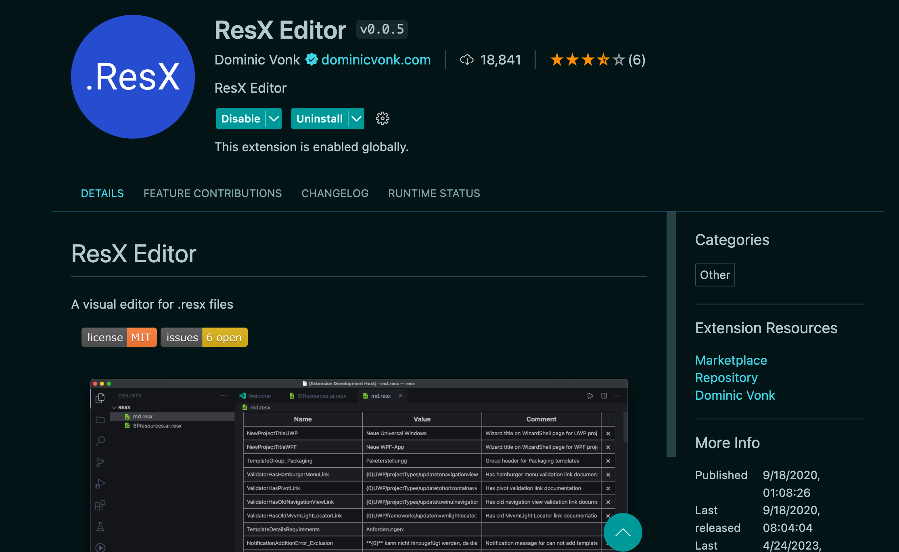

On peut ainsi avoir automatiquement un éditeur visuel pour générer le `xml` du fichier `.resx`:

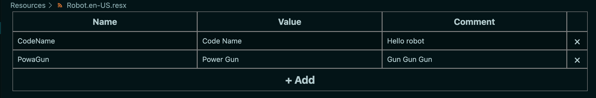

On obtient dérrière un long fichier `xml` où on trouve nos données à la fin:

`Robot.en-Us.resx`

```xml
// ...
</resheader>
  <data name="CodeName" xml:space="preserve">
    <value>Code Name</value>
    <comment>Hello robot</comment>
  </data>
  <data name="PowaGun" xml:space="preserve">
    <value>Power Gun</value>
    <comment>Gun Gun Gun</comment>
  </data>
</root>
```

On fait la même chose en français par exemple:

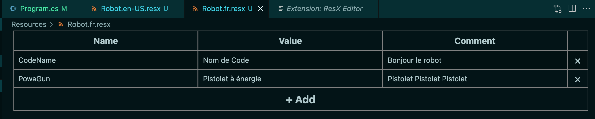

`Robot.fr.resx`

```xml
// ...  
</resheader>
  <data name="CodeName" xml:space="preserve">
    <value>Nom de Code</value>
    <comment>Bonjour le robot</comment>
  </data>
  <data name="PowaGun" xml:space="preserve">
    <value>Pistolet à énergie</value>
    <comment>Pistolet Pistolet Pistolet</comment>
  </data>
</root>
```


## Préparer l'application à utiliser les fichiers `.resx`

Dans `Program.cs`

```cs
builder.Services.AddLocalization(
	options => options.ResourcePath = "Resources"
);
```

On a ici cette arborescence:

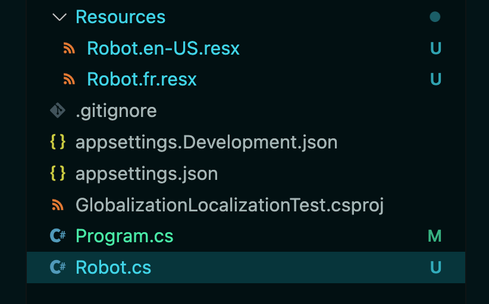

Dans le code:

```cs
app.MapGet("/localizer", (IStringLocalizer<Robot> Localizer) => {
    return $"{Localizer["CodeName"]}: TT-674 {Localizer["PowaGun"]}: Megatron Gun";
})
```

Comme `IStringLocalizer` est typé, il faut aussi créer la classe contenant le nom des libellé de traduction:

`Robot.cs`

```cs
public class Robot
{
	// pas besoin de mettre quoi que ce soit !!!
}
```

Cette classe doit avoir le même nom que le préfix des fichiers `.resx` : `Robot.en-US.resx` et `Robot.fr.resx`.

Cette classe ne doit pas contenir de propriété.


## Code de l'exemple final

C'est `CultureUIInfo` qui est utilisé pour les labels, il faut donc lui ajouter les mêmes `supported culture`:

```cs
app.UseRequestLocalization(options => {
var supportedCulture = new[] {"fr-FR", "en-US", "it", "pt"};

    options
        .AddSupportedCultures(supportedCulture)
        .AddSupportedUICultures(supportedCulture);
});
```

Le `endpoint` complet:

```cs
app.MapGet("/localizer", (IStringLocalizer<Robot> Localizer, HttpContext context) => {
    var output = $"Date : {DateTime.Now.ToLongDateString()}\n\n";

    var cultureInfo = CultureInfo.CurrentCulture;
    var cultureUIInfo = CultureInfo.CurrentUICulture;

    output += $"culture: {cultureInfo}, culture UI: {cultureUIInfo}\n";

    var requestCultureInfo = context.Features.Get<IRequestCultureFeature>();

    output += $"request culture: {requestCultureInfo!.RequestCulture.Culture}, request culture UI: {requestCultureInfo!.RequestCulture.UICulture}\n\n";

    output += $"{Localizer["CodeName"]}: TT-674 {Localizer["PowaGun"]}: Megatron Gun";

    return output;
});
```

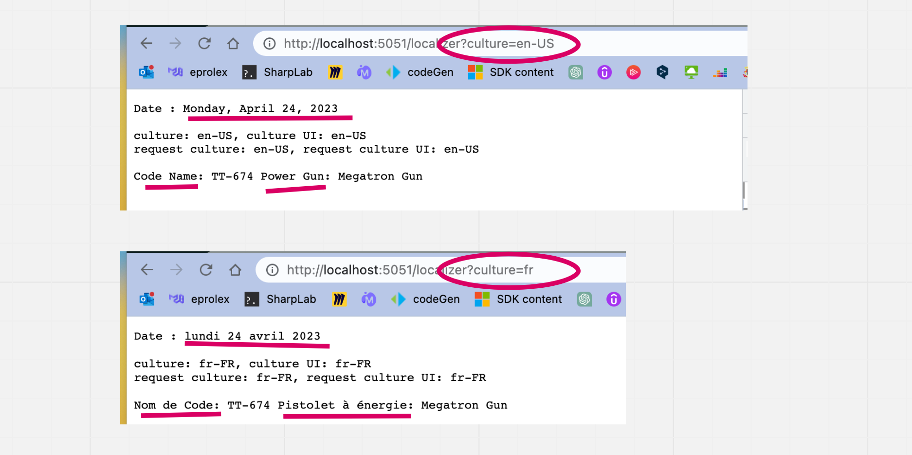

`Culture` permet ici d'avoir la `date` dans la bonne langue (et le bon format).

`Culture UI` lui va utiliser les fichiers `.resx` pour afficher la traduction juste.


## Préséance des `traductions`

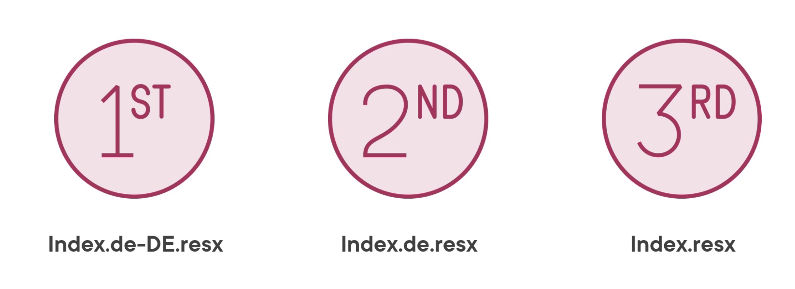

Le fichier le plus précis sur la culture sera choisi, par exemple `de-DE` plutôt que `de`.

On peut aussi désigner un fichier de trac-duction par défaut en ne précisant pas sa `culture`, dans notre cas ce serait `Robot.resx`.

Souvent ce dernier fichier (`fallback option`) est en anglais.

### Pas de fichier par défaut

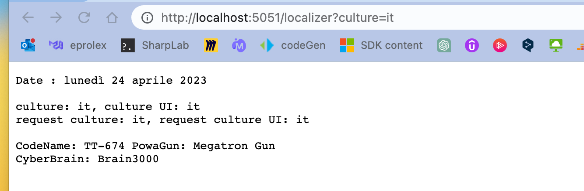

S'il n'y a pas de fichier de traduction par défaut, ici par exemple pour la `culture`:`it`, alors ce sont les noms de l'attribut `Name`  du fichier `.resx` qui sont affichés.

```xml
<data name="CodeName" xml:space="preserve">
```

On remarque que comme `it` fait partie des `supported culture`, la date est affiché correctement.


### Avec un fichier par défaut (`fallback culture`)

On créé ce fichier sans mentionner de culture dans son nom:

`Robot.resx`

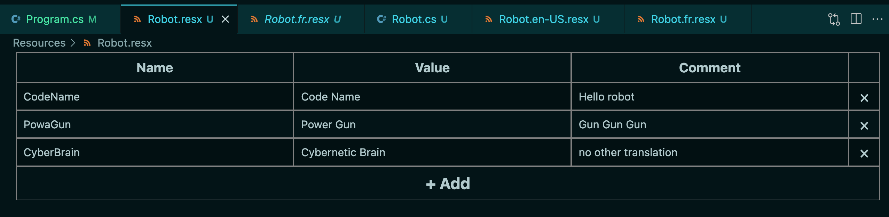

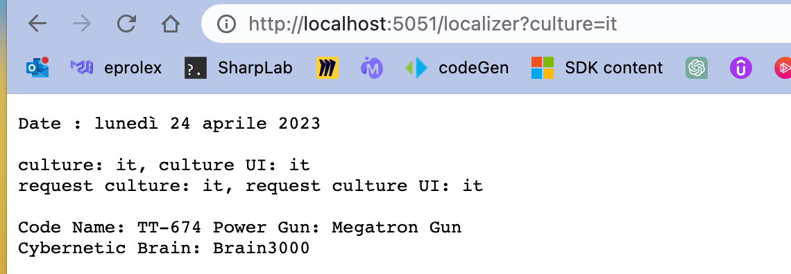

Ce ne sont plus les noms des propriétés qui sont affichés, mais les labels du fichier `fallback` `Robot.resx`.

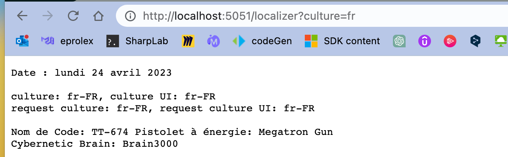

Si une traduction n'est pas trouvé dans le fichier dont la `culture` est demandée (ici `Robot.fr.resx`), elle sera cherchée dans le fichier `fallback` : `Robot.resx`.

Sans celui-ci on aurait :

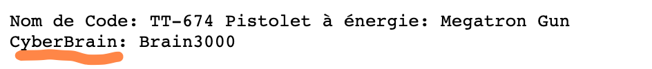


