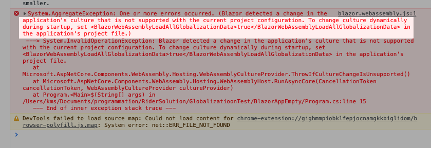

# 06 `Blazor` localization


## `CultureInfo`

Si on tente de changer la `culture` avant le démarrage de l'application dans une application `Blazor Wasm`:

`Program.cs`

```cs
// ...
builder.Services.AddScoped(sp => new HttpClient { BaseAddress = new Uri(builder.HostEnvironment.BaseAddress) });

CultureInfo.DefaultThreadCurrentUICulture = new CultureInfo("id"); // <- ici
CultureInfo.DefaultThreadCurrentCulture = new CultureInfo("id"); // <- ici

await builder.Build().RunAsync();
```

On obtient cette erreur:



Pour changer dynamiquement la `culture` pendant le démarrage, il faut ajouter `<BlazorWebAssemblyLoadAllGlobalizationData>`  dans le fichier `.csproj` et le mettre à `true`.

```xml
<PropertyGroup>
  <BlazorWebAssemblyLoadAllGlobalizationData>true</BlazorWebAssemblyLoadAllGlobalizationData>
</PropertyGroup>
```


## Sélection de la `culture`

```html
@page "/"
@using System.Globalization

<p>
    Date: @DateTime.Now.ToLongDateString()<br/>
    Number: @(number.ToString("N2"))
</p>

<p>
    @foreach (var lang in new[] { "fr", "it", "en", "de" })
    {
        <button @onclick="@(() => ChangeLang(lang))">@lang</button>
    }
</p>
```

```cs
@code {
    double number = 4567.98;

    void ChangeLang(string lang)
    {
        CultureInfo.DefaultThreadCurrentCulture = new CultureInfo(lang);
        CultureInfo.DefaultThreadCurrentUICulture = new CultureInfo(lang);
    }
}
```


## Ce qui fonctionne

- `IStringLocalizer` et `IStringLocalizer<T>`
- `.resx`


## Ce qui ne fonctionne pas

- `IHtmlLocalizer` et `IViewLocalizer`
- `Localizing Data Annotations`


## `Localization` avec `LocalStorage`

