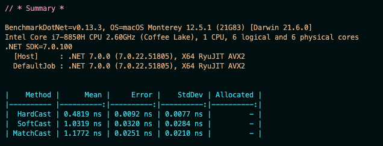
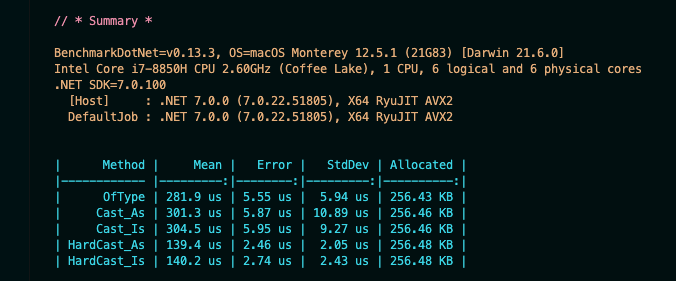
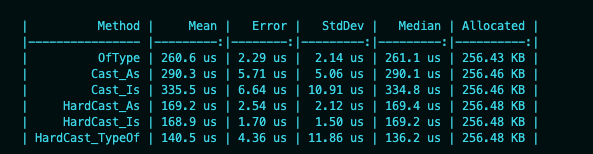

# Le `cast` en `c#`


## `Hard Cast`

La classe `Person`

```cs
public class Person
{
    public Guid Id { get; set; }
    public string FullName { get; set; } = default!;
}
```

Une classe `StaticObject` renvoyant un `objet` instance de `Person`

```cs
public class StaticObject
{
    public static object Hukar = new Person {
        Id = Guid.NewGuid(),
        FullName = "Hukar The Robot",
    };
}
```

On doit `caster` pour transformer l'`object` de retour en `Person`.

```cs
Person hukar = (Person)StaticObject.Hukar;
```

On garantie au compilateur que `StaticObject.Hukar` est bien une `Person`.

Mais que ce serait-il passé si `StaticObject.Hukar` n'était pas vraiment une `Person` :

```cs
public static object Hukar = new {
    Id = Guid.NewGuid(),
    FullName = "Hukar The Robot",
};
```

C'est maintenant un `Anonymous Type`, mais avec un `hard cast` `(Person)MyObject` il n'y a pas d'erreur à la compilation.

Par contre à l'exécution on obtient une `Exception`:

### `InvalidCastException`

```bash
Unhandled exception. System.InvalidCastException: Unable to cast object of type '<>f__AnonymousType0`2[System.Guid,System.String]' to type 'Person'.
   at Program.<Main>$(String[] args) in /Users/kms/Documents/programmation/c#/CastDemo/Program.cs:line 4
```


## `as ` : `safe casting`

On peut utiliser le mot clé `as` pour éviter les problèmes du `hard casting`:

```cs
Person? hukar = StaticObject.Hukar as Person;
```

Ici `as` renvoie une `Person` ou `null`.

Si on utilise plus loin l'instance `hukar` :

```cs
Console.WriteLine($"hukar fullname : {hukar.FullName}");
```

on risque cette fois ci une

###  `NullReferenceException`.


## `is` : `match cast`

```cs
if(StaticObject.Hukar is Person hukar)
{
    Console.WriteLine($"hukar fullname : {hukar.FullName}");
}
```

C'est la façon la plus sûre de procéder.


## Test de performance : `BenchmarkDotnet`

```bash
dotnet add package BenchmarkDotNet
```

Il faut créer une classe de `Benchmark`:

```cs
using BenchmarkDotNet.Attributes;

[MemoryDiagnoser(false)]
public class Benchmarks
{
    [Benchmark]
    public Person HardCast()
    {
        Person hukarHardCast = (Person)StaticObject.Hukar;

        return hukarHardCast;
    }
    [Benchmark]
    public Person SoftCast()
    {
        Person? hukarSafeCast = StaticObject.Hukar as Person;

        return hukarSafeCast!;
    }
    [Benchmark]
    public Person MatchCast()
    {
        if(StaticObject.Hukar is Person hukarMatchCast)
        {
            return hukarMatchCast;
        }

        return null!;
    }
}
```

Dans `Program.cs`

```cs
using BenchmarkDotNet.Running;

BenchmarkRunner.Run<Benchmarks>();
```

Pour lancer le `Benchmark` il faut être en `Release`:

```bash
dotnet run -c release
```

> C'est assez long



La différence ne justifie pas d'employer une façon sur le critère de la performance, autant prendre la façon la plus propre (`clean`) souvent `is`.


### Avec une `collection`

`StaticObject`

```cs
public class StaticObject
{
    // ...
    
    public static List<object> People = Enumerable
        .Range(0, 10000)
        .Select(x => (object)new Person{ 
            Id = Guid.NewGuid(),
            FullName = Guid.NewGuid().ToString()
        })
        .ToList();
}
```

Dans `Benchmarks`

Avec `OfType`

```cs
[Benchmark]
public List<Person> OfType()
{
    return StaticObject.People
        .OfType<Person>()
        .ToList();
}
```

Avec `as` et `Cast`

```cs
[Benchmark]
public List<Person> Cast_As()
{
    return StaticObject.People
        .Where(x => x as Person is not null)
        .Cast<Person>()
        .ToList();
}
```

car `as` peut retourner `null`.

Avec `is` et `Cast`

```cs
[Benchmark]
public List<Person> Cast_Is()
{
    return StaticObject.People
        .Where(x => x is Person)
        .Cast<Person>()
        .ToList();
}
```

`Hard Cast` avec `as` et `is`

```cs
[Benchmark]
public List<Person> HardCast_As()
{
    return StaticObject.People
        .Where(x => x as Person is not null)
        .Select(x => (Person)x)
        .ToList();
}

[Benchmark]
public List<Person> HardCast_Is()
{
    return StaticObject.People
        .Where(x => x is Person)
        .Select(x => (Person)x)
        .ToList();
}
```

```bash
dotnet run -c Release
```



On peut aussi utiliser `typeof`:

```cs
[Benchmark]
public List<Person> HardCast_TypeOf()
{
    return StaticObject.People
        .Where(x => x.GetType() == typeof(Person))
        .Select(x => (Person)x)
        .ToList();
}
```



Cette méthode est la plus rapide alors qu'elle utilise la `Reflection` avec `GetType`.

Mais s'il n'y a pas de souci d'optimisation la version avec `.OfType<Person>()` est certainement la plus simple et la plus claire.

## `as` et `is`

On est dans un contexte de `Type Checking` et de `type casting`.

`is` permet de tester le type d'un objet :

```cs
if(o is Cat) { ... }
```

`as` permet de `caster` un objet ou renvoie `null`.

```cs
o as cat
```

est équivalent à 

```cs
o is cat ? (Cat)o : (cat)null
```

