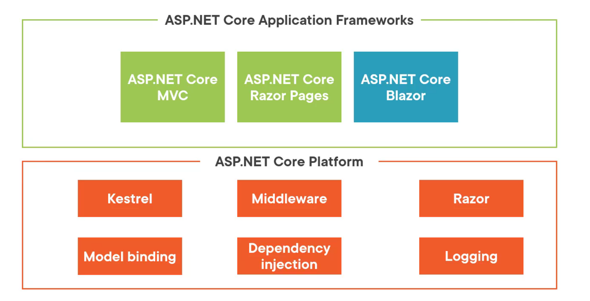
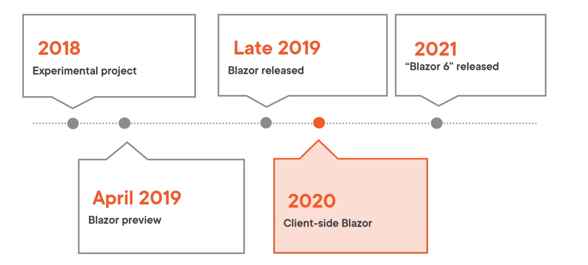

# 00 Introduction

## Architecture de `.NET`

## `Component`

Tout dans `Blazor` est `component`.

Un `component` est une classe `c#` qui mélange du `HTML` et du `code c#`.

Dans la partie `template HTML`, c'est la `razor syntax` qui est utilisée.

## History

`Blazor wasm` n'est disponible que depuis `2020`.