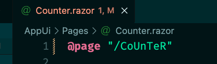
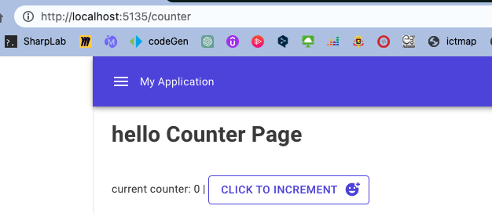
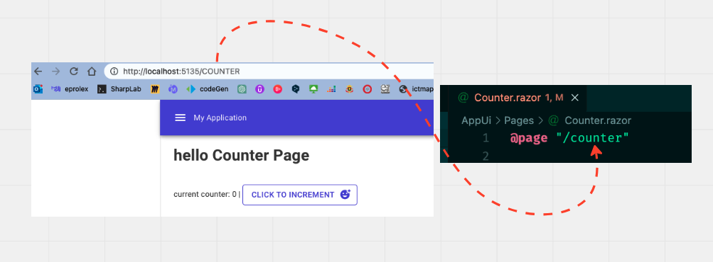
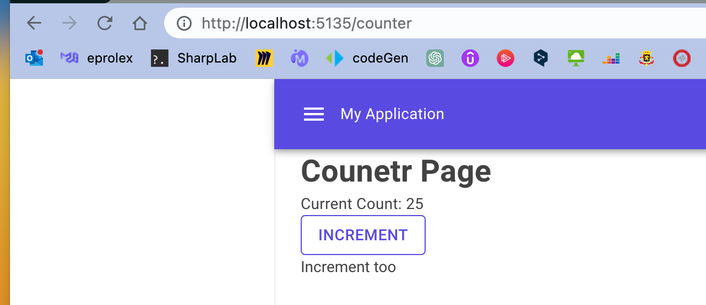

# 02 `Page`


## Structure dune `Page`

`CounterPage.razor`

```asp
@page "/counter"

<h1>Counter Page</h1>
<p>Current Count: @currentCount</p>
<p>
    <MudButton 
    Variant="Variant.Outlined" 
    Color="Color.Primary"
    OnClick="IncrementCount">Increment</MudButton>
</p>

<p>
    <button @onclick="IncrementCount">Increment too</button>
</p>

@code {
    int currentCount = 0;

    void IncrementCount()
    {
        currentCount ++;
    }
}
```

`@page` définit la route à laquelle la `page` (le composant `page`) doit s'afficher.

> ## `@page` est `case insensitive`
>
> 
>
> Et dans le navigateur:
>
> 
>
> Et vice et versa:
>
> 

`@onclick` est l'événement auquel on passe le nom d'une méthode devant s'exécuter.

Dans `MudBlazor`, c'est l'attribut `OnClick`.

> Un fichier d'extension `.razor` doit commencer par une majuscule.




