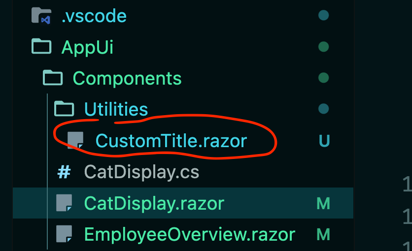
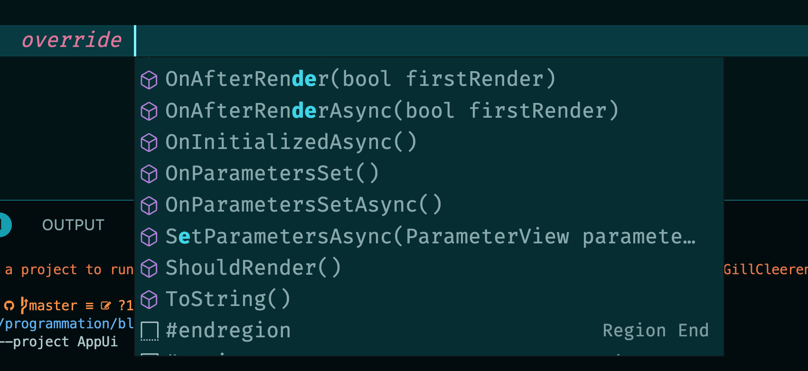
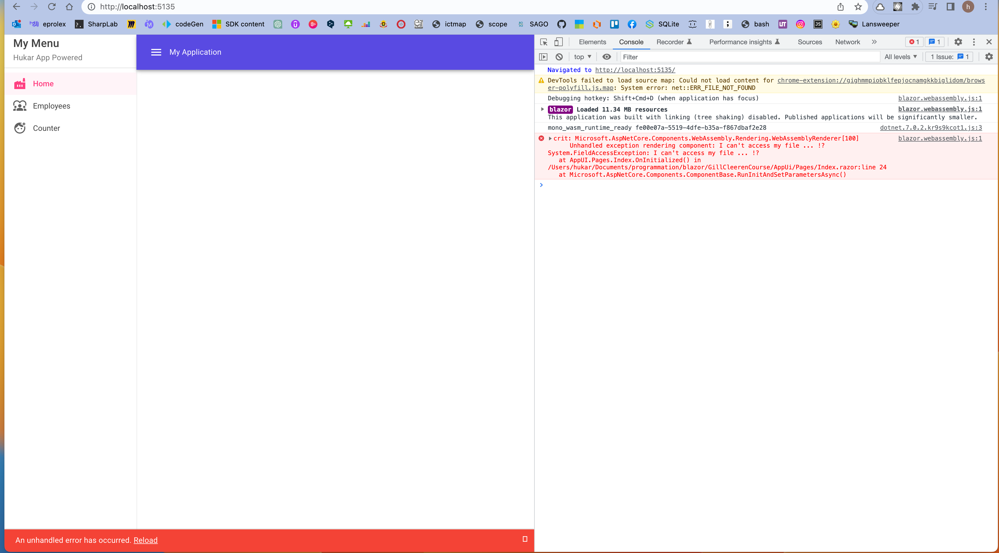
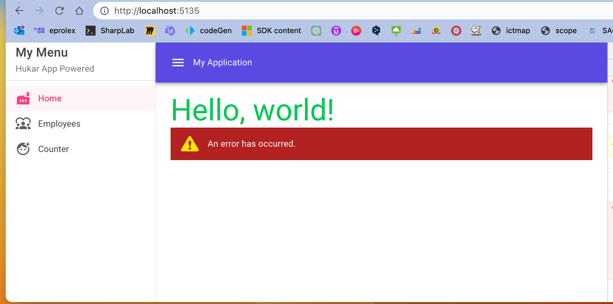
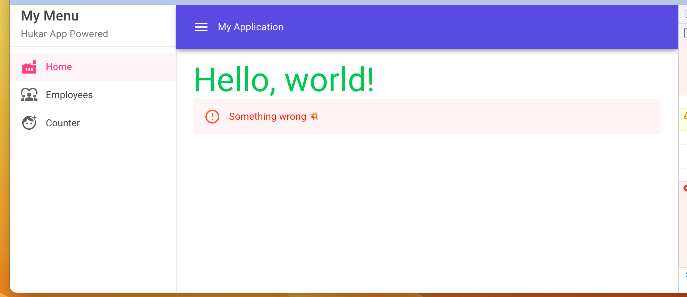
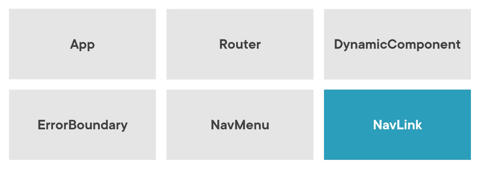
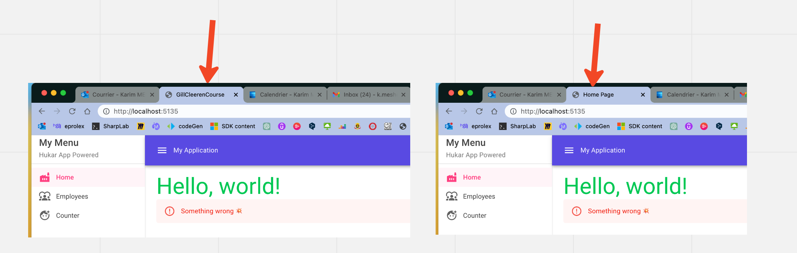

# 03 `Component`

Tout dans `Blazor` est `component`.

Un `component` est contenu dans un fichier `.razor` et utilise la `razor syntax`.

On crée l'application en imbriquant des `component` les un dans les autres.

Les `page` sont des `component` avec la directive `@page`.


## Exemple de `Component`

`CatDisplay.razor`

```asp
<MudText Typo="Typo.h2" Align="Align.Center" Class="pa-8">Pretty cat is displayed</MudText>

<p Class="d-flex gap-3 justify-center align-center">  
    <MudAvatar Size="Size.Large" Color="Color.Secondary" Variant="Variant.Filled">
        <MudIcon 
            Icon="@Icons.Custom.Brands.GitHub" 
            style="color:white"
            Size="Size.Large" />
    </MudAvatar>
    <MudText Typo="Typo.body1">Pussy Name: @PussyName</MudText>
    <MudText Typo="Typo.body2" Color="Color.Error">Pussy Age: @PussyAge</MudText>
</p>

@code {
    public string PussyName { get; set; } = "MiauPolo";
    public int PussyAge { get; set; } = 13;
}
```


## Passer les données : `[Parameter]`

Pour passer des données du `parent component` au `child component`, on utilise l'`attribute` : `[parameter]`.

```ruby
<h3>@Name</h3>
    
@code {
    [Parameter]
    public string Name { get; set; } = string.Empty;
}
```

Et dans le `component` parent:

```ruby
<EmployeeCard Name="Hukar The Great" />
```


## `Namespace`

### Par convention

Le `namespace` du `component` est détérminé en concatenant le nom du projet (`root namespace`) et les dossiers contenant le `component`:



```ruby
@using AppUI.Components.Utilities
```

On peut placer cette directive soit dans chaque composant utilisant des `component` de ce `namespace` soit pour toute l'`application` dans `_Imports.razor`.

### définir son propre `namespace`

On peut aussi définir explicitement son propre `namespace`:

`CustomTitle.razor`

```ruby
@namespace MyNamespace.Component.Utility

<p>
    <MudText Typo="Typo.h3" Color="Color.Secondary">@Text</MudText>
</p>

@code {
    [Parameter]
    public string Text { get; set; } = "default text for title";
}
```

Dans un autre composant:

```ruby
@using MyNamespace.Component.Utility

// ...

<CustomTitle Text="Hukar is beautiful" />
```


## Séparer le `code` du `template` : `partial class`

On peut utiliser les `Partials Class` pour séparer la logique contenu dans `@code { ... }` du template:

`CatDisplay.razor`

```html
<MudText Typo="Typo.h2" Align="Align.Center" Class="pa-8">Pretty cat is displayed</MudText>

<p Class="d-flex gap-3 justify-center align-center">  
    <MudAvatar Size="Size.Large" Color="Color.Secondary" Variant="Variant.Filled">
        <MudIcon 
            Icon="@Icons.Custom.Brands.GitHub" 
            style="color:white"
            Size="Size.Large" />
    </MudAvatar>
    <MudText Typo="Typo.body1">Pussy Name: @PussyName</MudText>
    <MudText Typo="Typo.body2" Color="Color.Error">Pussy Age: @PussyAge</MudText>
</p>
```

`CatDisplay.cs`

```cs
namespace GillCleerenCourse.Components;

public partial class CatDisplay
{
    public string PussyName { get; set; } = "Mow Bill";
    public int PussyAge { get; set; } = 18;
}
```


## `Life Cycle` méthode

On ne place pas le code d'initialisation d'un `component` dans le constructeur, mais on utilise les méthode du `Life Cycle` à la place:

```c#
@code {
    public List<Employee> Employees { get; set; } = new();

    protected override void OnInitialized()
    {
        Employees = MockDataService.Employees;
    }
}
```

> en tapant `override`, l'`IDE` nous propose ces méthodes:
>
> 


## Gestion des `Exceptions`

Par défaut les `Exceptions` sont gérées en affichant un petit bordereau `rouge` en bas de la page:

```cs
@code {
    protected override void OnInitialized()
    {
        throw new FieldAccessException("I can't access my file ... !?");
    }
}
```




### `<ErrorBoundary>`

```html
<ErrorBoundary> 
    <ChildContent> <BoumComponent /> </ChildContent> 
</ErrorBoundary>
```



Ici la ligne rouge d'erreur en-dessous a été supprimée et un message d'erreur par défaut s'affiche à l'emplacement du `component`.


```html
<ErrorBoundary> 
    <ChildContent> 
        <BoumComponent />
    </ChildContent>

    <ErrorContent>
        <MudAlert Severity="Severity.Error">Something wrong 💥</MudAlert>
    </ErrorContent> 
</ErrorBoundary>
```




## `Built-In Component`

Un certain nombre de `component` est fourni par `Blazor`.



`NavLink` est comme une `ancre` mais fourni automatiquement la classe `active`.

- Il y a aussi des `component` pour l'`Authentication`
- Aussi pour les `Forms`


### `<PageTitle>`

Permet de modifier le `titre` d'une `page`.

```ruby
@page "/"
<PageTitle>@_pageTitle</PageTitle>
    
...
```

```cs
@code {
    string _pageTitle = "Home Page";
```



