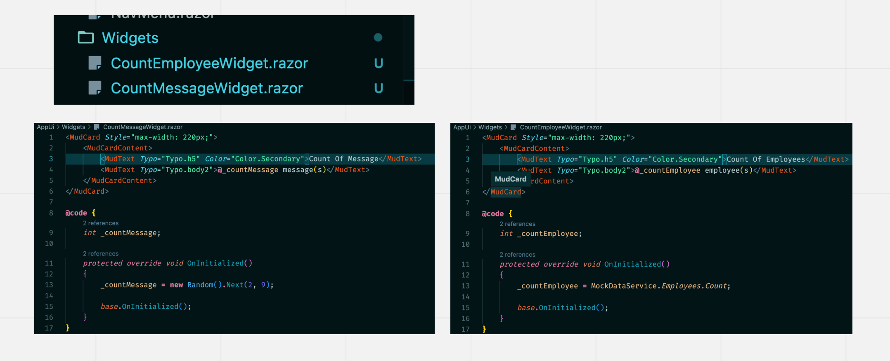

# 03.5 `Dynamic Component`

On peut charger des `component` de manière `dynamic` (`dynamic ` ≠ `hard coded`), c'est à dire qu'on ne connait les `components` que au `Run Time` et non plus au `Compile Time`.

> On utilise le terme **langage de programmation dynamique** en [informatique](https://fr.wikipedia.org/wiki/Informatique) pour décrire une classe de [langages de haut niveau](https://fr.wikipedia.org/wiki/Langage_de_haut_niveau) qui exécutent au moment de l'exécution des actions que d'autres langages ne peuvent exécuter que durant la [compilation](https://fr.wikipedia.org/wiki/Compilateur).
>
> `Wikipedia`

```html
<DynamicComponent Type="@type" />
```

```cs
@code {
    private Type type = ...;
}
```

On peut rendre ainsi une `UI` de manière `dynamic` à travers une `loop`.


## Exemple

On a deux `component` dans un dossier `Widgets`:



Dans `Index.razor` on va les afficher de manière `dynamic`:

```ruby
@page "/"

<MudText Class="mt-4" Typo="Typo.h3" Color="Color.Success">Hello, world!</MudText>

<MudGrid Class="mt-4" Spacing="4" Justify="Justify.Center">
@foreach(var widgetType in WidgetTypes)
{
    <MudItem>
        <DynamicComponent Type="@widgetType" />
    </MudItem>
}
</MudGrid>
```

```cs
@code {
    List<Type> WidgetTypes = new() { 
        typeof(CountEmployeeWidget), typeof(CountMessageWidget),
    };
}
```

On pourrait obtenir cette liste de manière `dynamic` aussi avec un `call` en `DB`.